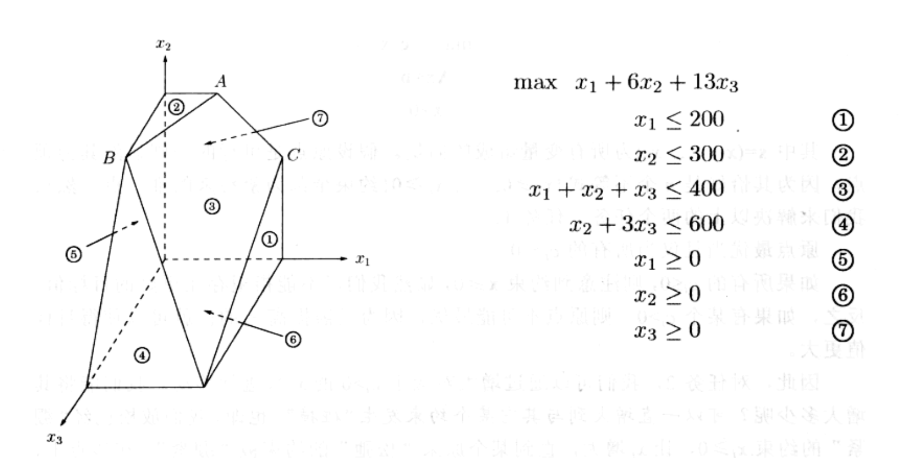
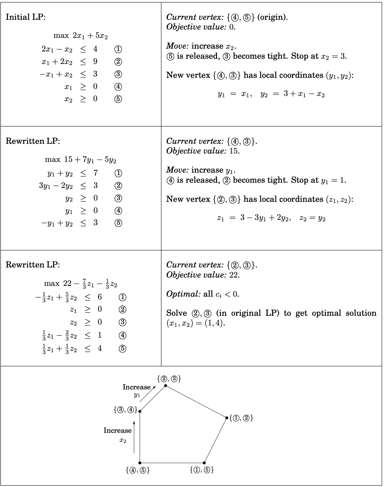

# Linear Programming
## Technique definition (no problem/solution required)

Linear programming is one of the important branches of operations research. (Operational research is a discipline that solves optimal solutions under certain constraints. It applies existing scientific and technological knowledge and mathematical means to solve various problems in real life. It is an applied discipline.) There are also branches of operations research, planning theory, queuing theory, graph theory, decision theory and so on.

## Simplex algorithm

Simplex: A polyhedron with n+1 vertices in n-dimensional space.

For example, points in 0-dimensional space, line segments in 1-dimensional space, triangles in 2-dimensional space, and so on. It may be difficult to imagine what a high-dimensional space looks like from a physical point of view, but this is not the crux of our problem. We only need to understand from a mathematical point of view that whenever a set of linearly independent vectors is added to a vector group, the dimension of the vector group increase by one. The dimension can also be understood as the rank of the corresponding matrix.

The simplex method is divided into the following steps: 
(1) determination of the initial basic feasible solution, 
(2) finding the basic feasible solution, 
(3) optimality test, 
(4) changing the basis variable, and 
(5) iterative operation.

The geometric meaning of the simplex method is to move from one vertex to another until the optimal vertex is reached. A simplex table can be seen as a Dashboard that monitors this movement algebraically. A lot of information needed by the simplex algorithm can be read from the simplex table, such as what is the Basis solution of the iterative step, what is the reduced cost of the Nonbasis variable, and so on. This information can be used to decide how many variables to advance to the next basis, and what is the calculation iteration step size.

On each iteration, simplex has two tasks:
1. Check whether the current vertex is optimal (and if so, halt). 
2. 2. Determine where to move next.

#### Simplex in action

####The running time of simplex
A way to perform an iteration would be to check each potential neighbor to see whether it really is a vertex of the polyhedron and to determine its cost. Finding the cost is quick, just a dot product, but checking whether it is a true vertex involves solving a system of n equations in n unknowns (that is, satisfying the n chosen inequalities exactly) and checking whether the result is feasible. By Gaussian elimination (see the following box) this takes $O(n^3)$ time, giving an unappetizing running time of $O(mn^4)$ per iteration.

## Linear programming algorithmic design