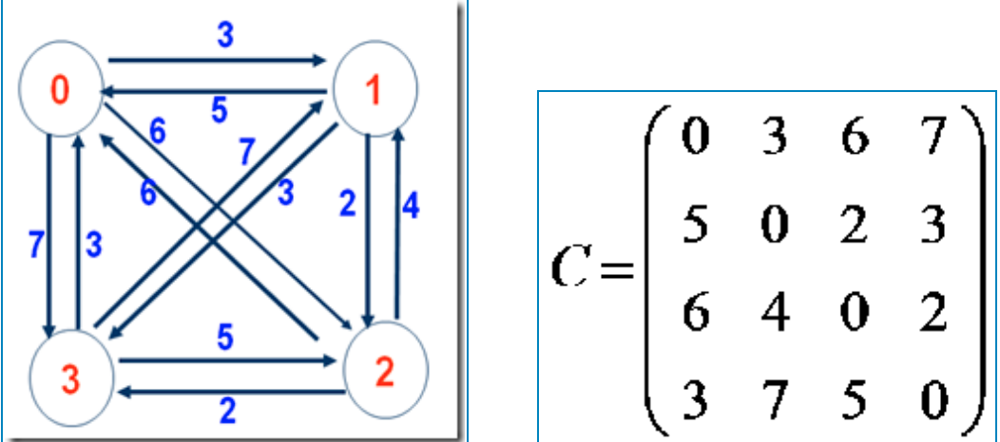
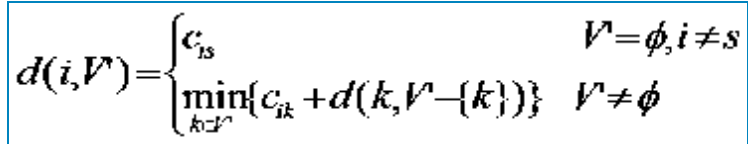
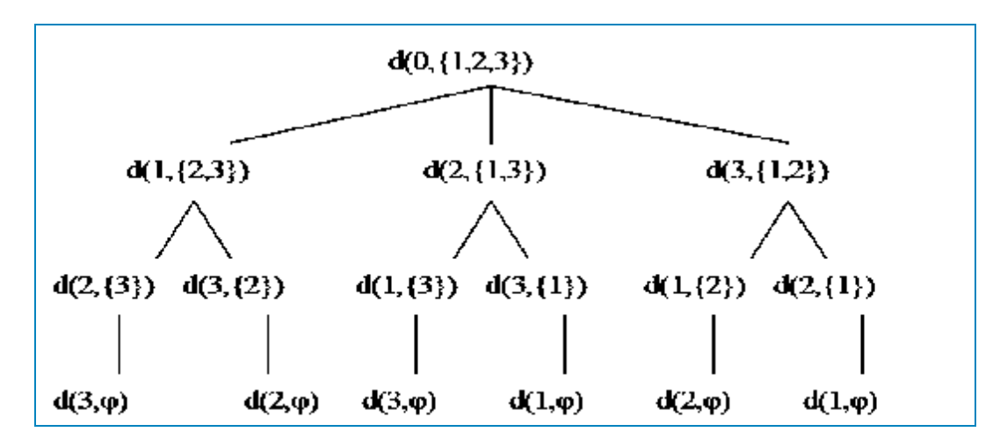
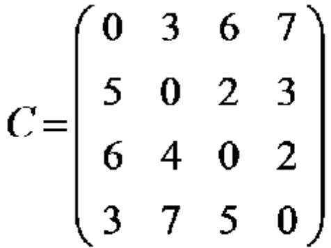
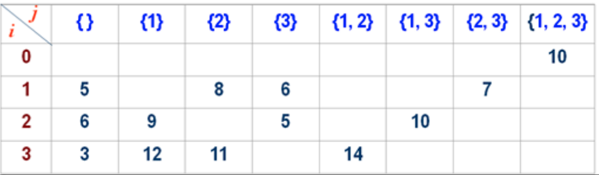
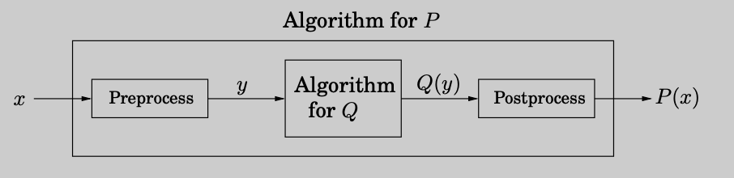
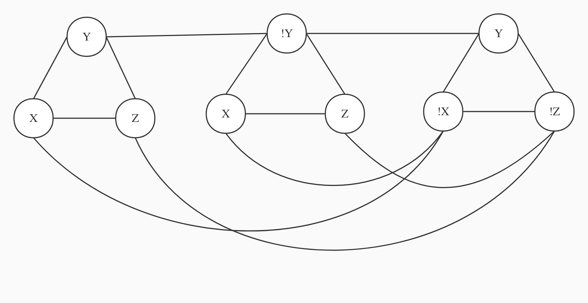
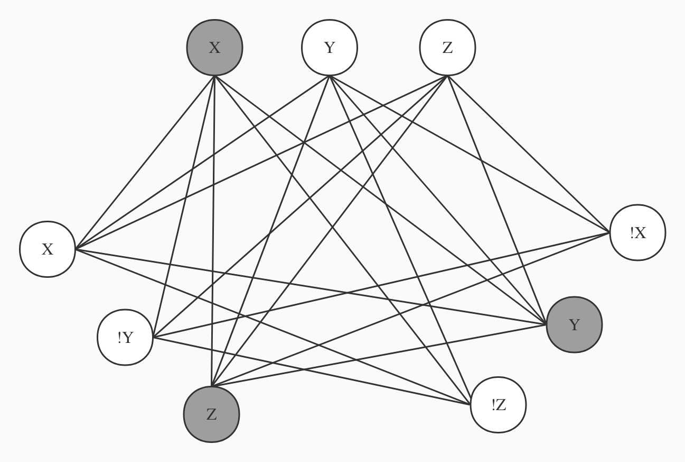
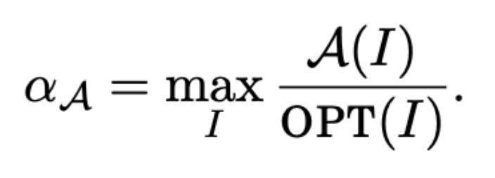

# NP-Completeness

## Definition (no problem/solution required)
**NP: classification of languages (read: problems) that can be solved via a non-deterministic Turing machine in polynomial time.**
before we talk about this question we must takl about turning machine.
In general, A Turing machine is a mathematical computational model that defines an abstract machine that manipulates symbols on a tape according to a table of rules. Although the model is simple, given any given computer algorithm, a Turing machine that simulates the logic of that algorithm can be constructed. Simply put, a Turing machine is an abstract machine that simulates the operation of an algorithm. It is defined like this:
- There is an infinite length of tape, this tape is divided into cells one after the other, the tape is used to write letters and symbols.
- A head that reads and writes tapes, this head is responsible for controlling the writing and left-right movement of the stack of tapes.
- A state register that stores the state of the Turing machine.
- A list of instructions that instructs the machine to perform specific operations based on the state the machine is currently in and the current symbols on the tape. For example: erasing or writing a symbol, moving the head left or right.

The Turing machine has an infinitely long paper tape, a finite state automaton (a state machine is a directed graph, the points are states, and the edges mark what characters to read, what operations to do, and which states to move to), and a read The write head can move left and right as well as read and write tape. For a problem, you first write the problem on a paper tape, and then according to what you read, according to the rules of state transition, you move to the next state. After the final calculation, when the state transitions to "yes", the Turing machine judges yes, otherwise it judges "no". No other computational model can be more powerful than a Turing machine.

#### Determining Turing Machines

In a Deterministic Turing Machine (DTM), its governing rules dictate that at most one action can be performed in any given situation. Deterministic Turing Machines have a transition function that, for a given state and symbol under the tape head, specifies three things: the symbol to be written to the tape, the direction in which the head should move (left, right, or neither direction), and subsequent states of limited control. For example, an X on the tape in state 3 might cause the DTM to write a Y on the tape, move the head one position to the right, and then switch to state 5.

#### Nondeterministic Turing Machine

In theoretical computer science, a nondeterministic Turing machine (NTM) is a theoretical computational model whose control rules specify multiple possible actions under some given circumstances. That is, the NTM's next state is not entirely determined by its actions and the current symbol it sees (unlike a deterministic Turing machine). For example, an X on a tape in state 3 might allow the NTM to: enter a Y, move to the right, then switch to state 5 or write an X, move to the left, and stay in state 3. So the question is, how to choose the next step for a non-deterministic Turing machine? In fact, NTM is lucky enough that it will always choose the step that will eventually lead to the accepting state. You can think of the branches of an NTM as many copies, each of which follows a possible transition. DTMs follow a single "computation path", while NTMs are "computation trees". If at least one branch in the tree leads to an accepting state, then the NTM accepts this input state. Let's look at the decision diagrams of the two:


NP is generally aimed at the decision problem. For example, in the SAT problem, we need to know whether a Boolean expression can be satisfied. There are only two cases of Yes and No. There are two definitions of NP problems:

- Problems whose solutions can be verified in polynomial time
- Problems that can be solved by a nondeterministic Turing machine in polynomial time

If we have a polynomial-time solution to a deterministic Turing machine verification problem, we can construct a non-deterministic Turing machine to "guess" the solution, and then use that machine to check whether the guess is correct. If we had a non-deterministic Turing machine solving this problem, then for every (possible) solution, it would only have one branch running (validating) that solution. So we only need to simulate the behavior of this non-deterministic Turing machine on a certain branch, and we can get a polynomial-time "verification machine".
## SAT

SATISFIABILITY, or SAT (recall Exercise 3.28 and Section 5.3), is a problem of great practical importance, with applications ranging from chip testing and computer design to image analy- sis and software engineering. It is also a canonical hard problem. Here’s what an instance of SAT looks like:


SAT is a typical search problem. Given an instance I (i.e. some input data specifying the problem at hand, in this case a Boolean formula in conjunctive normal form), we are asked to find a solution S (an object satisfying a certain specification, in this case is an assignment that satisfies each clause). If no such solution exists, we say no.

For SAT, if someone tells you that a Boolean expression can be satisfied, and then he gives a set of solutions, you can easily verify whether the set of solutions can satisfy the Boolean expression. But if someone tells you that a boolean expression cannot be satisfied, you have no way to easily verify that he is right. If coSAT is defined as the set of all unsatisfiable Boolean expressions, then verifying that a Boolean expression is not in coSAT is coNP (and coNP-complete)


#### definition for a search problem

A search problem is specified by an algorithm C that takes two inputs, an instance I and a proposed solution S, and runs in time polynomial in |I|. We say S is a solution to I if and only if C(I, S) = true.


#### exercise

A family of three went to a Toyota 4s store to buy a car. In order to meet the requirements of all, each person puts forward three requirements according to the possible situation. Daddy wanted an SUV with a V6 engine and a third row of seats. Mom thinks gas is too expensive recently and wants to buy a small SUV with no V6 engine and a third row of seats. The child is a jeep Wrangler enthusiast. He only likes the powerful horsepower provided by the V6 engine of this car. This is not an SUV, but an off-road vehicle. And there's no third-row seat either.Use the sat method to check whether they have a feasible solution.

#### solution
- Variable: 
> SUV=x, 
> 
> V6=y, 
> 
> third row seats=z


- The set of clause will be, ! means no here.
> ( x V y V z ) ( x V !y V z ) ( !x V y V !z )

In this case an SUV with v6 engine and third row seats will satisfy this sat clause. In this case ( x V y V z ) ( x V !y V z ) ( !x V y V !z ) is true.

## TSP

**description of the TSP problem**
In a complete graph with n cities, a traveler wishing to make an itinerary, or experience a Hamiltonian circuit, can visit each city exactly once and eventually return to the departure city. The total cost of this tour is the sum of the cost of visiting each city, so the traveler also hopes that the cost of the entire itinerary is the lowest. What is the arrangement strategy for this route?


**The essence of the TSP problem can be abstracted as:**
In a completely undirected graph with weights, find a Hamiltonian circuit with the smallest sum of weights.
The TSP problem translated into mathematical language is, in a completely undirected graph G of N cities.

**completely undirected graph**
$ G(N,A) $

$N={1,2,...,n}$

$ A={(i,j)|i,j	\in N}$

**two dimensional matrix recording the distance between each city:**
$(d{i}{j}){n}{n} $  distance_matrix=[n][n]

**distance between cities:**
$min$ $ f(w)=\sum_1^n(d {il-li}) $

The variable to be solved is w, and w is an arrangement that makes the objective function reach the minimum value.And the last item of w is satisfied to return to the departure city.
$w=(w1,w2,w3,w4....wn)$

Obviously, there are N! combinations for the combination solution of the TSP problem. As the scale of the number of cities N increases, the number of combinations will increase exponentially. Therefore, using the exhaustive method will face the problem of combination explosion, so TSP is an NP-complete problem.

#### exercise
solve tsp problem with dynamic programming
#### solution

The TSP problem (Traveling Salesman Problem) means that a traveler wants to travel n cities, requires each city to experience and only once and then returns to the departure city, and requires the shortest distance traveled.
Suppose there are four cities, 0, 1, 2, 3, the cost between them is shown in Figure 1, which can be stored in the form of a two-dimensional table.Now we have to start from city 0 and return to 0 at the end. During the period 1, 2, and 3 must pass through only once, so as to minimize the cost.


2. Dynamic programming feasibility
Let s, s1, s2, …, sp, s be a simple circuit with the shortest path length from s. Assuming that from s to the next city s1 has been found, the problem is transformed into finding the shortest path from s1 to s, Obviously, s1, s2, …, sp, s must constitute a shortest path from s1 to s, so the TSP problem is of the nature of the optimal substructure, and it is reasonable to use dynamic programming to solve it.

3. Derive the dynamic programming equation
        Suppose starting from vertex s, let d(i, V') denote the shortest path length from vertex i to each vertex in V' (which is a set of points) once and only once, and finally back to the starting point s.

        Derivation: (discuss by case)

        ①When V' is an empty set, then d(i, V') means that it returns to s without passing through any point from i, as shown in the figure above, city 3->city 0 (0 is the starting city). At this time, d(i, V')=Cis (that is, the distance from city i to city s),

        ②If V' is not empty, then it is the optimal solution to the sub-problem. You have to try each one in the set of cities V' and find the best solution.

           d(i, V’)=min{Cik + d(k, V’-{k})}

Note: Cik represents the distance between your chosen city and city i, and d(k, V'-{k}) is a sub-problem.
        In summary, the dynamic programming equation of the TSP problem comes out:


4. Case Analysis
The example in the problem definition is now used to illustrate the TSP solution process. (Assume the departure city is 0 city)


    ① The final result we require is d(0,{1,2,3}), which means that        starting from city 0, passing through the cities in {1,2,3} and only       once, find the shortest path.

    ②d(0,{1,2,3}) cannot be calculated at once, so how is his value obtained? Looking at the second layer of the above figure, the second layer indicates the value that d(0,{1,2,3}) needs to depend on. Then we get:
```python
       d(0,{1,2,3})=min{
                undefined

                C01+d(1,{2,3})

                C02+d{2,{1,3}}

                C03+d{3,{1,2}}

                }
```
    
③d(1,{2,3}), d(2,{1,3}), d(3,{1,2}) are also not solved in one step, and their solutions also need to be dependent, For example, d(1,{2,3})

```python
       d(1,{2,3})=min{undefined

                C12+d(2,{3})                             

                C13+d(3,{2})

                }
```

d(2,{1,3}), d(3,{1,2}) also need to be calculated like this


④According to the above idea, only the last layer, when V' is an empty set, the value of Cis can be calculated, and its value is directly from the



5. Programming ideas
Convert d(i, V') into a two-dimensional table, d[i][j]


## Reductions

 If any subroutine for task Q can also be used to solve P , we say P reduces to Q. Often, P is solvable by a single call to Q’s subroutine, which means any instance x of P can be transformed into an instance y of Q such that P (x) can be deduced from Q(y):



Reduction enhances the power of an algorithm: once we have an algorithm for problem Q (e.g., possibly the shortest path), we can use it to solve other problems


- two way to use reduction

#### exercise
A family of three went to a Toyota 4s store to buy a car. In order to meet the requirements of all, each person puts forward three requirements according to the possible situation. Daddy wanted an SUV with a V6 engine and a third row of seats. Mom thinks gas is too expensive recently and wants to buy a small SUV with no V6 engine and a third row of seats. The child is a jeep Wrangler enthusiast. He only likes the powerful horsepower provided by the V6 engine of this car. This is not an SUV, but an off-road vehicle. And there's no third-row seat either.Use the sat method to check whether they have a feasible solution.

Try to reduce the above problems into an independent set.

#### solution

It is known that 3-SAT is an NP-hard problem, and 3-SAT can be reduced to an independent set problem in polynomial time, which means that the independent set problem is also an NP-hard problem. It needs to be shown that, given a 3-SAT problem instance Ф with k sentences, construct a graph that has independent sets of size k if and only if Ф is satisfied.

- Step 1 Construct an instance of the 3-SAT problem

- Variable: 
> SUV=x, 
> 
> V6=y, 
> 
> third row seats=z
> 
>( x V y V z ) ( x V !y V z ) ( !x V y V !z )

Here 3 sentences (k=3) are constructed, each sentence contains yes/inform of three variables.

- step2 structure diagram
Each sentence is represented by three connected vertices
The yes and no values connecting each variable, such as x1 and !x1



- The third step is to prove
The correctness of the    specification requires two-way proof, that is, if the independent set exists, then Ф is satisfied; if Ф is satisfied, then the independent set exists.
=>
   There is an independent set of size k in the graph G, then there must be a point in each triangle in the independent set (the points in the triangle are adjacent and not independent);
   Set the value of these k points (variables) to true, then the values of all other points can be determined;
  Because the k points are in k different sentences, then Ф can be satisfied and the proof is obtained.
<=
  Ф is satisfied, select three variables in k sentences and set them to true, they correspond to k points in k triangles in graph G;
   These k points just constitute an independent set of size k of graph G (because the opposite variables will not be true at the same time, that is, they will not be in k points at the same time), which is proved.

Ⅱ. Vertex Cover ≡p Independent Set
Vertex cover: there is a subset V'∈V in the graph G=(V, E), any edge (u,v)∈E, there is u∈V or v∈U (any edge in the graph G There is at least one endpoint in the set V'), then the set V' is a point cover of the graph G. Such a minimum set V' is called the minimum point cover of the graph G.

**prove**
  S is an independent set of graph G=(V, E) if and only if V-S is a point cover. (Independent set and point coverage complement each other)
=>
  S is any independent set of graph G
   Then any edge (u,v)∈E, has u ∉ S or v ∉ S; then u∈V-S or v∈V-S
   So any edge of the graph has at least one endpoint in the set V-S, which is a point cover
<=
  V-S is any point cover of graph G
   Then any edge (u, v)∈E, has u∈V-S or v∈V-S; then u ∉ S or v ∉ S
   So at least one endpoint of any edge of the graph is not in the set S, and the set S is an independent set
certified.


- Independent Set ≤p Clique
There is an independent set S in the    graph G=(V, E) if and only if in G's complement G'=(V, E'), S is a clique. (Complementary image: the point remains unchanged, and the edge is complemented)
=>
  There is an independent set S in the graph G, then any u, v∈S has (u, v) ∉ E;
   Then (u, v)∈E', that is, in graph G', any two points in the set of S have connected edges; so S is a group of graph G'.
<=
  There is a group S in the graph G', then any u, v∈S, there is (u, v)∈E';
   Then (u, v) ∉ E, that is, in graph G, any two points in the set of S are not connected; so S is an independent set of graph G.

## Getting around NP-Completeness (no problem/solution required)


Classification of solutions to NP-hard problems, possibly yielding
Occasional optimal solution, but considered "close enough"
application.
● How do we measure "close enough"? Usually we have an approximation
The ratio formula is as follows:


Where A(I) represents the value out of our approximation algorithm, and 
OPT(I) represents the value out of the optimal solution for input I. This is also 
sometimes called c-approximation where c is this ratio a .


