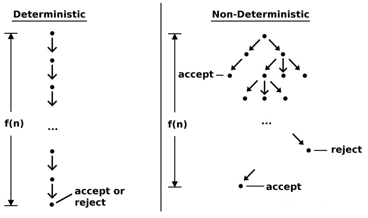
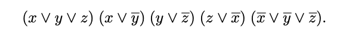

# NP-Completeness

## Definition (no problem/solution required)
**NP: classification of languages (read: problems) that can be solved via a non-deterministic Turing machine in polynomial time.**
before we talk about this question we must takl about turning machine.
In general, A Turing machine is a mathematical computational model that defines an abstract machine that manipulates symbols on a tape according to a table of rules. Although the model is simple, given any given computer algorithm, a Turing machine that simulates the logic of that algorithm can be constructed. Simply put, a Turing machine is an abstract machine that simulates the operation of an algorithm. It is defined like this:
- There is an infinite length of tape, this tape is divided into cells one after the other, the tape is used to write letters and symbols.
- A head that reads and writes tapes, this head is responsible for controlling the writing and left-right movement of the stack of tapes.
- A state register that stores the state of the Turing machine.
- A list of instructions that instructs the machine to perform specific operations based on the state the machine is currently in and the current symbols on the tape. For example: erasing or writing a symbol, moving the head left or right.

The Turing machine has an infinitely long paper tape, a finite state automaton (a state machine is a directed graph, the points are states, and the edges mark what characters to read, what operations to do, and which states to move to), and a read The write head can move left and right as well as read and write tape. For a problem, you first write the problem on a paper tape, and then according to what you read, according to the rules of state transition, you move to the next state. After the final calculation, when the state transitions to "yes", the Turing machine judges yes, otherwise it judges "no". No other computational model can be more powerful than a Turing machine.

## Determining Turing Machines

In a Deterministic Turing Machine (DTM), its governing rules dictate that at most one action can be performed in any given situation. Deterministic Turing Machines have a transition function that, for a given state and symbol under the tape head, specifies three things: the symbol to be written to the tape, the direction in which the head should move (left, right, or neither direction), and subsequent states of limited control. For example, an X on the tape in state 3 might cause the DTM to write a Y on the tape, move the head one position to the right, and then switch to state 5.

## Nondeterministic Turing Machine

In theoretical computer science, a nondeterministic Turing machine (NTM) is a theoretical computational model whose control rules specify multiple possible actions under some given circumstances. That is, the NTM's next state is not entirely determined by its actions and the current symbol it sees (unlike a deterministic Turing machine). For example, an X on a tape in state 3 might allow the NTM to: enter a Y, move to the right, then switch to state 5 or write an X, move to the left, and stay in state 3. So the question is, how to choose the next step for a non-deterministic Turing machine? In fact, NTM is lucky enough that it will always choose the step that will eventually lead to the accepting state. You can think of the branches of an NTM as many copies, each of which follows a possible transition. DTMs follow a single "computation path", while NTMs are "computation trees". If at least one branch in the tree leads to an accepting state, then the NTM accepts this input state. Let's look at the decision diagrams of the two:

NP is generally aimed at the decision problem. For example, in the SAT problem, we need to know whether a Boolean expression can be satisfied. There are only two cases of Yes and No. There are two definitions of NP problems:

- Problems whose solutions can be verified in polynomial time
- Problems that can be solved by a nondeterministic Turing machine in polynomial time

If we have a polynomial-time solution to a deterministic Turing machine verification problem, we can construct a non-deterministic Turing machine to "guess" the solution, and then use that machine to check whether the guess is correct. If we had a non-deterministic Turing machine solving this problem, then for every (possible) solution, it would only have one branch running (validating) that solution. So we only need to simulate the behavior of this non-deterministic Turing machine on a certain branch, and we can get a polynomial-time "verification machine".
## SAT

SATISFIABILITY, or SAT (recall Exercise 3.28 and Section 5.3), is a problem of great practical importance, with applications ranging from chip testing and computer design to image analy- sis and software engineering. It is also a canonical hard problem. Here’s what an instance of SAT looks like:

SAT is a typical search problem. Given an instance I (i.e. some input data specifying the problem at hand, in this case a Boolean formula in conjunctive normal form), we are asked to find a solution S (an object satisfying a certain specification, in this case is an assignment that satisfies each clause). If no such solution exists, we say no.

For SAT, if someone tells you that a Boolean expression can be satisfied, and then he gives a set of solutions, you can easily verify whether the set of solutions can satisfy the Boolean expression. But if someone tells you that a boolean expression cannot be satisfied, you have no way to easily verify that he is right. If coSAT is defined as the set of all unsatisfiable Boolean expressions, then verifying that a Boolean expression is not in coSAT is coNP (and coNP-complete)

#### definition for a search problem

A search problem is specified by an algorithm C that takes two inputs, an instance I and a proposed solution S, and runs in time polynomial in |I|. We say S is a solution to I if and only if C(I, S) = true.

## TSP

**description of the TSP problem**
In a complete graph with n cities, a traveler wishing to make an itinerary, or experience a Hamiltonian circuit, can visit each city exactly once and eventually return to the departure city. The total cost of this tour is the sum of the cost of visiting each city, so the traveler also hopes that the cost of the entire itinerary is the lowest. What is the arrangement strategy for this route?

**The essence of the TSP problem can be abstracted as:**
In a completely undirected graph with weights, find a Hamiltonian circuit with the smallest sum of weights.
The TSP problem translated into mathematical language is, in a completely undirected graph G of N cities.

**completely undirected graph**
$ G(N,A) $

$N={1,2,...,n}$

$ A={(i,j)|i,j	\in N}$

**two dimensional matrix recording the distance between each city:**
$(d{i}{j}){n}{n} $  distance_matrix=[n][n]

**distance between cities:**
$min$ $ f(w)=\sum_1^n(d {il-li}) $

The variable to be solved is w, and w is an arrangement that makes the objective function reach the minimum value.And the last item of w is satisfied to return to the departure city.
$w=(w1,w2,w3,w4....wn)$

Obviously, there are N! combinations for the combination solution of the TSP problem. As the scale of the number of cities N increases, the number of combinations will increase exponentially. Therefore, using the exhaustive method will face the problem of combination explosion, so TSP is an NP-complete problem.

● Reductions
- two way to use reduction
● Getting around NP-Completeness (no problem/solution required)

