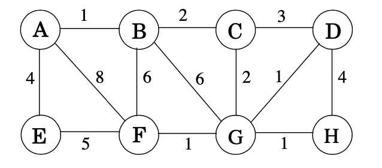

#### 1.) Apply the Bellman-Ford algorithm on the following graph, with source vertex A to all vertices in our graph. Show all steps.


Bellman-ford simply update all the edges, |V | − 1 times. In this graph V, the number of vertex is 8. the number of edge is 10. So, strictly, if the judgment of each edge is viewed as a step, we will have 70 steps.
The final unswer is 
- dist =  {'A': 0, 'B': 3, 'C': 7, 'D': 7, 'E': 2, 'F': 9, 'G': 10, 'H': 0}
- Previous_node =  {'A': None, 'B': 'A', 'C': 'B', 'D': 'H', 'E': 'D', 'F': 'D', 'G': 'F', 'H': 'B'}

> current i is  0
> - step 1 --------------
u is  A and v is  B
dist[v]= 10000
graph[u][v] + dist[u]= 3
Apparently,dist[v] > graph[u][v] + dist[u]
dist is  {'A': 0, 'B': 3, 'C': 10000, 'D': 10000, 'E': 10000, 'F': 10000, 'G': 10000, 'H': 10000}
Previous is  {'A': None, 'B': 'A', 'C': None, 'D': None, 'E': None, 'F': None, 'G': None, 'H': None}
> - step 2 --------------
u is  B and v is  C
dist[v]= 10000
graph[u][v] + dist[u]= 7
Apparently,dist[v] > graph[u][v] + dist[u]
> - step 3 --------------
u is  B and v is  H
dist[v]= 10000
graph[u][v] + dist[u]= 0
Apparently,dist[v] > graph[u][v] + dist[u]
dist is  {'A': 0, 'B': 3, 'C': 7, 'D': 10000, 'E': 10000, 'F': 10000, 'G': 10000, 'H': 0}
Previous is  {'A': None, 'B': 'A', 'C': 'B', 'D': None, 'E': None, 'F': None, 'G': None, 'H': 'B'}
> - step 4 --------------
u is  C and v is  D
dist[v]= 10000
graph[u][v] + dist[u]= 9
Apparently,dist[v] > graph[u][v] + dist[u]
dist is  {'A': 0, 'B': 3, 'C': 7, 'D': 9, 'E': 10000, 'F': 10000, 'G': 10000, 'H': 0}
Previous is  {'A': None, 'B': 'A', 'C': 'B', 'D': 'C', 'E': None, 'F': None, 'G': None, 'H': 'B'}
> - step 5 --------------
u is  D and v is  E
dist[v]= 10000
graph[u][v] + dist[u]= 4
Apparently,dist[v] > graph[u][v] + dist[u]
> - step 6 --------------
u is  D and v is  F
dist[v]= 10000
graph[u][v] + dist[u]= 11
Apparently,dist[v] > graph[u][v] + dist[u]
dist is  {'A': 0, 'B': 3, 'C': 7, 'D': 9, 'E': 4, 'F': 11, 'G': 10000, 'H': 0}
Previous is  {'A': None, 'B': 'A', 'C': 'B', 'D': 'C', 'E': 'D', 'F': 'D', 'G': None, 'H': 'B'}
> - step 7 --------------
u is  E and v is  B
dist[v]= 3
graph[u][v] + dist[u]= 6
dist is  {'A': 0, 'B': 3, 'C': 7, 'D': 9, 'E': 4, 'F': 11, 'G': 10000, 'H': 0}
Previous is  {'A': None, 'B': 'A', 'C': 'B', 'D': 'C', 'E': 'D', 'F': 'D', 'G': None, 'H': 'B'}
> - step 8 --------------
u is  F and v is  G
dist[v]= 10000
graph[u][v] + dist[u]= 12
Apparently,dist[v] > graph[u][v] + dist[u]
dist is  {'A': 0, 'B': 3, 'C': 7, 'D': 9, 'E': 4, 'F': 11, 'G': 12, 'H': 0}
Previous is  {'A': None, 'B': 'A', 'C': 'B', 'D': 'C', 'E': 'D', 'F': 'D', 'G': 'F', 'H': 'B'}
> - step 9 --------------
u is  G and v is  H
dist[v]= 0
graph[u][v] + dist[u]= 20
dist is  {'A': 0, 'B': 3, 'C': 7, 'D': 9, 'E': 4, 'F': 11, 'G': 12, 'H': 0}
Previous is  {'A': None, 'B': 'A', 'C': 'B', 'D': 'C', 'E': 'D', 'F': 'D', 'G': 'F', 'H': 'B'}
> - step 10 --------------
u is  H and v is  D
dist[v]= 9
graph[u][v] + dist[u]= 7
Apparently,dist[v] > graph[u][v] + dist[u]
dist is  {'A': 0, 'B': 3, 'C': 7, 'D': 7, 'E': 4, 'F': 11, 'G': 12, 'H': 0}
Previous is  {'A': None, 'B': 'A', 'C': 'B', 'D': 'H', 'E': 'D', 'F': 'D', 'G': 'F', 'H': 'B'}

> current i is  1
> - step 11 --------------
u is  A and v is  B
dist[v]= 3
graph[u][v] + dist[u]= 3
dist is  {'A': 0, 'B': 3, 'C': 7, 'D': 7, 'E': 4, 'F': 11, 'G': 12, 'H': 0}
Previous is  {'A': None, 'B': 'A', 'C': 'B', 'D': 'H', 'E': 'D', 'F': 'D', 'G': 'F', 'H': 'B'}
> - step 12 --------------
u is  B and v is  C
dist[v]= 7
graph[u][v] + dist[u]= 7
> - step 13 --------------
u is  B and v is  H
dist[v]= 0
graph[u][v] + dist[u]= 0
dist is  {'A': 0, 'B': 3, 'C': 7, 'D': 7, 'E': 4, 'F': 11, 'G': 12, 'H': 0}
Previous is  {'A': None, 'B': 'A', 'C': 'B', 'D': 'H', 'E': 'D', 'F': 'D', 'G': 'F', 'H': 'B'}
> - step 14 --------------
u is  C and v is  D
dist[v]= 7
graph[u][v] + dist[u]= 9
dist is  {'A': 0, 'B': 3, 'C': 7, 'D': 7, 'E': 4, 'F': 11, 'G': 12, 'H': 0}
Previous is  {'A': None, 'B': 'A', 'C': 'B', 'D': 'H', 'E': 'D', 'F': 'D', 'G': 'F', 'H': 'B'}
> - step 15 --------------
u is  D and v is  E
dist[v]= 4
graph[u][v] + dist[u]= 2
Apparently,dist[v] > graph[u][v] + dist[u]
> - step 16 --------------
u is  D and v is  F
dist[v]= 11
graph[u][v] + dist[u]= 9
Apparently,dist[v] > graph[u][v] + dist[u]
dist is  {'A': 0, 'B': 3, 'C': 7, 'D': 7, 'E': 2, 'F': 9, 'G': 12, 'H': 0}
Previous is  {'A': None, 'B': 'A', 'C': 'B', 'D': 'H', 'E': 'D', 'F': 'D', 'G': 'F', 'H': 'B'}
> - step 17 --------------
u is  E and v is  B
dist[v]= 3
graph[u][v] + dist[u]= 4
dist is  {'A': 0, 'B': 3, 'C': 7, 'D': 7, 'E': 2, 'F': 9, 'G': 12, 'H': 0}
Previous is  {'A': None, 'B': 'A', 'C': 'B', 'D': 'H', 'E': 'D', 'F': 'D', 'G': 'F', 'H': 'B'}
> - step 18 --------------
u is  F and v is  G
dist[v]= 12
graph[u][v] + dist[u]= 10
Apparently,dist[v] > graph[u][v] + dist[u]
dist is  {'A': 0, 'B': 3, 'C': 7, 'D': 7, 'E': 2, 'F': 9, 'G': 10, 'H': 0}
Previous is  {'A': None, 'B': 'A', 'C': 'B', 'D': 'H', 'E': 'D', 'F': 'D', 'G': 'F', 'H': 'B'}
> - step 19 --------------
u is  G and v is  H
dist[v]= 0
graph[u][v] + dist[u]= 18
dist is  {'A': 0, 'B': 3, 'C': 7, 'D': 7, 'E': 2, 'F': 9, 'G': 10, 'H': 0}
Previous is  {'A': None, 'B': 'A', 'C': 'B', 'D': 'H', 'E': 'D', 'F': 'D', 'G': 'F', 'H': 'B'}
> - step 20 --------------
u is  H and v is  D
dist[v]= 7
graph[u][v] + dist[u]= 7
dist is  {'A': 0, 'B': 3, 'C': 7, 'D': 7, 'E': 2, 'F': 9, 'G': 10, 'H': 0}
Previous is  {'A': None, 'B': 'A', 'C': 'B', 'D': 'H', 'E': 'D', 'F': 'D', 'G': 'F', 'H': 'B'}

> current i is  2  
> - step 21 --------------
u is  A and v is  B
dist[v]= 3
graph[u][v] + dist[u]= 3
dist is  {'A': 0, 'B': 3, 'C': 7, 'D': 7, 'E': 2, 'F': 9, 'G': 10, 'H': 0}
Previous is  {'A': None, 'B': 'A', 'C': 'B', 'D': 'H', 'E': 'D', 'F': 'D', 'G': 'F', 'H': 'B'}
> - step 22 --------------
u is  B and v is  C
dist[v]= 7
graph[u][v] + dist[u]= 7
> - step 23 --------------
u is  B and v is  H
dist[v]= 0
graph[u][v] + dist[u]= 0
dist is  {'A': 0, 'B': 3, 'C': 7, 'D': 7, 'E': 2, 'F': 9, 'G': 10, 'H': 0}
Previous is  {'A': None, 'B': 'A', 'C': 'B', 'D': 'H', 'E': 'D', 'F': 'D', 'G': 'F', 'H': 'B'}
> - step 24 --------------
u is  C and v is  D
dist[v]= 7
graph[u][v] + dist[u]= 9
dist is  {'A': 0, 'B': 3, 'C': 7, 'D': 7, 'E': 2, 'F': 9, 'G': 10, 'H': 0}
Previous is  {'A': None, 'B': 'A', 'C': 'B', 'D': 'H', 'E': 'D', 'F': 'D', 'G': 'F', 'H': 'B'}
> - step 25 --------------
u is  D and v is  E
dist[v]= 2
graph[u][v] + dist[u]= 2
> - step 26 --------------
u is  D and v is  F
dist[v]= 9
graph[u][v] + dist[u]= 9
dist is  {'A': 0, 'B': 3, 'C': 7, 'D': 7, 'E': 2, 'F': 9, 'G': 10, 'H': 0}
Previous is  {'A': None, 'B': 'A', 'C': 'B', 'D': 'H', 'E': 'D', 'F': 'D', 'G': 'F', 'H': 'B'}
> - step 27 --------------
u is  E and v is  B
dist[v]= 3
graph[u][v] + dist[u]= 4
dist is  {'A': 0, 'B': 3, 'C': 7, 'D': 7, 'E': 2, 'F': 9, 'G': 10, 'H': 0}
Previous is  {'A': None, 'B': 'A', 'C': 'B', 'D': 'H', 'E': 'D', 'F': 'D', 'G': 'F', 'H': 'B'}
> - step 28 --------------
u is  F and v is  G
dist[v]= 10
graph[u][v] + dist[u]= 10
dist is  {'A': 0, 'B': 3, 'C': 7, 'D': 7, 'E': 2, 'F': 9, 'G': 10, 'H': 0}
Previous is  {'A': None, 'B': 'A', 'C': 'B', 'D': 'H', 'E': 'D', 'F': 'D', 'G': 'F', 'H': 'B'}
> - step 29 --------------
u is  G and v is  H
dist[v]= 0
graph[u][v] + dist[u]= 18
dist is  {'A': 0, 'B': 3, 'C': 7, 'D': 7, 'E': 2, 'F': 9, 'G': 10, 'H': 0}
Previous is  {'A': None, 'B': 'A', 'C': 'B', 'D': 'H', 'E': 'D', 'F': 'D', 'G': 'F', 'H': 'B'}
> - step 30 --------------
u is  H and v is  D
dist[v]= 7
graph[u][v] + dist[u]= 7
dist is  {'A': 0, 'B': 3, 'C': 7, 'D': 7, 'E': 2, 'F': 9, 'G': 10, 'H': 0}
Previous is  {'A': None, 'B': 'A', 'C': 'B', 'D': 'H', 'E': 'D', 'F': 'D', 'G': 'F', 'H': 'B'}

> current i is  3  
> - step 31 --------------
u is  A and v is  B
dist[v]= 3
graph[u][v] + dist[u]= 3
dist is  {'A': 0, 'B': 3, 'C': 7, 'D': 7, 'E': 2, 'F': 9, 'G': 10, 'H': 0}
Previous is  {'A': None, 'B': 'A', 'C': 'B', 'D': 'H', 'E': 'D', 'F': 'D', 'G': 'F', 'H': 'B'}
> - step 32 --------------
u is  B and v is  C
dist[v]= 7
graph[u][v] + dist[u]= 7
> - step 33 --------------
u is  B and v is  H
dist[v]= 0
graph[u][v] + dist[u]= 0
dist is  {'A': 0, 'B': 3, 'C': 7, 'D': 7, 'E': 2, 'F': 9, 'G': 10, 'H': 0}
Previous is  {'A': None, 'B': 'A', 'C': 'B', 'D': 'H', 'E': 'D', 'F': 'D', 'G': 'F', 'H': 'B'}
> - step 34 --------------
u is  C and v is  D
dist[v]= 7
graph[u][v] + dist[u]= 9
dist is  {'A': 0, 'B': 3, 'C': 7, 'D': 7, 'E': 2, 'F': 9, 'G': 10, 'H': 0}
Previous is  {'A': None, 'B': 'A', 'C': 'B', 'D': 'H', 'E': 'D', 'F': 'D', 'G': 'F', 'H': 'B'}
> - step 35 --------------
u is  D and v is  E
dist[v]= 2
graph[u][v] + dist[u]= 2
> - step 36 --------------
u is  D and v is  F
dist[v]= 9
graph[u][v] + dist[u]= 9
dist is  {'A': 0, 'B': 3, 'C': 7, 'D': 7, 'E': 2, 'F': 9, 'G': 10, 'H': 0}
Previous is  {'A': None, 'B': 'A', 'C': 'B', 'D': 'H', 'E': 'D', 'F': 'D', 'G': 'F', 'H': 'B'}
> - step 37 --------------
u is  E and v is  B
dist[v]= 3
graph[u][v] + dist[u]= 4
dist is  {'A': 0, 'B': 3, 'C': 7, 'D': 7, 'E': 2, 'F': 9, 'G': 10, 'H': 0}
Previous is  {'A': None, 'B': 'A', 'C': 'B', 'D': 'H', 'E': 'D', 'F': 'D', 'G': 'F', 'H': 'B'}
> - step 38 --------------
u is  F and v is  G
dist[v]= 10
graph[u][v] + dist[u]= 10
dist is  {'A': 0, 'B': 3, 'C': 7, 'D': 7, 'E': 2, 'F': 9, 'G': 10, 'H': 0}
Previous is  {'A': None, 'B': 'A', 'C': 'B', 'D': 'H', 'E': 'D', 'F': 'D', 'G': 'F', 'H': 'B'}
> - step 39 --------------
u is  G and v is  H
dist[v]= 0
graph[u][v] + dist[u]= 18
dist is  {'A': 0, 'B': 3, 'C': 7, 'D': 7, 'E': 2, 'F': 9, 'G': 10, 'H': 0}
Previous is  {'A': None, 'B': 'A', 'C': 'B', 'D': 'H', 'E': 'D', 'F': 'D', 'G': 'F', 'H': 'B'}
> - step 40 --------------
u is  H and v is  D
dist[v]= 7
graph[u][v] + dist[u]= 7
dist is  {'A': 0, 'B': 3, 'C': 7, 'D': 7, 'E': 2, 'F': 9, 'G': 10, 'H': 0}
Previous is  {'A': None, 'B': 'A', 'C': 'B', 'D': 'H', 'E': 'D', 'F': 'D', 'G': 'F', 'H': 'B'}

> current i is  4  
> - step 41 --------------
u is  A and v is  B
dist[v]= 3
graph[u][v] + dist[u]= 3
dist is  {'A': 0, 'B': 3, 'C': 7, 'D': 7, 'E': 2, 'F': 9, 'G': 10, 'H': 0}
Previous is  {'A': None, 'B': 'A', 'C': 'B', 'D': 'H', 'E': 'D', 'F': 'D', 'G': 'F', 'H': 'B'}
> - step 42 --------------
u is  B and v is  C
dist[v]= 7
graph[u][v] + dist[u]= 7
> - step 43 --------------
u is  B and v is  H
dist[v]= 0
graph[u][v] + dist[u]= 0
dist is  {'A': 0, 'B': 3, 'C': 7, 'D': 7, 'E': 2, 'F': 9, 'G': 10, 'H': 0}
Previous is  {'A': None, 'B': 'A', 'C': 'B', 'D': 'H', 'E': 'D', 'F': 'D', 'G': 'F', 'H': 'B'}
> - step 44 --------------
u is  C and v is  D
dist[v]= 7
graph[u][v] + dist[u]= 9
dist is  {'A': 0, 'B': 3, 'C': 7, 'D': 7, 'E': 2, 'F': 9, 'G': 10, 'H': 0}
Previous is  {'A': None, 'B': 'A', 'C': 'B', 'D': 'H', 'E': 'D', 'F': 'D', 'G': 'F', 'H': 'B'}
> - step 45 --------------
u is  D and v is  E
dist[v]= 2
graph[u][v] + dist[u]= 2
> - step 46 --------------
u is  D and v is  F
dist[v]= 9
graph[u][v] + dist[u]= 9
dist is  {'A': 0, 'B': 3, 'C': 7, 'D': 7, 'E': 2, 'F': 9, 'G': 10, 'H': 0}
Previous is  {'A': None, 'B': 'A', 'C': 'B', 'D': 'H', 'E': 'D', 'F': 'D', 'G': 'F', 'H': 'B'}
> - step 47 --------------
u is  E and v is  B
dist[v]= 3
graph[u][v] + dist[u]= 4
dist is  {'A': 0, 'B': 3, 'C': 7, 'D': 7, 'E': 2, 'F': 9, 'G': 10, 'H': 0}
Previous is  {'A': None, 'B': 'A', 'C': 'B', 'D': 'H', 'E': 'D', 'F': 'D', 'G': 'F', 'H': 'B'}
> - step 48 --------------
u is  F and v is  G
dist[v]= 10
graph[u][v] + dist[u]= 10
dist is  {'A': 0, 'B': 3, 'C': 7, 'D': 7, 'E': 2, 'F': 9, 'G': 10, 'H': 0}
Previous is  {'A': None, 'B': 'A', 'C': 'B', 'D': 'H', 'E': 'D', 'F': 'D', 'G': 'F', 'H': 'B'}
> - step 49 --------------
u is  G and v is  H
dist[v]= 0
graph[u][v] + dist[u]= 18
dist is  {'A': 0, 'B': 3, 'C': 7, 'D': 7, 'E': 2, 'F': 9, 'G': 10, 'H': 0}
Previous is  {'A': None, 'B': 'A', 'C': 'B', 'D': 'H', 'E': 'D', 'F': 'D', 'G': 'F', 'H': 'B'}
> - step 50 --------------
u is  H and v is  D
dist[v]= 7
graph[u][v] + dist[u]= 7
dist is  {'A': 0, 'B': 3, 'C': 7, 'D': 7, 'E': 2, 'F': 9, 'G': 10, 'H': 0}
Previous is  {'A': None, 'B': 'A', 'C': 'B', 'D': 'H', 'E': 'D', 'F': 'D', 'G': 'F', 'H': 'B'}

> current i is  5  
> - step 51 --------------
u is  A and v is  B
dist[v]= 3
graph[u][v] + dist[u]= 3
dist is  {'A': 0, 'B': 3, 'C': 7, 'D': 7, 'E': 2, 'F': 9, 'G': 10, 'H': 0}
Previous is  {'A': None, 'B': 'A', 'C': 'B', 'D': 'H', 'E': 'D', 'F': 'D', 'G': 'F', 'H': 'B'}
> - step 52 --------------
u is  B and v is  C
dist[v]= 7
graph[u][v] + dist[u]= 7
> - step 53 --------------
u is  B and v is  H
dist[v]= 0
graph[u][v] + dist[u]= 0
dist is  {'A': 0, 'B': 3, 'C': 7, 'D': 7, 'E': 2, 'F': 9, 'G': 10, 'H': 0}
Previous is  {'A': None, 'B': 'A', 'C': 'B', 'D': 'H', 'E': 'D', 'F': 'D', 'G': 'F', 'H': 'B'}
> - step 54 --------------
u is  C and v is  D
dist[v]= 7
graph[u][v] + dist[u]= 9
dist is  {'A': 0, 'B': 3, 'C': 7, 'D': 7, 'E': 2, 'F': 9, 'G': 10, 'H': 0}
Previous is  {'A': None, 'B': 'A', 'C': 'B', 'D': 'H', 'E': 'D', 'F': 'D', 'G': 'F', 'H': 'B'}
> - step 55 --------------
u is  D and v is  E
dist[v]= 2
graph[u][v] + dist[u]= 2
> - step 56 --------------
u is  D and v is  F
dist[v]= 9
graph[u][v] + dist[u]= 9
dist is  {'A': 0, 'B': 3, 'C': 7, 'D': 7, 'E': 2, 'F': 9, 'G': 10, 'H': 0}
Previous is  {'A': None, 'B': 'A', 'C': 'B', 'D': 'H', 'E': 'D', 'F': 'D', 'G': 'F', 'H': 'B'}
> - step 57 --------------
u is  E and v is  B
dist[v]= 3
graph[u][v] + dist[u]= 4
dist is  {'A': 0, 'B': 3, 'C': 7, 'D': 7, 'E': 2, 'F': 9, 'G': 10, 'H': 0}
Previous is  {'A': None, 'B': 'A', 'C': 'B', 'D': 'H', 'E': 'D', 'F': 'D', 'G': 'F', 'H': 'B'}
> - step 58 --------------
u is  F and v is  G
dist[v]= 10
graph[u][v] + dist[u]= 10
dist is  {'A': 0, 'B': 3, 'C': 7, 'D': 7, 'E': 2, 'F': 9, 'G': 10, 'H': 0}
Previous is  {'A': None, 'B': 'A', 'C': 'B', 'D': 'H', 'E': 'D', 'F': 'D', 'G': 'F', 'H': 'B'}
> - step 59 --------------
u is  G and v is  H
dist[v]= 0
graph[u][v] + dist[u]= 18
dist is  {'A': 0, 'B': 3, 'C': 7, 'D': 7, 'E': 2, 'F': 9, 'G': 10, 'H': 0}
Previous is  {'A': None, 'B': 'A', 'C': 'B', 'D': 'H', 'E': 'D', 'F': 'D', 'G': 'F', 'H': 'B'}
> - step 60 --------------
u is  H and v is  D
dist[v]= 7
graph[u][v] + dist[u]= 7
dist is  {'A': 0, 'B': 3, 'C': 7, 'D': 7, 'E': 2, 'F': 9, 'G': 10, 'H': 0}
Previous is  {'A': None, 'B': 'A', 'C': 'B', 'D': 'H', 'E': 'D', 'F': 'D', 'G': 'F', 'H': 'B'}

> current i is  6  
> - step 61 --------------
u is  A and v is  B
dist[v]= 3
graph[u][v] + dist[u]= 3
dist is  {'A': 0, 'B': 3, 'C': 7, 'D': 7, 'E': 2, 'F': 9, 'G': 10, 'H': 0}
Previous is  {'A': None, 'B': 'A', 'C': 'B', 'D': 'H', 'E': 'D', 'F': 'D', 'G': 'F', 'H': 'B'}
> - step 62 --------------
u is  B and v is  C
dist[v]= 7
graph[u][v] + dist[u]= 7
> - step 63 --------------
u is  B and v is  H
dist[v]= 0
graph[u][v] + dist[u]= 0
dist is  {'A': 0, 'B': 3, 'C': 7, 'D': 7, 'E': 2, 'F': 9, 'G': 10, 'H': 0}
Previous is  {'A': None, 'B': 'A', 'C': 'B', 'D': 'H', 'E': 'D', 'F': 'D', 'G': 'F', 'H': 'B'}
> - step 64 --------------
u is  C and v is  D
dist[v]= 7
graph[u][v] + dist[u]= 9
dist is  {'A': 0, 'B': 3, 'C': 7, 'D': 7, 'E': 2, 'F': 9, 'G': 10, 'H': 0}
Previous is  {'A': None, 'B': 'A', 'C': 'B', 'D': 'H', 'E': 'D', 'F': 'D', 'G': 'F', 'H': 'B'}
> - step 65 --------------
u is  D and v is  E
dist[v]= 2
graph[u][v] + dist[u]= 2
> - step 66 --------------
u is  D and v is  F
dist[v]= 9
graph[u][v] + dist[u]= 9
dist is  {'A': 0, 'B': 3, 'C': 7, 'D': 7, 'E': 2, 'F': 9, 'G': 10, 'H': 0}
Previous is  {'A': None, 'B': 'A', 'C': 'B', 'D': 'H', 'E': 'D', 'F': 'D', 'G': 'F', 'H': 'B'}
> - step 67 --------------
u is  E and v is  B
dist[v]= 3
graph[u][v] + dist[u]= 4
dist is  {'A': 0, 'B': 3, 'C': 7, 'D': 7, 'E': 2, 'F': 9, 'G': 10, 'H': 0}
Previous is  {'A': None, 'B': 'A', 'C': 'B', 'D': 'H', 'E': 'D', 'F': 'D', 'G': 'F', 'H': 'B'}
> - step 68 --------------
u is  F and v is  G
dist[v]= 10
graph[u][v] + dist[u]= 10
dist is  {'A': 0, 'B': 3, 'C': 7, 'D': 7, 'E': 2, 'F': 9, 'G': 10, 'H': 0}
Previous is  {'A': None, 'B': 'A', 'C': 'B', 'D': 'H', 'E': 'D', 'F': 'D', 'G': 'F', 'H': 'B'}
> - step 69 --------------
u is  G and v is  H
dist[v]= 0
graph[u][v] + dist[u]= 18
dist is  {'A': 0, 'B': 3, 'C': 7, 'D': 7, 'E': 2, 'F': 9, 'G': 10, 'H': 0}
Previous is  {'A': None, 'B': 'A', 'C': 'B', 'D': 'H', 'E': 'D', 'F': 'D', 'G': 'F', 'H': 'B'}
> - step 70 --------------
u is  H and v is  D
dist[v]= 7
graph[u][v] + dist[u]= 7
dist is  {'A': 0, 'B': 3, 'C': 7, 'D': 7, 'E': 2, 'F': 9, 'G': 10, 'H': 0}
Previous is  {'A': None, 'B': 'A', 'C': 'B', 'D': 'H', 'E': 'D', 'F': 'D', 'G': 'F', 'H': 'B'}


## In a ***coloring*** of a graph, one assigns colors to the nodes such that any two nodes connected by an edge receive different colors. An optimal coloring is one which uses the fewest colors. For example, here is an optimal coloring of these two graphs.


#### (a) How long does this algorithm take? Justify

First, we use a greedy method for this algorithem.

> **Candidates** - vertices ,The color corresponding to each node

> **Selection** - color, we can use a list or dictionary to store the current number of color.  ```color={red:1,green:2 ....}```  ( we always select the smallest available color in it) 

> **Solution check** -  does every vertices are assigned a color? 


> **Feasibility check** - If there's at least one available color in color list. 


> **Select function** - check all the adjacency node of current node. If a color is used in one of it's adjacency color, the this color is unavailable, vice versa. Find the smallest available color.


> **Objective function** - an list or dictionary indicating $ {node1:color1,node2:color2 ....} $

This is a typical graph& greedy algorithem. We need to go through all the vertex of the graph, and in Select function we need to check all the nodes adjacency to the current node. So there will be at least two for loop. And we need to check smallest available at every for loop.
So the worst time complexity will be $O(V*(V+V))=O(2V^2)=O(V^2)$
```python
## this is presocode
def coloring()
    for vertex in graph:
        for nodes in vertex.adjacency_node:
            mark_unavailable_color in color_list
        check_smallest_available_color

def check_smallest_available_color():
    num=100000
    for i in color_list:
        if i is available and i[num]<num:
            num=i[num]

        
```

#### (b) Does the algorithm work? Justify
The unswer is no. This algorithem depending heavily on the order of node iteration.
Example:
If we loop following graph vertex in order of A,B,C,D,E, the color e will be green. In this situation, red is not available because e is adjacency to a red node. Green and blue are available. green is 1,blue is 2 , we choose green. We can color the graph with three color.


**However** , if we loop following the graph vertex in order of A,B,C,E,D. E will be red, because all color are available for E. And we have to add another color for D, because D's adjacency node's color is blue, green and red. We need at least four color in this order.


## 5.2. Suppose we want to find the minimum spanning tree of the following graph.

#### (a) Run Prim’s algorithm; whenever there is a choice of nodes, always use alphabetic ordering
(e.g., start from node A). Draw a table showing the intermediate values of the cost array.

| set(s)  | A | B     | C     | D     | E     | F     | G     | H     |
|---------|---|-------|-------|-------|-------|-------|-------|-------|
|         | 0 | 10000 | 10000 | 10000 | 10000 | 10000 | 10000 | 10000 |
| A       |   | 1     | 10000 | 10000 | 4     | 8     | 10000 | 10000 |
| A,B     |   |       | 2     | 10000 |       | 6     | 10000 | 10000 |
| A,B,C   |   |       |       | 3     |       | 6     | 2     | 10000 |
| A,B,C,G |   |       |       | 1     |       | 1     |       | 1     |

> - step 1 --------------
current u is  A  ,z is  B
cost[ B ]= 100000
Graph[ A ][ B ] is  1
apparently cost[ B ] > Graph[ A ][ B ]
*** update cost and previous ****
current cost is  {'A': 0, 'B': 1, 'C': 100000, 'D': 100000, 'E': 100000, 'F': 100000, 'G': 100000, 'H': 100000}
current prev is  {'A': None, 'B': 'A', 'C': None, 'D': None, 'E': None, 'F': None, 'G': None, 'H': None}
 
> - step 2 --------------
current u is  A  ,z is  E
cost[ E ]= 100000
Graph[ A ][ E ] is  4
apparently cost[ E ] > Graph[ A ][ E ]
*** update cost and previous ****
current cost is  {'A': 0, 'B': 1, 'C': 100000, 'D': 100000, 'E': 4, 'F': 100000, 'G': 100000, 'H': 100000}
current prev is  {'A': None, 'B': 'A', 'C': None, 'D': None, 'E': 'A', 'F': None, 'G': None, 'H': None}
 
> - step 3 --------------
current u is  A  ,z is  F
cost[ F ]= 100000
Graph[ A ][ F ] is  8
apparently cost[ F ] > Graph[ A ][ F ]
*** update cost and previous ****
current cost is  {'A': 0, 'B': 1, 'C': 100000, 'D': 100000, 'E': 4, 'F': 8, 'G': 100000, 'H': 100000}
current prev is  {'A': None, 'B': 'A', 'C': None, 'D': None, 'E': 'A', 'F': 'A', 'G': None, 'H': None}
 
> - step 4 --------------
current u is  B  ,z is  A
cost[ A ] is  0
Graph[ B ][ A ] is  1
apparently cost[ A ] < Graph[ B ][ A ]
no update continue
 
> - step 5 --------------
current u is  B  ,z is  C
cost[ C ]= 100000
Graph[ B ][ C ] is  2
apparently cost[ C ] > Graph[ B ][ C ]
*** update cost and previous ****
current cost is  {'A': 0, 'B': 1, 'C': 2, 'D': 100000, 'E': 4, 'F': 8, 'G': 100000, 'H': 100000}
current prev is  {'A': None, 'B': 'A', 'C': 'B', 'D': None, 'E': 'A', 'F': 'A', 'G': None, 'H': None}
 
> - step 6 --------------
current u is  B  ,z is  F
cost[ F ]= 8
Graph[ B ][ F ] is  6
apparently cost[ F ] > Graph[ B ][ F ]
*** update cost and previous ****
current cost is  {'A': 0, 'B': 1, 'C': 2, 'D': 100000, 'E': 4, 'F': 6, 'G': 100000, 'H': 100000}
current prev is  {'A': None, 'B': 'A', 'C': 'B', 'D': None, 'E': 'A', 'F': 'B', 'G': None, 'H': None}
 
> - step 7 --------------
current u is  B  ,z is  G
cost[ G ]= 100000
Graph[ B ][ G ] is  6
apparently cost[ G ] > Graph[ B ][ G ]
*** update cost and previous ****
current cost is  {'A': 0, 'B': 1, 'C': 2, 'D': 100000, 'E': 4, 'F': 6, 'G': 6, 'H': 100000}
current prev is  {'A': None, 'B': 'A', 'C': 'B', 'D': None, 'E': 'A', 'F': 'B', 'G': 'B', 'H': None}
 
> - step 8 --------------
current u is  C  ,z is  B
cost[ B ] is  1
Graph[ C ][ B ] is  2
apparently cost[ B ] < Graph[ C ][ B ]
no update continue
 
> - step 9 --------------
current u is  C  ,z is  D
cost[ D ]= 100000
Graph[ C ][ D ] is  3
apparently cost[ D ] > Graph[ C ][ D ]
*** update cost and previous ****
current cost is  {'A': 0, 'B': 1, 'C': 2, 'D': 3, 'E': 4, 'F': 6, 'G': 6, 'H': 100000}
current prev is  {'A': None, 'B': 'A', 'C': 'B', 'D': 'C', 'E': 'A', 'F': 'B', 'G': 'B', 'H': None}
 
> - step 10 --------------
current u is  C  ,z is  G
cost[ G ]= 6
Graph[ C ][ G ] is  2
apparently cost[ G ] > Graph[ C ][ G ]
*** update cost and previous ****
current cost is  {'A': 0, 'B': 1, 'C': 2, 'D': 3, 'E': 4, 'F': 6, 'G': 2, 'H': 100000}
current prev is  {'A': None, 'B': 'A', 'C': 'B', 'D': 'C', 'E': 'A', 'F': 'B', 'G': 'C', 'H': None}
 
> - step 11 --------------
current u is  G  ,z is  B
cost[ B ] is  1
Graph[ G ][ B ] is  6
apparently cost[ B ] < Graph[ G ][ B ]
no update continue
 
> - step 12 --------------
current u is  G  ,z is  C
cost[ C ] is  2
Graph[ G ][ C ] is  2
apparently cost[ C ] < Graph[ G ][ C ]
no update continue
 
> - step 13 --------------
current u is  G  ,z is  D
cost[ D ]= 3
Graph[ G ][ D ] is  1
apparently cost[ D ] > Graph[ G ][ D ]
*** update cost and previous ****
current cost is  {'A': 0, 'B': 1, 'C': 2, 'D': 1, 'E': 4, 'F': 6, 'G': 2, 'H': 100000}
current prev is  {'A': None, 'B': 'A', 'C': 'B', 'D': 'G', 'E': 'A', 'F': 'B', 'G': 'C', 'H': None}
 
> - step 14 --------------
current u is  G  ,z is  F
cost[ F ]= 6
Graph[ G ][ F ] is  1
apparently cost[ F ] > Graph[ G ][ F ]
*** update cost and previous ****
current cost is  {'A': 0, 'B': 1, 'C': 2, 'D': 1, 'E': 4, 'F': 1, 'G': 2, 'H': 100000}
current prev is  {'A': None, 'B': 'A', 'C': 'B', 'D': 'G', 'E': 'A', 'F': 'G', 'G': 'C', 'H': None}
 
> - step 15 --------------
current u is  G  ,z is  H
cost[ H ]= 100000
Graph[ G ][ H ] is  1
apparently cost[ H ] > Graph[ G ][ H ]
*** update cost and previous ****
current cost is  {'A': 0, 'B': 1, 'C': 2, 'D': 1, 'E': 4, 'F': 1, 'G': 2, 'H': 1}
current prev is  {'A': None, 'B': 'A', 'C': 'B', 'D': 'G', 'E': 'A', 'F': 'G', 'G': 'C', 'H': 'G'}
 
> - step 16 --------------
current u is  D  ,z is  C
cost[ C ] is  2
Graph[ D ][ C ] is  3
apparently cost[ C ] < Graph[ D ][ C ]
no update continue
 
> - step 17 --------------
current u is  D  ,z is  G
cost[ G ] is  2
Graph[ D ][ G ] is  1
apparently cost[ G ] < Graph[ D ][ G ]
no update continue
 
> - step 18 --------------
current u is  D  ,z is  H
cost[ H ] is  1
Graph[ D ][ H ] is  4
apparently cost[ H ] < Graph[ D ][ H ]
no update continue
 
> - step 19 --------------
current u is  F  ,z is  A
cost[ A ] is  0
Graph[ F ][ A ] is  8
apparently cost[ A ] < Graph[ F ][ A ]
no update continue
 
> - step 20 --------------
current u is  F  ,z is  B
cost[ B ] is  1
Graph[ F ][ B ] is  6
apparently cost[ B ] < Graph[ F ][ B ]
no update continue
 
> - step 21 --------------
current u is  F  ,z is  E
cost[ E ] is  4
Graph[ F ][ E ] is  5
apparently cost[ E ] < Graph[ F ][ E ]
no update continue
 
> - step 22 --------------
current u is  F  ,z is  G
cost[ G ] is  2
Graph[ F ][ G ] is  1
apparently cost[ G ] < Graph[ F ][ G ]
no update continue
 
> - step 23 --------------
current u is  H  ,z is  D
cost[ D ] is  1
Graph[ H ][ D ] is  4
apparently cost[ D ] < Graph[ H ][ D ]
no update continue
 
> - step 24 --------------
current u is  H  ,z is  G
cost[ G ] is  2
Graph[ H ][ G ] is  1
apparently cost[ G ] < Graph[ H ][ G ]
no update continue
 
> - step 25 --------------
current u is  E  ,z is  A
cost[ A ] is  0
Graph[ E ][ A ] is  4
apparently cost[ A ] < Graph[ E ][ A ]
no update continue
 
> - step 26 --------------
current u is  E  ,z is  F
cost[ F ] is  1
Graph[ E ][ F ] is  5
apparently cost[ F ] < Graph[ E ][ F ]
no update continue


 

#### (b) Run Kruskal’s algorithm on the same graph. Show how the disjoint-sets data structure looks at every intermediate stage (including the structure of the directed trees), assuming path compression is used.

> - First we sort the edge with Ascending order.
(A-B)=1
(D-G)=1
(F-G)=1
(G-H)=1
(B-C)=2
(C-G)=2
(C-D)=3
(A-E)=4
(D-H)=4
(E-F)=5
(B-F)=6
(B-G)=6
(A-F)=8

> - Secondly, makeset(A),makeset(B),...,makeset(G),makeset(H):

> - Then we start run union by rank on the disjoint set.

**number behind( is the rank of node**

> - step 1 Union (A,B)
**Directed Graph**

 Disjoint set is 

> - step 2 Union (D,G)
> **Directed Graph**

 Disjoint set is 

> - step 3 Union (F,G)
> **Directed Graph**

 Disjoint set is 

> - step 4 Union (G,H)
> **Directed Graph**

 Disjoint set is 

> - step 5 Union (B,C)
> **Directed Graph**

 Disjoint set is 

> - step 6 Union (C,G)
> **Directed Graph**

 Disjoint set is 

Then we do the path compression on the immediate directed tree


> - step 7 Union (C,D)
> C and D are already in one set, we igore this path
> - step 8 Union (A,E)
> **Directed Graph**

 Disjoint set is 

## 5.13. A long string consists of the four characters A,C,G,T; they appear with frequency 31%,20%,9%, and 40%, respectively. What is the Huffman encoding of these four characters?

> Sort the character in descending order

T = 40%
A = 31%
C = 20%
G = 9%

> step1 temporary character X=G +C=29%

T = 40%
A = 31%
X = 29%
C = 20%
G = 9%


> step2 temporary character Y=A +X=60%

T = 40%
Y = 60%
A = 31%
X = 29%
C = 20%
G = 9%


> step3 temporary character Z=A +Y=100%
Z = 100%
T = 40%
Y = 60%
A = 31%
X = 29%
C = 20%
G = 9%


T = 0
A = 11
G = 100
C = 101