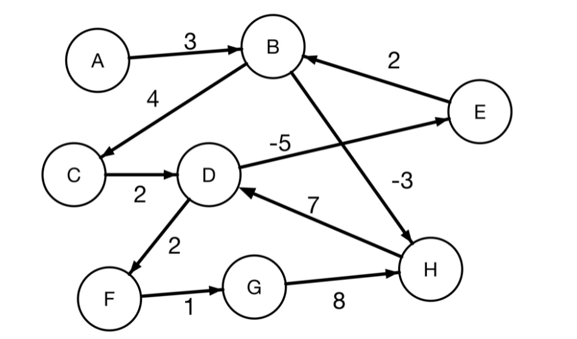
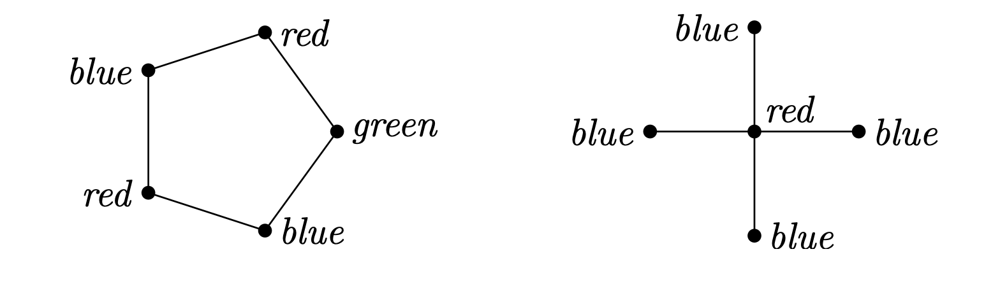
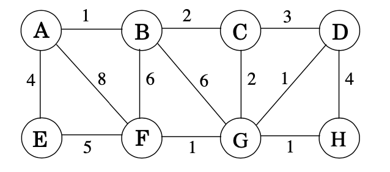

#### 1.) Apply the Bellman-Ford algorithm on the following graph, with source vertex A to all vertices in our graph. Show all steps.

> current i is  0
step 1 --------------
u is  A and v is  B
dist[v]= 10000
graph[u][v] + dist[u]= 3
Apparently,dist[v] > graph[u][v] + dist[u]
dist is  {'A': 0, 'B': 3, 'C': 10000, 'D': 10000, 'E': 10000, 'F': 10000, 'G': 10000, 'H': 10000}
Previous is  {'A': None, 'B': 'A', 'C': None, 'D': None, 'E': None, 'F': None, 'G': None, 'H': None}
current i is  0
step 2 --------------
u is  B and v is  C
dist[v]= 10000
graph[u][v] + dist[u]= 7
Apparently,dist[v] > graph[u][v] + dist[u]
u is  B and v is  H
dist[v]= 10000
graph[u][v] + dist[u]= 0
Apparently,dist[v] > graph[u][v] + dist[u]
dist is  {'A': 0, 'B': 3, 'C': 7, 'D': 10000, 'E': 10000, 'F': 10000, 'G': 10000, 'H': 0}
Previous is  {'A': None, 'B': 'A', 'C': 'B', 'D': None, 'E': None, 'F': None, 'G': None, 'H': 'B'}
current i is  0
step 3 --------------
u is  C and v is  D
dist[v]= 10000
graph[u][v] + dist[u]= 9
Apparently,dist[v] > graph[u][v] + dist[u]
dist is  {'A': 0, 'B': 3, 'C': 7, 'D': 9, 'E': 10000, 'F': 10000, 'G': 10000, 'H': 0}
Previous is  {'A': None, 'B': 'A', 'C': 'B', 'D': 'C', 'E': None, 'F': None, 'G': None, 'H': 'B'}
current i is  0
step 4 --------------
u is  D and v is  E
dist[v]= 10000
graph[u][v] + dist[u]= 4
Apparently,dist[v] > graph[u][v] + dist[u]
u is  D and v is  F
dist[v]= 10000
graph[u][v] + dist[u]= 11
Apparently,dist[v] > graph[u][v] + dist[u]
dist is  {'A': 0, 'B': 3, 'C': 7, 'D': 9, 'E': 4, 'F': 11, 'G': 10000, 'H': 0}
Previous is  {'A': None, 'B': 'A', 'C': 'B', 'D': 'C', 'E': 'D', 'F': 'D', 'G': None, 'H': 'B'}
current i is  0
step 5 --------------
u is  E and v is  B
dist[v]= 3
graph[u][v] + dist[u]= 6
dist is  {'A': 0, 'B': 3, 'C': 7, 'D': 9, 'E': 4, 'F': 11, 'G': 10000, 'H': 0}
Previous is  {'A': None, 'B': 'A', 'C': 'B', 'D': 'C', 'E': 'D', 'F': 'D', 'G': None, 'H': 'B'}
current i is  0
step 6 --------------
u is  F and v is  G
dist[v]= 10000
graph[u][v] + dist[u]= 12
Apparently,dist[v] > graph[u][v] + dist[u]
dist is  {'A': 0, 'B': 3, 'C': 7, 'D': 9, 'E': 4, 'F': 11, 'G': 12, 'H': 0}
Previous is  {'A': None, 'B': 'A', 'C': 'B', 'D': 'C', 'E': 'D', 'F': 'D', 'G': 'F', 'H': 'B'}
current i is  0
step 7 --------------
u is  G and v is  H
dist[v]= 0
graph[u][v] + dist[u]= 20
dist is  {'A': 0, 'B': 3, 'C': 7, 'D': 9, 'E': 4, 'F': 11, 'G': 12, 'H': 0}
Previous is  {'A': None, 'B': 'A', 'C': 'B', 'D': 'C', 'E': 'D', 'F': 'D', 'G': 'F', 'H': 'B'}
current i is  0
step 8 --------------
u is  H and v is  D
dist[v]= 9
graph[u][v] + dist[u]= 7
Apparently,dist[v] > graph[u][v] + dist[u]
dist is  {'A': 0, 'B': 3, 'C': 7, 'D': 7, 'E': 4, 'F': 11, 'G': 12, 'H': 0}
Previous is  {'A': None, 'B': 'A', 'C': 'B', 'D': 'H', 'E': 'D', 'F': 'D', 'G': 'F', 'H': 'B'}
current i is  1
step 9 --------------
u is  A and v is  B
dist[v]= 3
graph[u][v] + dist[u]= 3
dist is  {'A': 0, 'B': 3, 'C': 7, 'D': 7, 'E': 4, 'F': 11, 'G': 12, 'H': 0}
Previous is  {'A': None, 'B': 'A', 'C': 'B', 'D': 'H', 'E': 'D', 'F': 'D', 'G': 'F', 'H': 'B'}
current i is  1
step 10 --------------
u is  B and v is  C
dist[v]= 7
graph[u][v] + dist[u]= 7
u is  B and v is  H
dist[v]= 0
graph[u][v] + dist[u]= 0
dist is  {'A': 0, 'B': 3, 'C': 7, 'D': 7, 'E': 4, 'F': 11, 'G': 12, 'H': 0}
Previous is  {'A': None, 'B': 'A', 'C': 'B', 'D': 'H', 'E': 'D', 'F': 'D', 'G': 'F', 'H': 'B'}
current i is  1
step 11 --------------
u is  C and v is  D
dist[v]= 7
graph[u][v] + dist[u]= 9
dist is  {'A': 0, 'B': 3, 'C': 7, 'D': 7, 'E': 4, 'F': 11, 'G': 12, 'H': 0}
Previous is  {'A': None, 'B': 'A', 'C': 'B', 'D': 'H', 'E': 'D', 'F': 'D', 'G': 'F', 'H': 'B'}
current i is  1
step 12 --------------
u is  D and v is  E
dist[v]= 4
graph[u][v] + dist[u]= 2
Apparently,dist[v] > graph[u][v] + dist[u]
u is  D and v is  F
dist[v]= 11
graph[u][v] + dist[u]= 9
Apparently,dist[v] > graph[u][v] + dist[u]
dist is  {'A': 0, 'B': 3, 'C': 7, 'D': 7, 'E': 2, 'F': 9, 'G': 12, 'H': 0}
Previous is  {'A': None, 'B': 'A', 'C': 'B', 'D': 'H', 'E': 'D', 'F': 'D', 'G': 'F', 'H': 'B'}
current i is  1
step 13 --------------
u is  E and v is  B
dist[v]= 3
graph[u][v] + dist[u]= 4
dist is  {'A': 0, 'B': 3, 'C': 7, 'D': 7, 'E': 2, 'F': 9, 'G': 12, 'H': 0}
Previous is  {'A': None, 'B': 'A', 'C': 'B', 'D': 'H', 'E': 'D', 'F': 'D', 'G': 'F', 'H': 'B'}
current i is  1
step 14 --------------
u is  F and v is  G
dist[v]= 12
graph[u][v] + dist[u]= 10
Apparently,dist[v] > graph[u][v] + dist[u]
dist is  {'A': 0, 'B': 3, 'C': 7, 'D': 7, 'E': 2, 'F': 9, 'G': 10, 'H': 0}
Previous is  {'A': None, 'B': 'A', 'C': 'B', 'D': 'H', 'E': 'D', 'F': 'D', 'G': 'F', 'H': 'B'}
current i is  1
step 15 --------------
u is  G and v is  H
dist[v]= 0
graph[u][v] + dist[u]= 18
dist is  {'A': 0, 'B': 3, 'C': 7, 'D': 7, 'E': 2, 'F': 9, 'G': 10, 'H': 0}
Previous is  {'A': None, 'B': 'A', 'C': 'B', 'D': 'H', 'E': 'D', 'F': 'D', 'G': 'F', 'H': 'B'}
current i is  1
step 16 --------------
u is  H and v is  D
dist[v]= 7
graph[u][v] + dist[u]= 7
dist is  {'A': 0, 'B': 3, 'C': 7, 'D': 7, 'E': 2, 'F': 9, 'G': 10, 'H': 0}
Previous is  {'A': None, 'B': 'A', 'C': 'B', 'D': 'H', 'E': 'D', 'F': 'D', 'G': 'F', 'H': 'B'}
current i is  2
step 17 --------------
u is  A and v is  B
dist[v]= 3
graph[u][v] + dist[u]= 3
dist is  {'A': 0, 'B': 3, 'C': 7, 'D': 7, 'E': 2, 'F': 9, 'G': 10, 'H': 0}
Previous is  {'A': None, 'B': 'A', 'C': 'B', 'D': 'H', 'E': 'D', 'F': 'D', 'G': 'F', 'H': 'B'}
current i is  2
step 18 --------------
u is  B and v is  C
dist[v]= 7
graph[u][v] + dist[u]= 7
u is  B and v is  H
dist[v]= 0
graph[u][v] + dist[u]= 0
dist is  {'A': 0, 'B': 3, 'C': 7, 'D': 7, 'E': 2, 'F': 9, 'G': 10, 'H': 0}
Previous is  {'A': None, 'B': 'A', 'C': 'B', 'D': 'H', 'E': 'D', 'F': 'D', 'G': 'F', 'H': 'B'}
current i is  2
step 19 --------------
u is  C and v is  D
dist[v]= 7
graph[u][v] + dist[u]= 9
dist is  {'A': 0, 'B': 3, 'C': 7, 'D': 7, 'E': 2, 'F': 9, 'G': 10, 'H': 0}
Previous is  {'A': None, 'B': 'A', 'C': 'B', 'D': 'H', 'E': 'D', 'F': 'D', 'G': 'F', 'H': 'B'}
current i is  2
step 20 --------------
u is  D and v is  E
dist[v]= 2
graph[u][v] + dist[u]= 2
u is  D and v is  F
dist[v]= 9
graph[u][v] + dist[u]= 9
dist is  {'A': 0, 'B': 3, 'C': 7, 'D': 7, 'E': 2, 'F': 9, 'G': 10, 'H': 0}
Previous is  {'A': None, 'B': 'A', 'C': 'B', 'D': 'H', 'E': 'D', 'F': 'D', 'G': 'F', 'H': 'B'}
current i is  2
step 21 --------------
u is  E and v is  B
dist[v]= 3
graph[u][v] + dist[u]= 4
dist is  {'A': 0, 'B': 3, 'C': 7, 'D': 7, 'E': 2, 'F': 9, 'G': 10, 'H': 0}
Previous is  {'A': None, 'B': 'A', 'C': 'B', 'D': 'H', 'E': 'D', 'F': 'D', 'G': 'F', 'H': 'B'}
current i is  2
step 22 --------------
u is  F and v is  G
dist[v]= 10
graph[u][v] + dist[u]= 10
dist is  {'A': 0, 'B': 3, 'C': 7, 'D': 7, 'E': 2, 'F': 9, 'G': 10, 'H': 0}
Previous is  {'A': None, 'B': 'A', 'C': 'B', 'D': 'H', 'E': 'D', 'F': 'D', 'G': 'F', 'H': 'B'}
current i is  2
step 23 --------------
u is  G and v is  H
dist[v]= 0
graph[u][v] + dist[u]= 18
dist is  {'A': 0, 'B': 3, 'C': 7, 'D': 7, 'E': 2, 'F': 9, 'G': 10, 'H': 0}
Previous is  {'A': None, 'B': 'A', 'C': 'B', 'D': 'H', 'E': 'D', 'F': 'D', 'G': 'F', 'H': 'B'}
current i is  2
step 24 --------------
u is  H and v is  D
dist[v]= 7
graph[u][v] + dist[u]= 7
dist is  {'A': 0, 'B': 3, 'C': 7, 'D': 7, 'E': 2, 'F': 9, 'G': 10, 'H': 0}
Previous is  {'A': None, 'B': 'A', 'C': 'B', 'D': 'H', 'E': 'D', 'F': 'D', 'G': 'F', 'H': 'B'}
current i is  3
step 25 --------------
u is  A and v is  B
dist[v]= 3
graph[u][v] + dist[u]= 3
dist is  {'A': 0, 'B': 3, 'C': 7, 'D': 7, 'E': 2, 'F': 9, 'G': 10, 'H': 0}
Previous is  {'A': None, 'B': 'A', 'C': 'B', 'D': 'H', 'E': 'D', 'F': 'D', 'G': 'F', 'H': 'B'}
current i is  3
step 26 --------------
u is  B and v is  C
dist[v]= 7
graph[u][v] + dist[u]= 7
u is  B and v is  H
dist[v]= 0
graph[u][v] + dist[u]= 0
dist is  {'A': 0, 'B': 3, 'C': 7, 'D': 7, 'E': 2, 'F': 9, 'G': 10, 'H': 0}
Previous is  {'A': None, 'B': 'A', 'C': 'B', 'D': 'H', 'E': 'D', 'F': 'D', 'G': 'F', 'H': 'B'}
current i is  3
step 27 --------------
u is  C and v is  D
dist[v]= 7
graph[u][v] + dist[u]= 9
dist is  {'A': 0, 'B': 3, 'C': 7, 'D': 7, 'E': 2, 'F': 9, 'G': 10, 'H': 0}
Previous is  {'A': None, 'B': 'A', 'C': 'B', 'D': 'H', 'E': 'D', 'F': 'D', 'G': 'F', 'H': 'B'}
current i is  3
step 28 --------------
u is  D and v is  E
dist[v]= 2
graph[u][v] + dist[u]= 2
u is  D and v is  F
dist[v]= 9
graph[u][v] + dist[u]= 9
dist is  {'A': 0, 'B': 3, 'C': 7, 'D': 7, 'E': 2, 'F': 9, 'G': 10, 'H': 0}
Previous is  {'A': None, 'B': 'A', 'C': 'B', 'D': 'H', 'E': 'D', 'F': 'D', 'G': 'F', 'H': 'B'}
current i is  3
step 29 --------------
u is  E and v is  B
dist[v]= 3
graph[u][v] + dist[u]= 4
dist is  {'A': 0, 'B': 3, 'C': 7, 'D': 7, 'E': 2, 'F': 9, 'G': 10, 'H': 0}
Previous is  {'A': None, 'B': 'A', 'C': 'B', 'D': 'H', 'E': 'D', 'F': 'D', 'G': 'F', 'H': 'B'}
current i is  3
step 30 --------------
u is  F and v is  G
dist[v]= 10
graph[u][v] + dist[u]= 10
dist is  {'A': 0, 'B': 3, 'C': 7, 'D': 7, 'E': 2, 'F': 9, 'G': 10, 'H': 0}
Previous is  {'A': None, 'B': 'A', 'C': 'B', 'D': 'H', 'E': 'D', 'F': 'D', 'G': 'F', 'H': 'B'}
current i is  3
step 31 --------------
u is  G and v is  H
dist[v]= 0
graph[u][v] + dist[u]= 18
dist is  {'A': 0, 'B': 3, 'C': 7, 'D': 7, 'E': 2, 'F': 9, 'G': 10, 'H': 0}
Previous is  {'A': None, 'B': 'A', 'C': 'B', 'D': 'H', 'E': 'D', 'F': 'D', 'G': 'F', 'H': 'B'}
current i is  3
step 32 --------------
u is  H and v is  D
dist[v]= 7
graph[u][v] + dist[u]= 7
dist is  {'A': 0, 'B': 3, 'C': 7, 'D': 7, 'E': 2, 'F': 9, 'G': 10, 'H': 0}
Previous is  {'A': None, 'B': 'A', 'C': 'B', 'D': 'H', 'E': 'D', 'F': 'D', 'G': 'F', 'H': 'B'}
current i is  4
step 33 --------------
u is  A and v is  B
dist[v]= 3
graph[u][v] + dist[u]= 3
dist is  {'A': 0, 'B': 3, 'C': 7, 'D': 7, 'E': 2, 'F': 9, 'G': 10, 'H': 0}
Previous is  {'A': None, 'B': 'A', 'C': 'B', 'D': 'H', 'E': 'D', 'F': 'D', 'G': 'F', 'H': 'B'}
current i is  4
step 34 --------------
u is  B and v is  C
dist[v]= 7
graph[u][v] + dist[u]= 7
u is  B and v is  H
dist[v]= 0
graph[u][v] + dist[u]= 0
dist is  {'A': 0, 'B': 3, 'C': 7, 'D': 7, 'E': 2, 'F': 9, 'G': 10, 'H': 0}
Previous is  {'A': None, 'B': 'A', 'C': 'B', 'D': 'H', 'E': 'D', 'F': 'D', 'G': 'F', 'H': 'B'}
current i is  4
step 35 --------------
u is  C and v is  D
dist[v]= 7
graph[u][v] + dist[u]= 9
dist is  {'A': 0, 'B': 3, 'C': 7, 'D': 7, 'E': 2, 'F': 9, 'G': 10, 'H': 0}
Previous is  {'A': None, 'B': 'A', 'C': 'B', 'D': 'H', 'E': 'D', 'F': 'D', 'G': 'F', 'H': 'B'}
current i is  4
step 36 --------------
u is  D and v is  E
dist[v]= 2
graph[u][v] + dist[u]= 2
u is  D and v is  F
dist[v]= 9
graph[u][v] + dist[u]= 9
dist is  {'A': 0, 'B': 3, 'C': 7, 'D': 7, 'E': 2, 'F': 9, 'G': 10, 'H': 0}
Previous is  {'A': None, 'B': 'A', 'C': 'B', 'D': 'H', 'E': 'D', 'F': 'D', 'G': 'F', 'H': 'B'}
current i is  4
step 37 --------------
u is  E and v is  B
dist[v]= 3
graph[u][v] + dist[u]= 4
dist is  {'A': 0, 'B': 3, 'C': 7, 'D': 7, 'E': 2, 'F': 9, 'G': 10, 'H': 0}
Previous is  {'A': None, 'B': 'A', 'C': 'B', 'D': 'H', 'E': 'D', 'F': 'D', 'G': 'F', 'H': 'B'}
current i is  4
step 38 --------------
u is  F and v is  G
dist[v]= 10
graph[u][v] + dist[u]= 10
dist is  {'A': 0, 'B': 3, 'C': 7, 'D': 7, 'E': 2, 'F': 9, 'G': 10, 'H': 0}
Previous is  {'A': None, 'B': 'A', 'C': 'B', 'D': 'H', 'E': 'D', 'F': 'D', 'G': 'F', 'H': 'B'}
current i is  4
step 39 --------------
u is  G and v is  H
dist[v]= 0
graph[u][v] + dist[u]= 18
dist is  {'A': 0, 'B': 3, 'C': 7, 'D': 7, 'E': 2, 'F': 9, 'G': 10, 'H': 0}
Previous is  {'A': None, 'B': 'A', 'C': 'B', 'D': 'H', 'E': 'D', 'F': 'D', 'G': 'F', 'H': 'B'}
current i is  4
step 40 --------------
u is  H and v is  D
dist[v]= 7
graph[u][v] + dist[u]= 7
dist is  {'A': 0, 'B': 3, 'C': 7, 'D': 7, 'E': 2, 'F': 9, 'G': 10, 'H': 0}
Previous is  {'A': None, 'B': 'A', 'C': 'B', 'D': 'H', 'E': 'D', 'F': 'D', 'G': 'F', 'H': 'B'}
current i is  5
step 41 --------------
u is  A and v is  B
dist[v]= 3
graph[u][v] + dist[u]= 3
dist is  {'A': 0, 'B': 3, 'C': 7, 'D': 7, 'E': 2, 'F': 9, 'G': 10, 'H': 0}
Previous is  {'A': None, 'B': 'A', 'C': 'B', 'D': 'H', 'E': 'D', 'F': 'D', 'G': 'F', 'H': 'B'}
current i is  5
step 42 --------------
u is  B and v is  C
dist[v]= 7
graph[u][v] + dist[u]= 7
u is  B and v is  H
dist[v]= 0
graph[u][v] + dist[u]= 0
dist is  {'A': 0, 'B': 3, 'C': 7, 'D': 7, 'E': 2, 'F': 9, 'G': 10, 'H': 0}
Previous is  {'A': None, 'B': 'A', 'C': 'B', 'D': 'H', 'E': 'D', 'F': 'D', 'G': 'F', 'H': 'B'}
current i is  5
step 43 --------------
u is  C and v is  D
dist[v]= 7
graph[u][v] + dist[u]= 9
dist is  {'A': 0, 'B': 3, 'C': 7, 'D': 7, 'E': 2, 'F': 9, 'G': 10, 'H': 0}
Previous is  {'A': None, 'B': 'A', 'C': 'B', 'D': 'H', 'E': 'D', 'F': 'D', 'G': 'F', 'H': 'B'}
current i is  5
step 44 --------------
u is  D and v is  E
dist[v]= 2
graph[u][v] + dist[u]= 2
u is  D and v is  F
dist[v]= 9
graph[u][v] + dist[u]= 9
dist is  {'A': 0, 'B': 3, 'C': 7, 'D': 7, 'E': 2, 'F': 9, 'G': 10, 'H': 0}
Previous is  {'A': None, 'B': 'A', 'C': 'B', 'D': 'H', 'E': 'D', 'F': 'D', 'G': 'F', 'H': 'B'}
current i is  5
step 45 --------------
u is  E and v is  B
dist[v]= 3
graph[u][v] + dist[u]= 4
dist is  {'A': 0, 'B': 3, 'C': 7, 'D': 7, 'E': 2, 'F': 9, 'G': 10, 'H': 0}
Previous is  {'A': None, 'B': 'A', 'C': 'B', 'D': 'H', 'E': 'D', 'F': 'D', 'G': 'F', 'H': 'B'}
current i is  5
step 46 --------------
u is  F and v is  G
dist[v]= 10
graph[u][v] + dist[u]= 10
dist is  {'A': 0, 'B': 3, 'C': 7, 'D': 7, 'E': 2, 'F': 9, 'G': 10, 'H': 0}
Previous is  {'A': None, 'B': 'A', 'C': 'B', 'D': 'H', 'E': 'D', 'F': 'D', 'G': 'F', 'H': 'B'}
current i is  5
step 47 --------------
u is  G and v is  H
dist[v]= 0
graph[u][v] + dist[u]= 18
dist is  {'A': 0, 'B': 3, 'C': 7, 'D': 7, 'E': 2, 'F': 9, 'G': 10, 'H': 0}
Previous is  {'A': None, 'B': 'A', 'C': 'B', 'D': 'H', 'E': 'D', 'F': 'D', 'G': 'F', 'H': 'B'}
current i is  5
step 48 --------------
u is  H and v is  D
dist[v]= 7
graph[u][v] + dist[u]= 7
dist is  {'A': 0, 'B': 3, 'C': 7, 'D': 7, 'E': 2, 'F': 9, 'G': 10, 'H': 0}
Previous is  {'A': None, 'B': 'A', 'C': 'B', 'D': 'H', 'E': 'D', 'F': 'D', 'G': 'F', 'H': 'B'}
current i is  6
step 49 --------------
u is  A and v is  B
dist[v]= 3
graph[u][v] + dist[u]= 3
dist is  {'A': 0, 'B': 3, 'C': 7, 'D': 7, 'E': 2, 'F': 9, 'G': 10, 'H': 0}
Previous is  {'A': None, 'B': 'A', 'C': 'B', 'D': 'H', 'E': 'D', 'F': 'D', 'G': 'F', 'H': 'B'}
current i is  6
step 50 --------------
u is  B and v is  C
dist[v]= 7
graph[u][v] + dist[u]= 7
u is  B and v is  H
dist[v]= 0
graph[u][v] + dist[u]= 0
dist is  {'A': 0, 'B': 3, 'C': 7, 'D': 7, 'E': 2, 'F': 9, 'G': 10, 'H': 0}
Previous is  {'A': None, 'B': 'A', 'C': 'B', 'D': 'H', 'E': 'D', 'F': 'D', 'G': 'F', 'H': 'B'}
current i is  6
step 51 --------------
u is  C and v is  D
dist[v]= 7
graph[u][v] + dist[u]= 9
dist is  {'A': 0, 'B': 3, 'C': 7, 'D': 7, 'E': 2, 'F': 9, 'G': 10, 'H': 0}
Previous is  {'A': None, 'B': 'A', 'C': 'B', 'D': 'H', 'E': 'D', 'F': 'D', 'G': 'F', 'H': 'B'}
current i is  6
step 52 --------------
u is  D and v is  E
dist[v]= 2
graph[u][v] + dist[u]= 2
u is  D and v is  F
dist[v]= 9
graph[u][v] + dist[u]= 9
dist is  {'A': 0, 'B': 3, 'C': 7, 'D': 7, 'E': 2, 'F': 9, 'G': 10, 'H': 0}
Previous is  {'A': None, 'B': 'A', 'C': 'B', 'D': 'H', 'E': 'D', 'F': 'D', 'G': 'F', 'H': 'B'}
current i is  6
step 53 --------------
u is  E and v is  B
dist[v]= 3
graph[u][v] + dist[u]= 4
dist is  {'A': 0, 'B': 3, 'C': 7, 'D': 7, 'E': 2, 'F': 9, 'G': 10, 'H': 0}
Previous is  {'A': None, 'B': 'A', 'C': 'B', 'D': 'H', 'E': 'D', 'F': 'D', 'G': 'F', 'H': 'B'}
current i is  6
step 54 --------------
u is  F and v is  G
dist[v]= 10
graph[u][v] + dist[u]= 10
dist is  {'A': 0, 'B': 3, 'C': 7, 'D': 7, 'E': 2, 'F': 9, 'G': 10, 'H': 0}
Previous is  {'A': None, 'B': 'A', 'C': 'B', 'D': 'H', 'E': 'D', 'F': 'D', 'G': 'F', 'H': 'B'}
current i is  6
step 55 --------------
u is  G and v is  H
dist[v]= 0
graph[u][v] + dist[u]= 18
dist is  {'A': 0, 'B': 3, 'C': 7, 'D': 7, 'E': 2, 'F': 9, 'G': 10, 'H': 0}
Previous is  {'A': None, 'B': 'A', 'C': 'B', 'D': 'H', 'E': 'D', 'F': 'D', 'G': 'F', 'H': 'B'}
current i is  6
step 56 --------------
u is  H and v is  D
dist[v]= 7
graph[u][v] + dist[u]= 7
dist is  {'A': 0, 'B': 3, 'C': 7, 'D': 7, 'E': 2, 'F': 9, 'G': 10, 'H': 0}
Previous is  {'A': None, 'B': 'A', 'C': 'B', 'D': 'H', 'E': 'D', 'F': 'D', 'G': 'F', 'H': 'B'}

## In a ***coloring*** of a graph, one assigns colors to the nodes such that any two nodes connected by an edge receive different colors. An optimal coloring is one which uses the fewest colors. For example, here is an optimal coloring of these two graphs.

## 5.2. Suppose we want to find the minimum spanning tree of the following graph.

#### (a) Run Prim’s algorithm; whenever there is a choice of nodes, always use alphabetic ordering
(e.g., start from node A). Draw a table showing the intermediate values of the cost array.
#### (b) Run Kruskal’s algorithm on the same graph. Show how the disjoint-sets data structure looks at every intermediate stage (including the structure of the directed trees), assuming path compression is used.