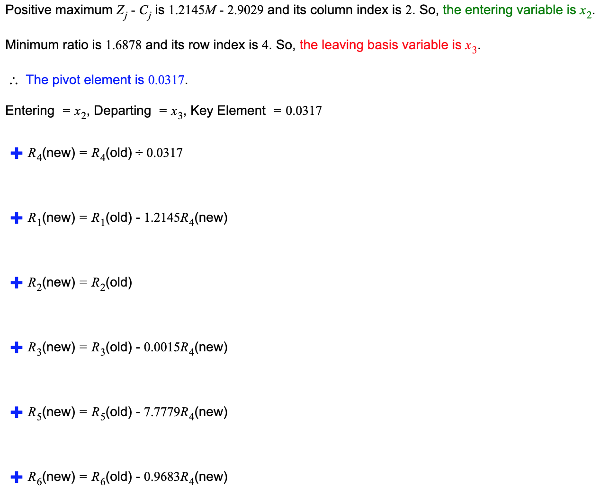

### 7.1. 
Consider the following linear program.
> maximize 5x+3y 
> 
> 5x − 2y ≥ 0
> 
> x+y≤7 
> 
> x≤5 
> 
> x≥0 
> 
> y≥0

Plot the feasible region and identify the optimal solution.

Z=5x+3y,  if we view z as a constant, Z=5x+3y is a line whose slope is -3/5.Our line can only go through the black shaded part.We need to find a point in the black shaded part that maximizes the y transverse coordinate of the line. So I find (5,2), When the line passes through (5, 2), the line passes through the boundary point of the shaded part, and makes 5x+3y get a maximum value of 31.

### 7.3 
A cargo plane can carry a maximum weight of 100 tons and a maximum volume of 60 cubic meters. There are three materials to be transported, and the cargo company may choose to carry any amount of each, upto the maximum available limits given below.
• Material 1 has density 2 tons/cubic meter,maximum available amount 40 cubic meters,and revenue $1,000 per cubic meter.

• Material 2 has density 1 ton/cubic meter, maximum available amount 30 cubic meters, and revenue $1,200 per cubic meter.

• Material 3 has density 3 tons/cubic meter,maximum available amount 20 cubic meters,and revenue $12,000 per cubic meter.

Write a linear program that optimizes revenue within the constraints.

- According to the definition I wrote following linear program
- x represents the cubic meters of Material 1, y represents the cubic meters of Material 2, z represents the the cubic meters of Material 3

> maximize 1000x+1200y+12000z
> 
> x+y+z≤60
> 
> 2x+y+3z≤100
> 
> x≥0 
> 
> y≥0
> 
> z≥0

V=1000x+1200y+12000z, if we view V as a constant, then V=1000x+1200y+12000z is a plane. And this plane must have at least one point in the space drawn by the red line. I drew this plane with a green dashed line.In theory when it crosses the point (0,0,1), it can make V=1000x+1200y+12000z take the maximum value. But x,y,z can only take integers, so when it crosses the point (0,1,33), the maximum value will be 397200.

### 7.6. 
Give an example of a linear program in two variables whose feasible region is infinite, but such that there is an optimum solution of bounded cost.

> minimize x+y
> 
> y≤2x+1
> 
> y≥1/2x+4
> 
> x≥0 
> 
> y≥0

feasible region is a two-dimensional space besieged by y≤2x+1 and y≥1/2x+4, it is infinite. But if we want to minimize. There is an optimum solution of bounded cost.Z=x+y,  if we view z as a constant, Z=x+y is a line whose slope is -3/5.Our line can only go through the black shaded part.We need to find a point in the black shaded part that minimizes Z=x+y. Apparently, when it go through(2,5), we can get the smallest z, which is 7.

### 7.16
A salad is any combination of the following ingredients: (1) tomato, (2) lettuce, (3) spinach, (4) carrot, and (5) oil. Each salad must contain: (A) at least 15 grams of protein, (B) at least 2 and at most 6 grams of fat, (C) at least 4 grams of carbohydrates, (D) at most 100 milligrams of sodium. Furthermore, (E) you do not want your salad to be more than 50% greens by mass. The nutritional contents of these ingredients (per 100 grams) are

find a linear programming applet on the web and use it to make the salad with the fewest calories under the nutritional constraints. describe your linear programming formulation and hte optimal solution(the quantity of each ingredient and the value). Cite the web resource you used

## Solution:

I use the this calculator .
https://cbom.atozmath.com/CBOM/Simplex.aspx?q=sm&q1=5%606%60MIN%60Z%60x1%2cx2%2cx3%2cx4%2cx5%6021%2c16%2c371%2c346%2c884%600.85%2c1.62%2c12.78%2c8.39%2c0%3b0.33%2c0.2%2c1.58%2c1.39%2c100%3b0.33%2c0.2%2c1.58%2c1.39%2c100%3b4.64%2c2.37%2c74.69%2c80%2c0%3b9%2c8%2c7%2c508.20%2c0%3b0%2c1%2c1%2c0%2c0%60%3e%3d%2c%3c%3d%2c%3e%3d%2c%3e%3d%2c%3c%3d%2c%3c%3d%6015%2c6%2c2%2c4%2c100%2c50%60%60D%60false%60true%60false%60true%60false%60false%60true&do=1#PrevPart