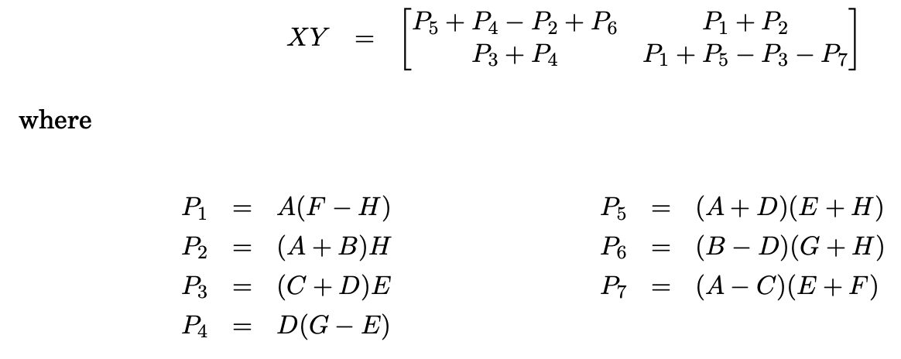

2 **Divide and Conquer**
2.1 **technique definition (no problem/solution required)**
Divide-and-conquer algorithms often follow a generic pattern: they tackle a problem of size n by recursively solving, say, a subproblems of size n/b and then combining these answers in O(nd) time, for some a, b, d > 0 (in the multiplication algorithm, a = 3, b = 2, and d = 1). Their running time can therefore be captured by the equation T (n) = aT (⌈n/b⌉) + O(nd).
- a is the number of time you call the funciton in the function body
- find b, b is how to divide the input data

• Small(P) is a Boolean function that determines whether the input size is small enough that the answer can be computed without splitting 
**exercise:**

You are given an integer array nums with no duplicates. A maximum binary tree can be built recursively from nums using the following algorithm:

- Create a root node whose value is the maximum value in nums.
- Recursively build the left subtree on the subarray prefix to the left of the maximum value.
- Recursively build the right subtree on the subarray suffix to the right of the maximum value.
Return the maximum binary tree built from nums.

**solution:**

```python
# Definition for a binary tree node.
# class TreeNode:
#     def __init__(self, val=0, left=None, right=None):
#         self.val = val
#         self.left = left
#         self.right = right
class Solution:
    def constructMaximumBinaryTree(self, nums: List[int]) -> TreeNode:
        if not nums:
            return 
        n = len(nums)
        if n == 1:
            return TreeNode(nums[0])
        
        max_v = max(nums)
        idx = nums.index(max_v)
        root = TreeNode(max_v)
        root.left = self.constructMaximumBinaryTree(nums[:idx])
        root.right = self.constructMaximumBinaryTree(nums[idx+1:])

        return root
```

##2.2 **divide and conquer multiplication**

#### a very simple implement of caculation of  $n^p$
```python
def power(n, p):
    if p == 0:
        return 1
    if p == 1:
        return n
    else:
        return power(n, np.floor(p/2))*power(n, p-np.floor(p/2))
```

####Strassen algorithm for matrix multiplication**



The new running time is $T(n)=7T(n/2)+O(n^2)$
a =7 b =2, $\log{_b}{a}=\log{_2}{7} > d = 2$ 
T(n)=O(n ^ $\log{_2}{7}$ )
**exercise:**

Develop the function of matrix multiplication.

**solution:**
```python
import numpy as np


def split(matrix):

    row, col = matrix.shape
    row2, col2 = row//2, col//2
    return matrix[:row2, :col2], matrix[:row2, col2:], matrix[row2:, :col2], matrix[row2:, col2:]


def strassen(x, y):
    if len(x) == 1:
        return x * y

    a, b, c, d = split(x)
    e, f, g, h = split(y)

    p1 = strassen(a, f - h)
    p2 = strassen(a + b, h)
    p3 = strassen(c + d, e)
    p4 = strassen(d, g - e)
    p5 = strassen(a + d, e + h)
    p6 = strassen(b - d, g + h)
    p7 = strassen(a - c, e + f)
    c11 = p5 + p4 - p2 + p6
    c12 = p1 + p2
    c21 = p3 + p4
    c22 = p1 + p5 - p3 - p7
    c = np.vstack((np.hstack((c11, c12)), np.hstack((c21, c22))))

    return c 
```
2.3 **divide and conquer algorithmic design**

  Control abstraction for the divide and conquer strategy
```python
Algorithm DAndC(P)
    if Small(P) then return S(P);
    else
        divide P into smaller instances P1,P2,P3----Pk, k≥1;
        Apply DAndC to each of these subproblems;
        return Combine(DAndC(P1),DAndC(P2)----,DAndC(pk));
}
}
```

**exercise:**
Given an integer array nums, find the contiguous subarray (containing at least one number) which has the largest sum and return its sum.

A subarray is a contiguous part of an array.

> example1
Input: nums = [-2,1,-3,4,-1,2,1,-5,4]
Output: 6
Explanation: [4,-1,2,1] has the largest sum = 6.

> Example 2:
Input: nums = [1]
Output: 1

>Example 3:
Input: nums = [5,4,-1,7,8]
Output: 23

**solution:**

- The recursive termination condition is that the length of nums is equal to 1
- Recursively calculate the maximum suborder sum of the left half
- Recursively calculate the maximum suborder sum of the right half
- Calculate the largest subsequence sum in the middle, calculate the largest subsequence sum on the left from right to left, calculate the largest subsequence sum on the right from left to right, and add them together
- return the largest of the three

```python
class Solution:
    def maxSubArray(self, nums: List[int]) -> int:
        n = len(nums)
        if n == 1:
            return nums[0]
        else:
            max_left = self.maxSubArray(nums[0:len(nums) // 2])
            max_right = self.maxSubArray(nums[len(nums) // 2:len(nums)])
        
        max_l = nums[len(nums) // 2 - 1]
        tmp = 0
        for i in range(len(nums) // 2 - 1, -1, -1):
            tmp += nums[i]
            max_l = max(tmp, max_l)
        max_r = nums[len(nums) // 2]
        tmp = 0
        for i in range(len(nums) // 2, len(nums)):
            tmp += nums[i]
            max_r = max(tmp, max_r)
        return max(max_right,max_left,max_l+max_r)
```