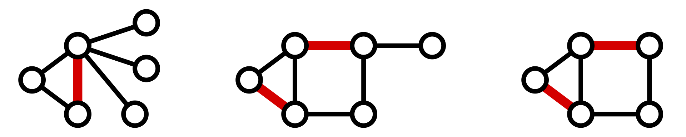
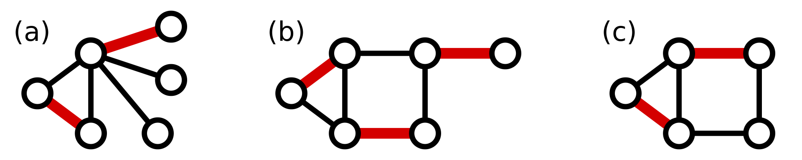
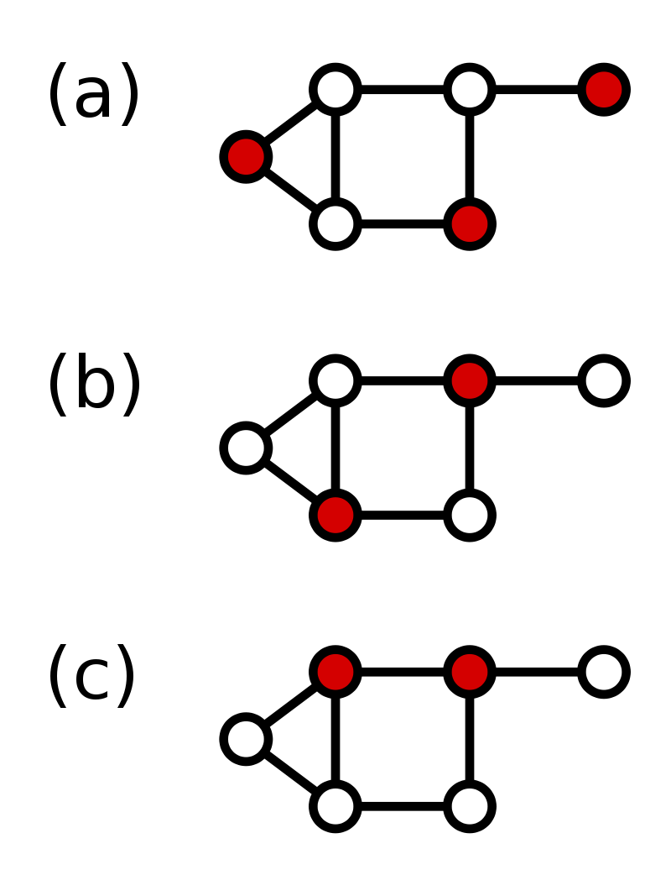

#5 **Graph Algorithms**
##5.1 **Dijkstra’s Algorithm**
  

#### 5.1.1 Steps Dijkstra’s Algorithm take to calculate the shortest distance in the following graph

- > Step1 : we make prev,dist and heap make the distance for the node where we start to 0
  > ```prev={{'A': None, 'B': None, 'C': None, 'D': None, 'E': None}}```
  > ```dist={'A': 0, 'B': 100000, 'C': 100000, 'D': 100000, 'E': 100000}```
  > ```heap={'A': 0, 'B': 100000, 'C': 100000, 'D': 100000, 'E': 100000}```
- > Step2 we pop the item who has smallest value from heap,make it u. u=```A:0```
  A's edges are ```'A': {'B': 4, 'C': 2},```
    Now we have
  > ```prev={{'A': None, 'B': A, 'C': A, 'D': None, 'E': None}}```
  > ```dist={'A': 0, 'B': 4, 'C': 2, 'D': 100000, 'E': 100000}```
    update the distance for heap
  > ```heap={'B': 4, 'C': 2, 'D': 100000, 'E': 100000}```
- > Step3 we pop the item who has smallest value from heap,make it u. u=```C:2``` 
  C's edges are ```'C': {'B': 1, 'D': 4, 'E': 5}```
    Now we have
  > ```prev={{'A': None, 'B': C, 'C': A, 'D': C, 'E': C}}```
  > ```dist={'A': 0, 'B': 3, 'C': 2, 'D': 6, 'E': 7}```
    update the distance for heap
  > ```heap={'B': 3, 'D': 6, 'E': 7}```

- > Step4 We pop the item who has smallest value from heap,make it u. u=```'B':3```
  C's edges are ``` 'B': {'C': 3, 'D': 2, 'E': 3}```
    Now we have
  > ```prev={{'A': None, 'B': C, 'C': A, 'D': B, 'E': B}}```
  > ```dist={'A': 0, 'B': 3, 'C': 2, 'D': 5, 'E': 6}```
    update the distance for heap
  > ```heap={'D': 5, 'E': 6}```

- > Step5. We pop the item who has smallest value from heap,make it u. u=```'D': 5```
  C's edges are ``` 'D': {}```
    Because D leads to no vertices so nothing changes,Now we have
  > ```prev={{'A': None, 'B': C, 'C': A, 'D': B, 'E': B}}```
  > ```dist={'A': 0, 'B': 3, 'C': 2, 'D': 5, 'E': 6}```
    update the distance for heap
  > ```heap={'E': 6}```

- > Step6.  Pop the item who has smallest value from heap,make it u. u=```'E': 6```
  C's edges are ``` 'E': {'D': 1}```
  > ```prev={{'A': None, 'B': C, 'C': A, 'D': B, 'E': B}}```
  > ```dist={'A': 0, 'B': 3, 'C': 2, 'D': 5, 'E': 6}```
  > ```heap={}```
- > step 7. Now heap is empty
  > return dist={'A': 0, 'B': 3, 'C': 2, 'D': 5, 'E': 6}

#### 5.1.2  How to implement a Dijkstra’s Algorithm
- Input : (Graph,source)
Graph is a  dictionary and source is a vertex. The data type of graph is dictionary, and the data type of source is string. actually source is a vertex here. You can use 'A','B' or any letter in the ```Graph```
```python
Graph = {
    'A': {'B': 4, 'C': 2}, 
    'B': {'C': 3, 'D': 2, 'E': 3}, 
    'C': {'B': 1, 'D': 4, 'E': 5}, 
    'D': {}, 
    'E': {'D': 1}
}
```
- I have three containers in the function. They are ```dist{}```, ```previous {}```, ```heap_dist{}``` On the dasgupty, dist and prev are lists. But I use dictionary in my function. Because I use letter to denote the vertex. 
- - dist{} shows the distance to each node from  source   
- - heap_dist{} contains key:value pair of unvisited vertices:dist I handle it as a heap, 
- - previous {} holds one crucial piece of information for each node :the identity of the node immediately before it on the shortest path from s to u. By following these back-pointers, we can easily reconstruct shortest paths, and so this array is a compact summary of all the paths found

**exercise:**
Develop the Dijkstra’s Algorithm with python.
``` 
Input: Graph G = (V, E), directed or undirected;
positive edge lengths {le : e ∈ E}; vertex s ∈ V
Output: For all vertices u reachable from s, dist(u) is set to the distance from s to u.
for all u ∈ V : 
    dist(u) = ∞
    prev(u) = nil 
dist(s) = 0
H = makequeue (V ) (using dist-values as keys) 
while H is not empty:
    u = deletemin(H)
    for all edges (u, v) ∈ E:
    if dist(v) > dist(u) + l(u, v): 
        dist(v) = dist(u) + l(u, v) 
        prev(v) = u 
    decreasekey(H, v)
```
**solution:**
```python
def dijkstra_adjacency_list(Graph, source):
    def deap_pop_min(heap):  # remember the input should be an dictionary
        min_key = None
        min_num = 1000000
        for i, j in heap.items():
            if j < min_num:
                min_num = j
                min_key = i
        heap.pop(min_key)
        return min_key

    visited=[]
    previous = {i: None for i in Graph}

    dist = {i: 100000 for i in Graph}
    dist[source] = 0
    heap_dist = {}
    heap_dist = {i: j for i, j in dist.items()}
    while len(heap_dist) != 0:
        u = deap_pop_min(heap_dist)
        visited.append(u)
        for v in Graph[u]:
            if v not in visited:
                edge_length = Graph[u][v]
                if dist[v] > dist[u] + edge_length:
                    dist[v] = dist[u] + edge_length
                    previous[v] = u
                # decreasekey(H, v),其实就是update heap_dist
                    heap_dist[v] = dist[u] + edge_length
        # print(dist)
    print(previous)
    return dist


print(dijkstra_adjacency_list(Graph, 'A'))
```
Apparently, the time complexity of dijkstra_adjacency_list is $O(v^2) $, v is the number of node in the graph
##5.2 **Bellman-Ford Algorithm**
#### 5.2.1 Background of Bellman-Ford Algorithm
**Lester Ford also published the algorithm in 1956. Therefore this algorithm is called the Bellman-Ford algorithm. In fact, Edward F. Moore published the same algorithm in 1957, so this algorithm is also called Bellman-Ford-Moore algorithm.**
#### 5.2.2 Why we need bellmanford?
- Bellmanford is much easy to implement than dijkstra. and it can apply to the graph whose's edge weight can be a negative number.
- Why we canot use Dijkstra when there's negative weighted edge in a graph?
Here's the answer in the geekforgeeks. Since Dijkstra follows a Greedy Approach, once a node is marked as visited it cannot be reconsidered even if there is another path with less cost or distance. This issue arises only if there exists a negative weight or edge in the graph. This is when bellmanford become really handy because it ca nbe used to detect negative cycles ad determine where they occur.
Finding negative cycles can be useful in many types of applications. One particularly neat application arises in finance when performing an arbitrage between two or more markets
- However, BF is not ideal for most SSSP problems because it has a time  complexity of O(EV). It is better to use Diikstra  algorithm which is much faster. It is on the order of 0 ( (E+V) log(V)) when using a binary heap priority queue.
#### 5.2.3 how to implement a bellmanford algorithem?
- Bellman ford simply update all the edges, |V | − 1 times. Code for this function is much quick and dirty to implement compare to dijkstra.
- Then it need to check if there is negative cycle in the graph and the nodes being afected by the negative cycle and make the distant of those nodes to infinity.
  
**exercise:**
Implement a Bellman-Ford Algorithm by python.
**solution:**
```python
def bellman_ford(graph, source):
    dist = {}
    p = {}
    max = 10000
    for v in graph:
        dist[v] = max  # 赋值为负无穷完成初始化
        p[v] = None
    dist[source] = 0

    for i in range(len(graph) - 1):
        for u in graph:
            for v in graph[u]:
                if dist[v] > graph[u][v] + dist[u]:
                    dist[v] = graph[u][v] + dist[u]
                    p[v] = u  # 完成松弛操作，p为前驱节点

    for u in graph:
        for v in graph[u]:
            if dist[v] > dist[u] + graph[u][v]:
                return None, None  # 判断是否存在环路

    return dist, p
```
## 5.3 **Matchings**
#### 5.3.1 Definition of matching from Wikipedia
- A matching or independent edge set in an undirected graph is a set of edges without common vertices.
- A vertex is matched (or saturated) if it is an endpoint of one of the edges in the matching. Otherwise the vertex is unmatched (or unsaturated).

- A maximal matching is a matching M of a graph G that is not a subset of any other matching. A matching M of a graph G is maximal if every edge in G has a non-empty intersection with at least one edge in M. The following figure shows examples of maximal matchings (red) in three graphs.

**Matching**

**Maximum Matching**


#### 5.3.2 Blossom algorithem:Steps to find matching in a gemeral graph:
-  If v has been matched, continue bfs from v
-  If v does not matched, find an augment path
If v has visited, a cycle is found:
-  If cycle is an even cycle, ignore it directly and skip the current node
-  If it is an odd cycle, shrink the current ring violently and shrink the ring into one blossom

#### 5.3.3 Hungarian algorithm, bipartite matching
- Subtract the smallest entry in each row from all the other entries in the row. This will make the smallest entry in the row now equal to 0.

- Subtract the smallest entry in each column from all the other entries in the column. This will make the smallest entry in the column now equal to 0.

- Draw lines through the row and columns that have the 0 entries such that the fewest lines possible are drawn.

- If there are nn lines drawn, an optimal assignment of zeros is possible and the algorithm is finished. If the number of lines is less than nn, then the optimal number of zeroes is not yet reached. Go to the next step.

- Find the smallest entry not covered by any line. Subtract this entry from each row that isn’t crossed out, and then add it to each column that is crossed out. Then, go back to Step 3.
**exercise:**
 Develop the Hungarian algorithm
**solution:**
```python
class DFS_hungary():
 
    def __init__(self, nx, ny, edge, cx, cy, visited):
        self.nx, self.ny=nx, ny
        self.edge = edge
        self.cx, self.cy=cx,cy
        self.visited=visited
 
    def max_match(self):
        res=0
        for i in self.nx:
            if self.cx[i]==-1:
                for key in self.ny:         # 将visited置0表示未访问过
                    self.visited[key]=0
                res+=self.path(i)
                return res
 
    def path(self, u):
        for v in self.ny:
            if self.edge[u][v] and (not self.visited[v]):
                self.visited[v]=1
                if self.cy[v]==-1:
                    self.cx[u] = v
                    self.cy[v] = u
                    M.append((u,v))
                    return 1
                else:
                    M.remove((self.cy[v], v))
                    if self.path(self.cy[v]):
                        self.cx[u] = v
                        self.cy[v] = u
                        M.append((u, v))
                        return 1
        return 0
```
## 5.4 **Domination**
####5.4.1 defination of Domination set
The dominating set of a graph G = (V, E) is a subset D of V such that every vertex not in D is adjacent to at least one member of D. The dominating number γ(G) is the smallest dominating set of the number of vertices G in a.

####5.4.2 How to find domination set in graph ,quote from geeksforgeeks
- First we have to initialize a set ‘S’ as empty
- Take any edge ‘e’ of the graph connecting the vertices ( say A and B )
- Add one vertex between A and B ( let say A ) to our set S
- Delete all the edges in the graph connected to A
- Go back to step 2 and repeat, if some edge is still left in the graph
- The final set S is a Dominant Set of the graph
**exercise:**
Using greedy algorithem to develop a method to find the Minimum dominant set in a Graph
>Minimum dominant set: The greedy strategy is to first select a point as the root, obtain the traversal sequence according to depth-first traversal, and perform greedy in the order of the reverse sequence of the obtained sequence.
For a point that neither belongs to the dominating set nor is connected to a point in the dominating set, if its parent node does not belong to the dominating set, add its parent node to the dominating set.
The order of greed in the greedy strategy is very important. According to the depth-first traversal to get the reverse direction of the traversal sequence, it can be guaranteed that for each point,
When all its subtrees have been processed, it will be the node's turn to process, which ensures the correctness of greedy.
(1) Search the entire tree depth-first with point 1, and find the number of each point in the depth-first traversal sequence and the parent node number of each point
(2) Check according to the reverse sequence of the depth-first sequence, if the current point neither belongs to the dominating set nor is connected to a point in the dominating set,
And its parent node does not belong to the dominating set, add its parent node to the dominating set, and add 1 to the number of points in the dominating set. Mark the current node,
The parent of the current node and the parent of the parent of the current node, since these nodes either belong to the dominating set (the parent of the current point),
Either connect to a point in the domination set (the current node and the parent of the current node's parent).


**solution:**
```cpp

int p[maxn];                //父节点编号
bool select[maxn];          //用于深度优先的判重
int newpos[maxn];           //newpos[i]表示深度优先序列的第i个点是哪个点，
int now;                    //表示当前深度优先序列已经有几个点了
int n,m;    
 
void dfs(int x)
{
    newpos[now++]=x;
    for(int k=head[x];k!=-1;k=edge[k].next){
        if(!select[edge[k].to]){
            select[edge[k].to]=true;
            p[edge[k].to]=x;
            dfs(edge[k].to);
        }
    }

int greedy()
{
    bool s[maxn]={0};               //如果s[i]是true，则表示s[i]被覆盖
    bool set[maxn]={0};             //set[i]表示点i属于要求的集合
    int ans=0;
    for(int i=n-1;i>=0;i--){
        int t=newpos[i];
        if(!s[t]){
            if(!set[p[t]]){
                set[p[t]]=true;
                ans++;
            }
            s[t]=true;
            s[p[t]]=true;
            s[p[p[t]]]=true;
        }
    }
    return ans;
}

```