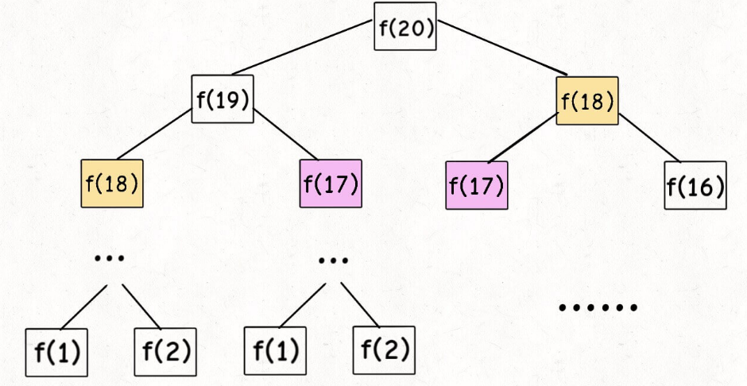
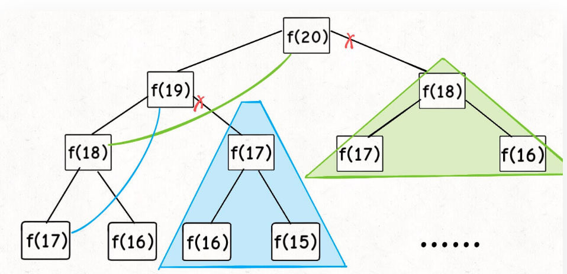
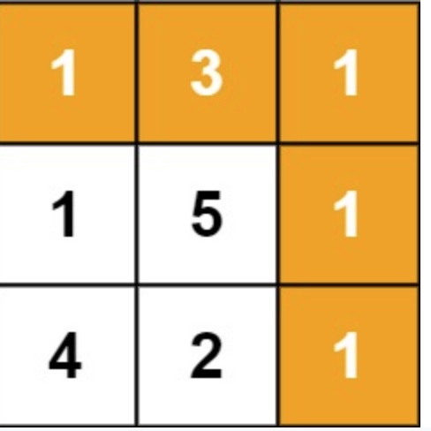
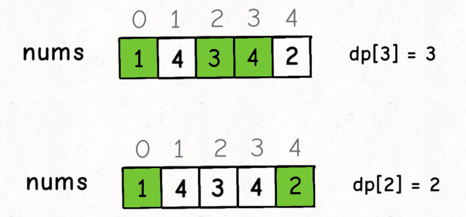
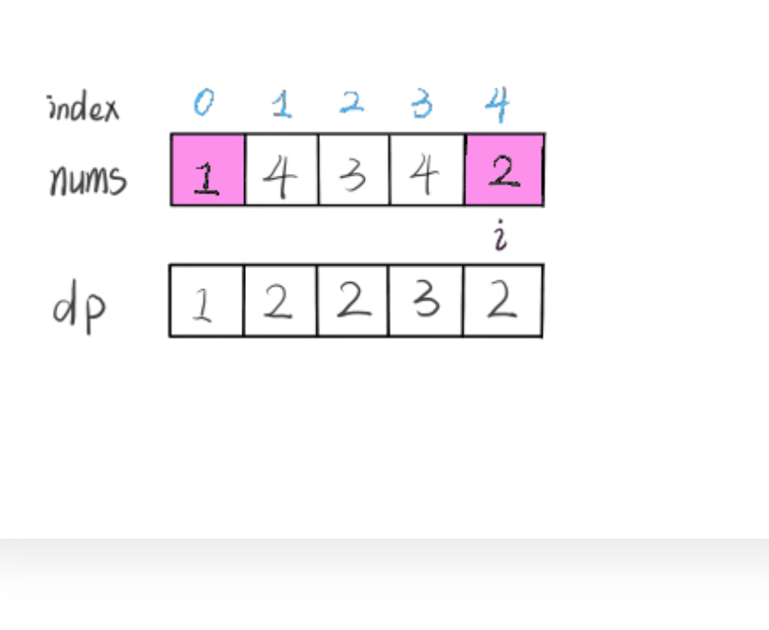
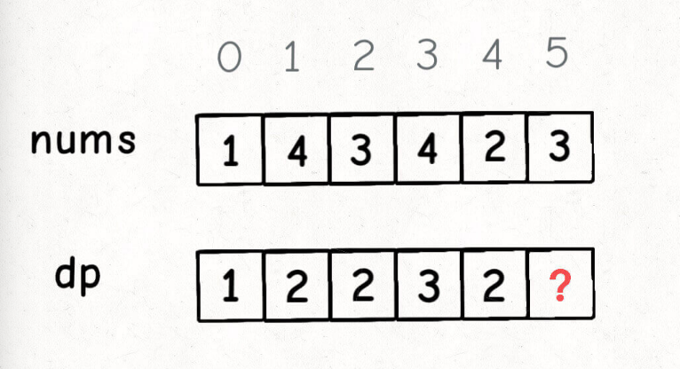
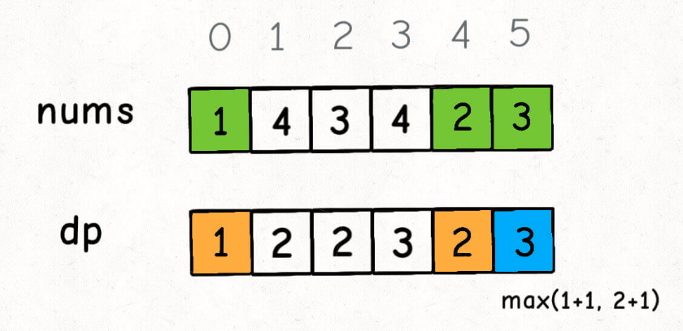
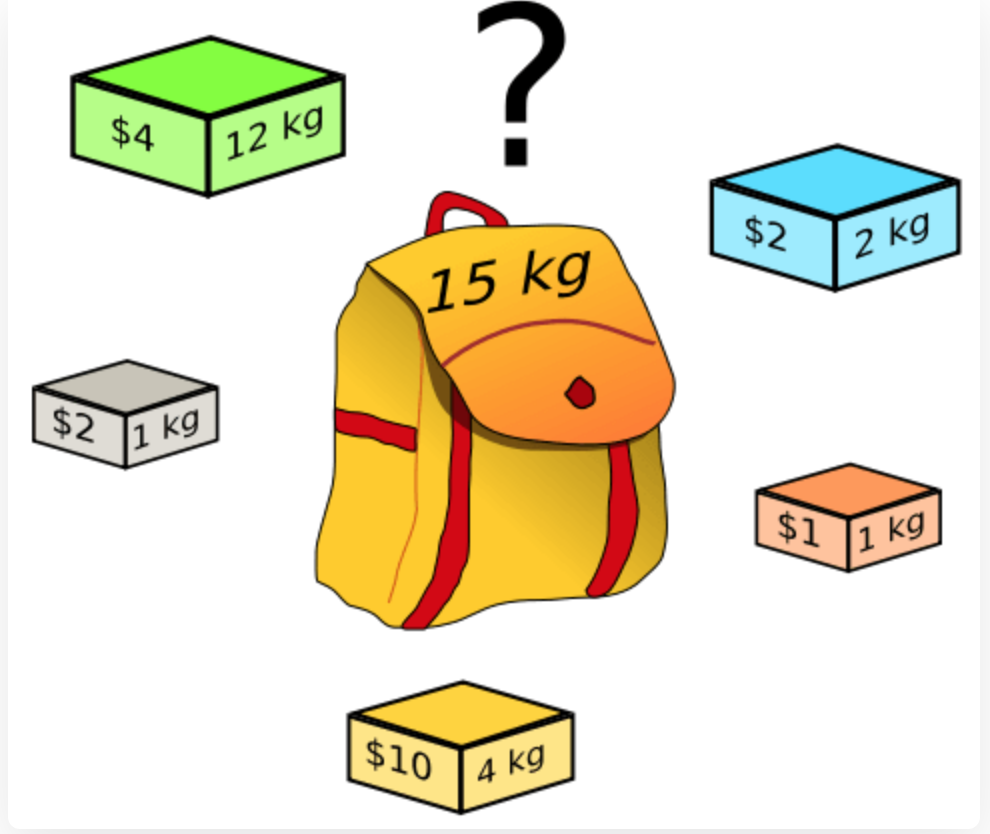
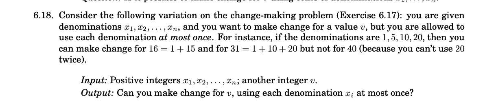
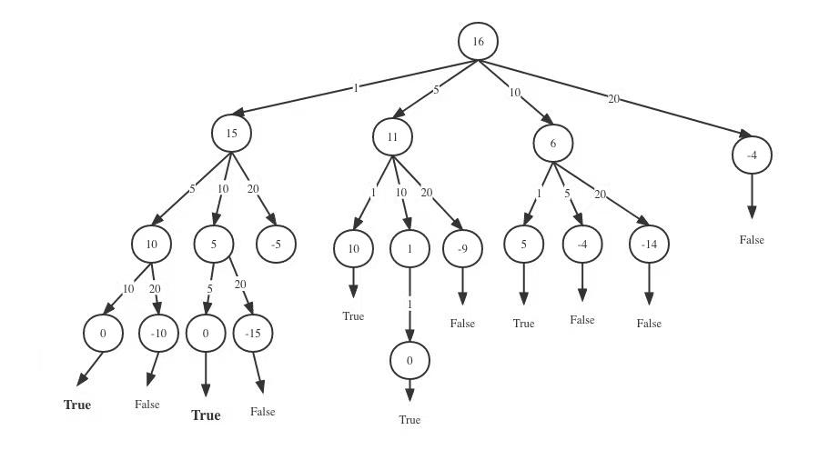

# Dynamic Programming
## technique definition (no problem/solution required)

Dynamic programming is often suitable for problems with overlapping subproblems [1] and optimal substructure properties, and the time consumption of dynamic programming methods is often much less than that of naive solutions.

The basic idea behind dynamic programming is very simple. Roughly speaking, to solve a given problem, we need to solve different parts of it (that is, the subproblems), and then use the solutions of the subproblems to arrive at the solution of the original problem.

Often many sub-problems are very similar, for this reason dynamic programming attempts to solve each sub-problem only once, thus reducing the amount of computation: once the solution to a given sub-problem has been solved, it is memoized so that the same sub-problem is needed next time Check the table directly when solving. This practice is particularly useful when the number of repeated subproblems grows exponentially with the size of the input.


## Fibonacci - good vs bad
**bad Fibonacci**
The mathematical form of the Fibonacci sequence is recursive, written in code like this:
```python
int fib(int N) {
    if (N == 1 || N == 2) return 1;
    return fib(N - 1) + fib(N - 2);
}
```
Although the code is concise and easy to understand, it is very inefficient.
Assuming n = 20, draw the recursion tree


To calculate the original problem f(20), I have to first calculate the sub-problems f(19) and f(18), and then to calculate f(19), I have to first calculate the sub-problems f(18) and f(18) f(17). Finally, when f(1) or f(2) is encountered, the result is known, and the result can be returned directly, and the recursive tree no longer grows downward.
Let's count the number of subproblems, that is, the total number of nodes in the recursion tree. Obviously, the total number of binary recursion tree nodes is exponential, so the number of subproblems is $O(2^n)$.
The reason for the inefficiency of the algorithm: there are a lot of repeated calculations, such as f(18) is calculated twice, and you can see that the recursive tree rooted at f(18) is huge, and it will cost a lot to calculate it again. time. What's more, more than one node f(18) is repeatedly calculated, so this algorithm is extremely inefficient.

**good Fibonacci**
Since the reason for the time-consuming is repeated calculation, then we can create a "memorandum", and don't rush to return after calculating the answer to a sub-question, first write it down in the "memorandum" and then return; each time a sub-question is encountered Go to the "Memo" and check it out. If you find that this problem has been solved before, just use the answer directly, and don't spend any more time calculating.

Usually an array is used as this "memo", of course you can also use a hash table (dictionary)
```java
int fib(int N) {
    int[] memo = new int[N + 1];
    return dp(memo, N);
}

int dp(int[] memo, int n) {
    // base case
    if (n == 0 || n == 1) return n;
    if (memo[n] != 0) return memo[n];
    memo[n] = helper(memo, n - 1) + helper(memo, n - 2);
    return memo[n];
```
Now, draw the recursion tree, and you know exactly what the "memo" does.


#### exercise
Given a m x n grid filled with non-negative numbers, find a path from top left to bottom right, which minimizes the sum of all numbers along its path.Give an dynamic programming solution of this question.
Note: You can only move either down or right at any point in time.

#### solution

Since the direction of the path can only be down or right, each element of the first row of the grid can only be reached from the top left element and moved to the right, and each element of the first column of the grid can only be reached from the top left The corner element begins to move down to arrive, and the path at this time is unique, so the minimum path sum corresponding to each element is the sum of the numbers on the corresponding path.

For elements that are not in the first row and first column, you can move one step down from the adjacent element above it, or move one step to the right from the adjacent element to the left, and the minimum path sum corresponding to the element is equal to the adjacent element above it and its adjacent element The minimum value of the minimum path sum corresponding to the two adjacent elements on the left plus the value of the current element. Since the minimum path corresponding to each element is related to the sum of the minimum paths corresponding to its neighbors, dynamic programming can be used to solve.

I will use tabulation for this problem.
- definition of  ```dp[i][j]```: ```dp[i][j]``` represents the minimal sum of all numbers along its path, when a sub-grid is ```grid[i-1 ][j-1] ```.
- We are searching for the  minimum path, so I will initiate dp matrix to inf. And the shape of dp matrix will be $m+1 * n+1$, m the number of rows,n is the number of column
```python
grid=[
[1,3,1],
[1,5,1],
[4,2,1]
]
```
```python
dp=[
[inf,inf,inf,inf],
[inf,inf,inf,inf],
[inf,inf,inf,inf],
[inf,inf,inf,inf]
]
```
- Then I will set the base case. In this case,base case is  dp[0][1]=0 and dp[1][0]=0. dp[1][1] represents the minimal path on grid[0][0], which is grid[0][0] itself.
  
```python
dp=[
[inf,0,inf,inf],
[0,inf,inf,inf],
[inf,inf,inf,inf],
[inf,inf,inf,inf]
]
```

- Let's define the state transaction equation, the path on ```dp[i][j]``` only come from up for left. So the state transaction equation will be ```dp[i][j]=min(dp[i-1][j]+grid[i-1][j-1],dp[i][j-1]+grid[i-1][j-1])```, and we will return the $dp[m+1][n+1]$
```python
    def minPathSum(self, grid: List[List[int]]) -> int:
        n=len(grid) # i 从上 往下遍历， 表示行数
        m=len(grid[0]) # j 从左往右遍历，表示列数
        dp= [[inf for i in range(0,m+1)] for _ in range(0,n+1)]
        dp[0][1]=0
        dp[1][0]=0

        for i in range(1,n+1):
            for j in range(1,m+1):
                dp[i][j]=min(dp[i-1][j]+grid[i-1][j-1],dp[i][j-1]+grid[i-1][j-1])
        return dp[n][m]
```
- stage 1 when i=1
```python
dp=[
[inf,0,inf,inf],
[0,1,4,5],
[inf,inf,inf],
[inf,inf,inf,inf]
]
```
- stage 2 when i=2
```python
dp=[
[inf,0,inf,inf],
[0,1,4,5],
[inf,2,7,6],
[inf,inf,inf,inf]
]
```
- stage 3 when i=2
```python
dp=[
[inf,0,inf,inf],
[0,1,4,5],
[inf,2,7,6],
[inf,6,8,7]
]
```
- At last we return ```dp[3][3]=7```

## Longest increasing subsequence
Input an unordered array of integers, find the length of the longest increasing subsequence in it.
For example, the input nums=[10,9,2,5,3,7,101,18], where the longest increasing subsequence is [2,3,7,101], so the output of the algorithm should be 4.
Note the difference between the nouns "subsequence" and "substring". Substrings must be consecutive, but subsequences are not necessarily consecutive. Let's first design a dynamic programming algorithm to solve this problem.
The core design idea of dynamic programming is mathematical induction. We want to prove a mathematical conclusion, then we first assume that the conclusion holds when k < n, and then according to this assumption, find a way to deduce that the conclusion also holds when k = n. If it can be proved, then this conclusion holds true for k equal to any number.
Our definition : dp[i] represents the length of the longest increasing subsequence ending with the number nums[i].
From this definition, we can deduce the base case: dp[i] is initially 1, because the longest increasing subsequence ending in nums[i] at least contains itself.




According to our definition of the dp array just now, we now want to find the value of dp[5], that is, we want to find the longest increasing subsequence ending with nums[5].

nums[5] = 3, since it is an increasing subsequence, we only need to find the previous subsequences whose ends are smaller than 3, and then connect 3 to the end of these subsequences to form a new increasing subsequence, and this new Add one to the subsequence length.
Just use a for loop to compare.
In our example, nums[0] and nums[4] are both less than nums[5], and then comparing the values of dp[0] and dp[4], dp[4]is the bigger one, so dp[5] = 3:



#### exercise
Given two strings text1 and text2, return the length of their longest common subsequence. 

A subsequence of a string is a new string generated from the original string with some characters (can be none) deleted without changing the relative order of the remaining characters.

For example, "ace" is a subsequence of "abcde".A common subsequence of two strings is a subsequence that is common to both strings.

> Input: text1 = "abcde", text2 = "ace" 
Output: 3  
Explanation: The longest common subsequence is "ace" and its length is 3.

>Input: text1 = "zabcde", text2 = "acez"
Output: 3
Explanation: The longest common subsequence is "abc" and its length is 3.
#### solution
- I use tabulation for this question. I use s1 for text1 and s2 for text2 in following explanation.

- dp array definition: ```dp[i][j]``` represents the longest Common Subsequence for ```s1[0:i-1]``` and ```s2[0:j-1]```

- Setting the base case: We are gonna find the longest common subsequence between two string, so the result has to be a number greater than or equal to 0. We can set our base case to 0.

Let's initiate the dp array.

|   |   | z | a | b | c | d | e |
|---|---|---|---|---|---|---|---|
|   | 0 | 0 | 0 | 0 | 0 | 0 | 0 |
| a | 0 | 0 | 0 | 0 | 0 | 0 | 0 |
| c | 0 | 0 | 0 | 0 | 0 | 0 | 0 |
| e | 0 | 0 | 0 | 0 | 0 | 0 | 0 |
| z | 0 | 0 | 0 | 0 | 0 | 0 | 0 |

- The state transaction euqation: 
when ```s1[i] == s2[j]```, ```dp[i][j]=dp[i-1][j-1]+1```
**explanation**: When ```s1[i] == s2[j]``` ,```s1[i]``` and ```s2[j]``` are definitely belong to the longest common subsequence between ```text1[0:i]``` and ```text2[0:j]```, because they are the last character of ```text1[0:i]``` and ```text2[0:j]```. So when 
When ```s1[i] !== s2[j]``` , ```dp[i][j]=max(dp[i-1][j],dp[i]j-1)```
**explanation**: When ```s1[i] !== s2[j]```, s1[i] or s2[j] might not in the longest common subsequence, or both of them not in the longest common subsequence. So we just need to inherit the bigger common subsequence number among the ```s1[i-1],s2[j]``` and ```s1[i],s2[j-1]```

Here's the code
```python
def longestCommonSubsequence(text1, text2):
    N = len(text1)
    M = len(text2)
    print(N, M)
    # N is column J is row we alway iter rate by row
    dp = [[0 for i in range(N+1)] for j in range(M+1)]
    for j in range(1, M+1):
        for i in range(1, N+1):
            if text2[j-1] == text1[i-1] and dp[j-1][i]+1 <= j:
                dp[j][i] = dp[j-1][i-1]+1
            else:
                dp[j][i] = max(dp[j][i-1], dp[j-1][i])
    return dp[M][N]
```

Let's run the algorithem,
> when i =1

|   |   | z | a | b | c | d | e |
|---|---|---|---|---|---|---|---|
|   | 0 | 0 | 0 | 0 | 0 | 0 | 0 |
| a | 0 | 0 | 1 | 1 | 1 | 1 | 1 |
| c | 0 | 0 | 0 | 0 | 0 | 0 | 0 |
| e | 0 | 0 | 0 | 0 | 0 | 0 | 0 |
| z | 0 | 0 | 0 | 0 | 0 | 0 | 0 |

> when i =2

|   |   | z | a | b | c | d | e |
|---|---|---|---|---|---|---|---|
|   | 0 | 0 | 0 | 0 | 0 | 0 | 0 |
| a | 0 | 0 | 1 | 1 | 1 | 1 | 1 |
| c | 0 | 0 | 1 | 1 | 2 | 2 | 2 |
| e | 0 | 0 | 0 | 0 | 0 | 0 | 0 |
| z | 0 | 0 | 0 | 0 | 0 | 0 | 0 |

> when i =3

|   |   | z | a | b | c | d | e |
|---|---|---|---|---|---|---|---|
|   | 0 | 0 | 0 | 0 | 0 | 0 | 0 |
| a | 0 | 0 | 1 | 1 | 1 | 1 | 1 |
| c | 0 | 0 | 1 | 1 | 2 | 2 | 2 |
| e | 0 | 0 | 1 | 1 | 2 | 2 | 3 |
| z | 0 | 0 | 0 | 0 | 0 | 0 | 0 |

> when i =4

|   |   | z | a | b | c | d | e |
|---|---|---|---|---|---|---|---|
|   | 0 | 0 | 0 | 0 | 0 | 0 | 0 |
| a | 0 | 0 | 1 | 1 | 1 | 1 | 1 |
| c | 0 | 0 | 1 | 1 | 2 | 2 | 2 |
| e | 0 | 0 | 1 | 1 | 2 | 2 | 3 |
| z | 0 | 0 | 1 | 1 | 2 | 2 | 3 |

At last, we return 3, the length of longest common subsequence between 'zabcde' and 'acez' is 3.


## Edit-distance
### definition of Edit-distance:
Given two words word1 and word2, calculate the minimum number of operations required to convert word1 to word2. You can perform the following three operations on a word.

- insert a character
- delete a character
- replace a character

```python
input: word1 = "horse", word2 = "ros"
output: 3
解释: 
horse -> rorse (replace 'h' of 'r')
rorse -> rose (delete 'r')
rose -> ros (delete 'e')
```

• Ideas
Our purpose is to simplify the problem. For example, two words horse and ros calculate the edit distance D between them. It is easy to find that if the word is shortened, the problem will be simplified. It is natural to think of using D[n ][m] represents the edit distance for input words of length n and m. Specifically, D[ i ][ j ] represents the edit distance between the first i letters of word1 and the first j letters of word2.

For a more general understanding, suppose we can use d[ i , j ] steps (you can use a two-dimensional array to save this value, using the idea of ​​dynamic programming), which means converting the string s[ 1...i ] to the string t [ 1 ...j ] requires the minimum number of steps, then, in the most basic case, that is, when i is equal to 0, that is to say, the string s is empty, then the corresponding d[ 0 , j ] is to add j characters, Make s into t, when j is equal to 0, that is to say the string t is empty, then the corresponding d[ i, 0] is to reduce i characters, so that s into t.

In a more general case, with idea of ​​dynamic programming, if we want to convert s[1..i] into t[1..j] after the minimum number of additions, deletions, or replacement operations, then we must Previously, it was possible to add, delete, or replace operations with the least number of times, so that now the string s and string t only need to do one more operation or not to complete the s[1..i] == t[1..j] convert. The so-called "before" is divided into the following three situations:

- To get s[1…i] == t[1…j-1] requires k operations
- To get s[1..i-1] == t[1..j] requires k operations
- To get s[1…i-1] == t[1…j-1] requires k operations

On the basis of the above three cases, we need to get s[1..i] == t[1..j] , we give solutions respectively, as follows

- In the first case, you only need to add t[1…j-1] to s[i] at the end to complete the match, so a total of k+1 operations are required.
- In the second case, you only need to add s[1..i-1] to t[j] at the end to complete the match, so a total of k+1 operations are required.
- In the third case, you only need to replace s[ i ] with t[ j ] at the end, so that s[1..i] == t[1..j], which requires k+1 operations in total.

Special note: if in the third case, s[i] is exactly equal to t[j], then we can complete the process with only k operations.

Finally, in order to ensure that the number of operations obtained is always the least, we can choose the least expensive one from the three cases above which is the smallest operation required to convert s[1..i] to t[1..j] frequency. We name the two-dimensional array storing k as D[ ][ ] , obviously when we get D[i-1][j], D[i][j-1] and D[i-1][j- 1], D[i][j] can be calculated.

If the last letters of the two substrings are the same, i.e. word1[i] = word2[i]:


If the last letter of the two substrings is not the same, i.e. word1[i] != word2[i] we will consider replacing the last character so that they are the same:


#### exercise

Given two strings ```'intention'``` and ```'insertion'```, return the minimum number of operations required to convert ```'intention'``` to ```'insertion'```.
You have the following three operations permitted on a word:
Insert a character
Delete a character
Replace a character

#### solution
The question is given two words, set to A and B, so that we can operate six ways.

But we can find that if we have word A and word B: Deleting a character from word A is equivalent to inserting a character from word B. For example, when word A is doge and word B is dog, we can either delete the last character e of word A to get the same dog, or add a character e at the end of word B to get the same doge;

Similarly, deleting a character in word B is equivalent to inserting a character in word A;

Replacing a character for word A is equivalent to replacing a character for word B. For example, when word A is bat and word B is cat, we modify the first letter b -> c of word A, and modify the first letter c -> b of word B is equivalent.

In this way, there are actually only three fundamentally different operations:

- Insert a character into word A;

- Insert a character in word B;

- Modify one character of the word A.

This way, we can transform the original problem into smaller subproblems. Let's use ```A = horse, B = ros``` as an example to see how this problem can be transformed into smaller sub-problems.

Insert a character into the word A: if we know that the edit distance from horse to ro is a, then obviously the edit distance from horse to ros will not exceed a + 1. This is because we can turn horse and ro into the same string after a operations, with just 1 extra operation, adding the character s at the end of word A, and we can convert horse and ro after a + 1 operations ro becomes the same string;

Insert a character in word B: if we know that the edit distance from horses to ros is b, then obviously the edit distance from horse to ros will not exceed b + 1, for the same reason as above;

Modify one character of word A: if we know that the edit distance from horses to ro is c, then obviously the edit distance from horse to ros will not exceed c + 1, for the same reason as above.

Then the edit distance from horse to ros should be ```min(a + 1, b + 1, c + 1)```.

Initiate the DP table
|   |   | i | n | t | e | n | t | i | o | n |
|---|---|---|---|---|---|---|---|---|---|---|
|   | 0 | 1 | 2 | 3 | 4 | 5 | 6 | 7 | 8 | 9 |
| i | 1 |   |   |   |   |   |   |   |   |   |
| n | 2 |   |   |   |   |   |   |   |   |   |
| c | 3 |   |   |   |   |   |   |   |   |   |
| e | 4 |   |   |   |   |   |   |   |   |   |
| p | 5 |   |   |   |   |   |   |   |   |   |
| t | 6 |   |   |   |   |   |   |   |   |   |
| i | 7 |   |   |   |   |   |   |   |   |   |
| o | 8 |   |   |   |   |   |   |   |   |   |
| n | 9 |   |   |   |   |   |   |   |   |   |

After we run the algorithem

|   |   | i | n | t | e | n | t | i | o | n |
|---|---|---|---|---|---|---|---|---|---|---|
|   | 0 | 1 | 2 | 3 | 4 | 5 | 6 | 7 | 8 | 9 |
| i | 1 | 0 | 1 | 2 | 3 | 4 | 5 | 6 | 7 | 8 |
| n | 2 | 1 | 0 | 1 | 2 | 3 | 4 | 5 | 6 | 7 |
| c | 3 | 2 | 1 | 1 | 2 | 3 | 4 | 5 | 6 | 7 |
| e | 4 | 3 | 2 | 2 | 1 | 2 | 3 | 4 | 5 | 6 |
| p | 5 | 4 | 3 | 3 | 3 | 2 | 3 | 4 | 5 | 6 |
| t | 6 | 5 | 4 | 3 | 3 | 3 | 2 | 3 | 4 | 5 |
| i | 7 | 6 | 5 | 4 | 4 | 4 | 3 | 2 | 3 | 4 |
| o | 8 | 7 | 6 | 5 | 5 | 5 | 4 | 3 | 2 | 3 |
| n | 9 | 8 | 7 | 6 | 6 | 5 | 5 | 4 | 3 | 2 |


## Knapsack (both 0-1 and unrestrained)

You are given a backpack of weight W and N items, each with weight and value. The weight of the i-th item is wt[i] and the value is val[i]. Now let you pack the item with this back, what is the maximum value it can hold?


- ```dp[i][w]``` is defined as follows: For the first i items, the current knapsack capacity is w, and the maximum value that can be loaded in this case is ```dp[i][w]```.
According to this definition, the final answer we want is ```dp[N][W]```. 

- The base case is ```dp[0][..] = dp[..][0] = 0```
explanation: when there are no items or the backpack has no space, the maximum value that can be loaded is 0.

- How to represent "put item i in the backpack" and "don't put item i in the backpack" in code?
**explanation**:If you didn't put the i-th item into the knapsack, then obviously the maximum value ```dp[i][w]``` should be equal to ```dp[i-1][w]```, inheriting the previous result. If you put the i-th item into the knapsack, then ```dp[i][w]``` should be equal to ```dp[i-1][w - wt[i-1]] + val[i-1]```.

```python
for i in [1..N]:
    for w in [1..W]:
        dp[i][w] = max(
            dp[i-1][w],
            dp[i-1][w - wt[i-1]] + val[i-1]
        )
return dp[N][W]
```
#### exercise

Given a non-empty array nums containing only positive integers, find if the array can be partitioned into two subsets such that the sum of elements in both subsets is equal.

> Input: nums = [1,5,11,5]
Output: true
Explanation: The array can be partitioned as [1, 5, 5] and [11].

> Input: nums = [1,2,3,5]
Output: false
Explanation: The array cannot be partitioned into equal sum subsets.
#### solution
This problem can actually be transformed into a knapsack problem.
The knapsack question asks
You are given a backpack of weight W and N items, each with weight and value. The weight of the i-th item is wt[i] and the value is val[i]. Now let you pack the item with this back, what is the maximum value it can hold?

Then for this problem, we can first sum the sets, get sum, and transform the problem into a knapsack problem: give a knapsack with a loadable weight of sum / 2 and N items, each with a weight of nums[i] . Now let you load the items, is there a way of loading that can fill the backpack exactly?

- The first step is to clarify two points, "status" and "selection". The status is "backpack capacity" and "optional items", and the choice is "packed in backpack" or "not in backpack"
- Then we define the dp table,According to the routine of the knapsack problem, the following definitions can be given: ```dp[i][j] = x``` means that, for the first ```i``` items, when the capacity of the current backpack is ```j```, if ```x``` is true, it means that the backpack can be filled exactly; if ```x ```is false, it means that the backpack cannot be filled exactly. For example, if ```dp[4][9] = true```, it means: for a knapsack with a capacity of 9, there is a way to fill the knapsack exactly with the first 4 items.
- The final answer we want is ```dp[N][sum/2]```, the base case is ```dp[..][0] = true``` and ```dp[0][..] = false```, because when the backpack has no space, it is Equivalent to full, so ```dp[..][0] = true```. And when there are no items to choose from, there is definitely no way to fill the backpack, in this case ```dp[0][..] = false```.
- Then we consider the state transaction equation
- - If you don't count nums[i] into the subset, or you don't put the i-th item into the backpack, whether you can fill the backpack exactly depends on the previous state of ```dp[i-1][j]```.

  - If you count ```nums[i]``` into the subset, or you put the i-th item into the knapsack, whether you can fill the knapsack exactly depends on the state ```dp[i-1][j-nums[i-1] ]```.

  - First, since i is 1-based and array indices are 0-based, the weight of the i-th item should be ```nums[i-1]```, don't get confused.

  - ```dp[i - 1][j-nums[i-1]]``` is also easy to understand: if you load the i-th item, it depends on whether the remaining weight of the backpack ```j - nums[i-1]``` can be used under the limit of ```j - nums[i-1]``` Just filled.

    - In other words, if the weight of ```j - nums[i-1]``` can be filled exactly, then as long as the ith item is loaded, the weight of j can also be filled exactly; otherwise, the weight j must be filled.
```python
def canPartition(nums):
    """
        :type nums: List[int]
        :rtype: bool
        """
    s = sum(nums)
    if s % 2 != 0:
        return False
    else:
        n = len(nums)+1
        target = s//2
        dp = [[False for i in range(target+1)] for _ in range(n)]
        for i in range(1, len(nums)+1):
            dp[i][0] = True
        for j in range(1, target+1):
            dp[0][j] = False
        for i in range(1, n):
            for j in range(1, target+1):
                if nums[i - 1] > j:
                    dp[i][j] = dp[i-1][j]
                else:
                    dp[i][j] = dp[i-1][j] or dp[i-1][j-nums[i-1]]
        return dp[len(nums)][target]
```

## Dynamic programming algorithmic design

First, the general form of the dynamic programming problem is to find the maximum and minimum values. Dynamic programming is actually an optimization method of operations research, but it is widely used in computer problems, such as asking you to find the longest increasing subsequence, the minimum edit distance, and so on.

Since it is the most valuable requirement, what is the core problem? The core problem of solving dynamic programming is exhaustion. Because the best value is required, we must exhaustively list all feasible answers, and then find the best value among them.

Dynamic programming is so simple, just exhaustive? The dynamic programming problems I've seen are so hard!

First of all, the exhaustion of dynamic programming is a bit special, because there are "overlapping sub-problems" in this type of problem. If the exhaustion is violent, the efficiency will be extremely low, so a "memorandum" or "DP table" is needed to optimize the exhaustion process and avoid unnecessary calculation.

Moreover, the dynamic programming problem must have an "optimal substructure", so that the maximum value of the original problem can be obtained through the maximum value of the subproblem.

In addition, although the core idea of ​​dynamic programming is to exhaustively find the most value, the problem can be ever-changing. It is not an easy task to exhaustively exhaust all feasible solutions. Only by listing the correct "state transition equation" can we correctly exhaust .

The overlapping subproblems, optimal substructures, and state transition equations mentioned above are the three elements of dynamic programming.
```python
# 初始化 base case
dp[0][0][...] = base
# 进行状态转移
for state1 in All values of state 1：
    for state2 in All values of state 2：
        for ...
            dp[state1][state1][...] = max/min(option1,option2...)
```

If the most traditional and standard dynamic programming is the problem of finding the most value (in the final analysis, it is still exhaustive), at this time, using tabulation to solve the problem can save time and space complexity? In this case, it is relatively easy to determine the definition of the dp array (which may also be two-dimensional) and the state transition equation? But when it is not a dynamic programming problem of standard maximization, such as outputting a boolean value, will it be better to use recursion's memorization? For example, in this case, the output is a boolean value. If tabulation needs to be raised to a two-dimensional array, the definition of the dp array and the state transition equation are also difficult to write. But with memorization, a recursion tree can be explained well, and the implementation is relatively easy?



#### exercise
Given a string s, find the longest palindromic subsequence's length in s.

A subsequence is a sequence that can be derived from another sequence by deleting some or no elements without changing the order of the remaining elements.
> Input: s = "bbbab"
Output: 4
Explanation: One possible longest palindromic subsequence is "bbbb".

> Input: s = "cbbd"
Output: 2
Explanation: One possible longest palindromic subsequence is "bb".

#### solution:
For a subsequence, if it is a palindrome and its length is greater than 22, it is still a palindrome after removing the first and last two characters. Therefore, dynamic programming can be used to calculate the longest palindromic subsequence of a given string.

Let ```p[i][j]``` denote the length of the longest palindromic subsequence in the subscript range [i, j] of the string s. Assuming that the length of the string s is n, only when ```0≤i≤j<n```, there will be ```dp[i][j]>0```, otherwise ```dp[i][j]=0```.

Since any subsequence of length 1 is a palindrome, the boundary case of dynamic programming is that for any ```0≤i<n```, ```dp[i][i]=1```.

When i<j, computing ```dp[i][j]``` needs to consider the equal and unequal cases of ```s[i]``` and ```s[j]``` respectively:

If ```s[i] = s[j]```, first get the longest palindrome subsequence within the range ```[i+1, j-1]``` of s, and then add ```s[i]``` and ```s[j]```, the longest palindrome subsequence in the subscript range ```[i, j]``` of s can be obtained, so ```dp[i][j]=dp[i+1][j−1]+2```;

If ```s[i]=s[j]```, then ```s[i]``` and``` s[j]``` cannot be the beginning and end of the same palindrome subsequence at the same time, so ```dp[i][j]=max(dp[i+1] [j],dp[i][j−1])```.

Since the state transition equations are all transitions from a subsequence with a shorter length to a subsequence with a longer length, it is necessary to pay attention to the loop sequence of dynamic programming.

Finally, ```dp[0][n−1]``` is the length of the longest palindrome subsequence of the string s.

```python
def longestPalindromeSubseq_table(s) :
    n = len(s)
    dp = [[0] * n for _ in range(n)]
    for i in range(n - 1, -1, -1):
        dp[i][i] = 1
        for j in range(i + 1, n):
            if s[i] == s[j]:
                dp[i][j] = dp[i + 1][j - 1] + 2
            else:
                dp[i][j] = max(dp[i + 1][j], dp[i][j - 1])
        print(dp)
    return dp[0][n - 1]

```


```python
def longestPalindromeSubseq_memo(s):
    if len(s) == 0:
        return 0
    if len(s) == 1:
        return 0
    case1 = longestPalindromeSubseq(s[1:])
    case2 = longestPalindromeSubseq(s[:-1])
    case3 = longestPalindromeSubseq(s[1:-1])
    print(case1, case2, case3)
    biggest = max(case1, case2, case3)

    if s[0] == s[-1]:
        return 2+max(case1, case2, case3)
    else:
        return max(case1, case2, case3)****
```