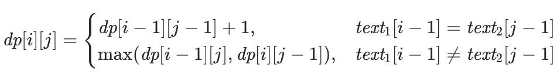
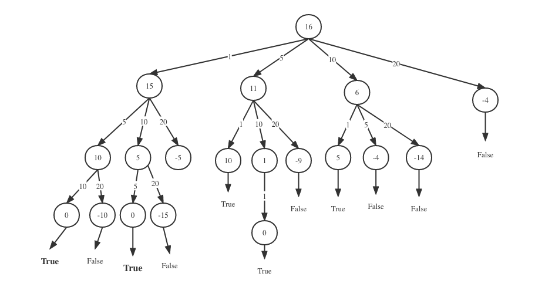

## 6.1. 
A contiguous subsequence of a list S is a subsequence made up of consecutive elements of S. For instance, if S is
5, 15, −30, 10, −5, 40, 10,
then 15, −30, 10 is a contiguous subsequence but 5, 15, 40 is not. Give a linear-time algorithm for
the following task:
Input: A list of numbers, a1, a2, . . . , an.
Output: The contiguous subsequence of maximum sum (a subsequence of length zero has sum zero).

###Solution:
I use tabulation for this question.
- **step1** If we use dynamic programming tabulation here. I will create an array dp to store the "maximum sum of subarrays" ending at nums[i] as dp[i].
```python
nums=[5, 15, −30, 10, −5, 40, 10]
```
We initiate the dp[]list first, the length of Array dp  will be the same length of nums. I set the initial value of elemnts in dp equals to -1000000. The question ask us to find the max sum of subarrays. It ask for something max , then we should set the initial value of dp array to something really small. Because when we update the dp array, if the initialelement of dp array is very big, computer will consider the initial value as the bigger one, then the update will fail.vice versa。
```python
dp=[-1000000,-1000000,-1000000,-1000000,-1000000,-1000000]
```
- **step2** Then we set a base case for dp array. We make the first element of nums array as the first element of dp array.
```python
 dp[0]=nums[0]
```
The reason why I do this is that for the first element in nums, the maximum sum of subarrays ending at nums[0] is nums[0] itself. Then the dp array will be like 
```python
dp=[5,0,0,0,0,0]
```
- **Step3** Now we need to consider the state transaction equation for dp.
Remember what's the definition of element om dp array? It indicates  the "maximum sum of subarrays" ending at nums[i] 
So We just ask for dp[i] at each position and return the maximum value in the dp array. So how do we find dp[i]? We can consider $nums[i]$ to be a segment by itself or to add the segment corresponding to $f(i-1)$, depending on the size of $nums[i]$ and $nums[i]+dp[i-1]$ , we hope to obtain a relatively large one, so we can write such a dynamic programming transition equation :
$dp[i]=max(dp[i]+nums[i],nums[i])$
So the presocode of  this algorithem  will be
```python
def maxSubArray(nums):
    dp = [-100000000]*(len(nums))

    dp[0] = nums[0]

    for i in range(1, len(dp)):
        if nums[i] < dp[i-1]+nums[i]:
            dp[i] = dp[i-1]+nums[i]
        else:
            dp[i] = nums[i]

    return max(dp)
```
- **step4** We can run the algorithem now
```python
nums = [5, 15, -30, 10, -5, 40, 10]
```
when i =1
```python
current nums[i] is  15
dp[i-1] is  5
dp[i-1]+nums[i] is  20
Apparently nums[i] < dp[i-1]+nums[i],we update the dp array, Now dp Array is 
 [5, 20, -1000000, -1000000, -1000000, -1000000, -1000000]
maximum sum of subarrays ends at 15 is 20
```
when i=2 
```python
current nums[i] is  -30
dp[i-1] is  20
dp[i-1]+nums[i] is  -10
Apparently nums[i] < dp[i-1]+nums[i],we update the dp array, Now dp Array is 
 [5, 20, -10, -1000000, -1000000, -1000000, -1000000]
maximum sum of subarrays ends at -30 is -10
```
when i=3

```python
current nums[i] is  10
dp[i-1] is  -10
dp[i-1]+nums[i] is  0
nums[i] > dp[i-1]+nums[i], so we make dp[i]=nums[i], Now dp Array is [5, 20, -10, 10, -1000000, -1000000, -1000000]
maximum sum of subarrays ends at 10 is 10
```
when i=4

```python
current nums[i] is  -5
dp[i-1] is  10
dp[i-1]+nums[i] is  5
Apparently nums[i] < dp[i-1]+nums[i],we update the dp array, Now dp Array is 
 [5, 20, -10, 10, 5, -1000000, -1000000]
maximum sum of subarrays ends at -5 is 5
```

when i=5
```python
current nums[i] is  40
dp[i-1] is  5
dp[i-1]+nums[i] is  45
Apparently nums[i] < dp[i-1]+nums[i],we update the dp array, Now dp Array is 
 [5, 20, -10, 10, 5, 45, -1000000]
maximum sum of subarrays ends at 40 is 45
```
when i =6 
```python
current nums[i] is  10
dp[i-1] is  45
dp[i-1]+nums[i] is  55
Apparently nums[i] < dp[i-1]+nums[i],we update the dp array, Now dp Array is 
 [5, 20, -10, 10, 5, 45, 55]
maximum sum of subarrays ends at 10 is 55
```
Finally, we pick up the max number in dp array. The answer is 55

## 6.5
Pebbling a checkerboard. We are given a checkerboard which has 4 rows and n columns, and has an integer written in each square. We are also given a set of 2n pebbles, and we want to place some or all of these on the checkerboard (each pebble can be placed on exactly one square) so as to maximize the sum of the integers in the squares that are covered by pebbles. There is one constraint: for a placement of pebbles to be legal, no two of them can be on horizontally or vertically adjacent squares (diagonal adjacency is fine).
(a) Determine the number of legal patterns that can occur in any column (in isolation, ignoring the pebbles in adjacent columns) and describe these patterns.
Call two patterns compatible if they can be placed on adjacent columns to form a legal placement. Let us consider subproblems consisting of the first k columns 1 ≤ k ≤ n. Each subproblem can be assigned a type, which is the pattern occurring in the last column.
(b) Using the notions of compatibility and type, give an O(n)-time dynamic programming algo- rithm for computing an optimal placement.

(a)
In the following table , 1 means A pebble is placed in the grid of this column, 0 means no pebble is placed in the grid of this column.
So there will be 8 pattern
| Pattern   | P0 | P1    | P2    | P3    | P4    | P5    | P6    | P7    |
|---------  |--- |-------|-------|-------|-------|-------|-------|-------|
|   row1    | 0  | 1   | 0 | 0 | 0 | 1 | 0 | 1 |
| row2      | 0  | 0   | 1 | 0 | 0 | 0 | 1 | 0 |
| row3    | 0  | 0   | 0 | 1 | 0 | 1 | 0 | 0 |
| row4    | 0  | 0   | 0 | 0 | 1 | 0 | 1 | 1 |

(b)
- Step 1,with answer for a) we already has the pattern matrix
```python
pattern=[
[0,0,0,0],
[1,0,0,0],
[0,1,0,0],
[0,0,1,0],
[0,0,0,1],
[1,0,1,0],
[0,1,0,1],
[1,0,0,1]
]
```
- step 2
Then we build a ```compatible[][]``` matrix,  ```compatible[i][j]``` indicating if ```pattern[i]``` is compatible to ```pattern [j]```.
If the ```compatible[i][j]=1``` , that means a column with pattern i if ok to be adjacent to a column with pattern j.

| Pattern   | P0 | P1    | P2    | P3    | P4    | P5    | P6    | P7    |
|---------  |--- |-------|-------|-------|-------|-------|-------|-------|
|   P0      | 1  | 1     | 1     | 1     | 1     | 1     | 1     | 1     |
|   P1      | 1  | 0     | 1     | 1     | 1     | 0     | 1     | 0     |
|   P2      | 1  | 1     | 0     | 1     | 1     | 1     | 0     | 1     |
|   P3      | 1  | 1     | 1     | 0     | 1     | 0     | 1     | 1     |
|   P4      | 1  | 1     | 1     | 1     | 0     | 1     | 0     | 0     |
|   P5      | 1  | 0     | 1     | 0     | 1     | 0     | 1     | 0     |
|   P6      | 1  | 1     | 0     | 1     | 0     | 1     | 0     | 0     |
|   P7      | 0  | 0     | 0     | 0     | 1     | 0     | 1     | 1     |

- step3 
For ease of understanding，Let's make the checkerboard like follow table.

| checkerboard   | Column0 | Column1    | Column2    | Column3 |
|---------  |--- |-------|-------|-------|
|   Row0    | 2  | 9   | 5 | 3 |
|   Row1    | 5  | 7   | 8 | 8 |
|   Row2    | 3 | 3   | 2 | 1 |
|   Row3    | 7  | 4   | 1 | 4 |

- step4  we start building our ```dp[][]``` matrix according to the checkerboard and the pattern matrix
  the definition of ```dp[i][j]``` is the maximum result ends at ```column j```, if ```column j``` has  ```pattern i```
We initiate the ``` dp[][]``` matrix to 0 or negative infinity. All the number in current checkerboard is Positive number.So in this case I make them to 0.
  
| DP matrix   | Column0 | Column1    | Column2    | Column3 |
|---------  |--- |-------|-------|-------|
|   P0    | 0  | 0   | 0 | 0 |
|   P1    | 0  | 0   | 0 | 0 |
|   P2    | 0  | 0   | 0 | 0 |
|   P3    | 0  | 0   | 0 | 0 |
|   P4    | 0  | 0   | 0 | 0 |
|   P5    | 0  | 0   | 0 | 0 |
|   P6    | 0  | 0   | 0 | 0 |
|   P7    | 0  | 0   | 0 | 0 |

- step 5 start run our algorithem
- The state transaction equation will be 
dp[i][j]= ```sum of elements in column[j],if column[j] is in pattern[i] ``` +```max(the compatible pattern number in column[j-1])```

We update the first column of dp matrix. pattern[5] is [1,0,1,0], so we need to add the first and the third element of column1 in checkerboard. we got 2+3=5.
P6,P7 is the same thing.

| DP matrix   | Column0 | Column1    | Column2    | Column3 |
|---------  |--- |-------|-------|-------|
|   P0    | 0  | 0   | 0 | 0 |
|   P1    | 2  | 0   | 0 | 0 |
|   P2    | 5  | 0   | 0 | 0 |
|   P3    | 3  | 0   | 0 | 0 |
|   P4    | 7  | 0   | 0 | 0 |
|   P5    | 2+3=5  | 0   | 0 | 0 |
|   P6    | 5+7=12  | 0   | 0 | 0 |
|   P7    | 2+7=9  | 0   | 0 | 0 |

Then we update the second column of DP matrix.
If column1 is in pattern0,  according to the state transaction equation. 
Pattern 6 is compatible to pattern 0 and it is the max compatible pattern. So the dp[0][1]will be  12.

If column 1 is in pattern 1 ,  according to the state transaction equation. 
the sum of column1 will be 9, the maximum compatible pattern number is still pattern6,so the max value of column[j-1] will be 12.
dp[1][1]=9+12=21
The rest element also works with above Logitech/

| DP matrix   | Column0 | Column1    | Column2    | Column3 |
|---------  |--- |-------|-------|-------|
|   P0    | 0  | 12   | 0 | 0 |
|   P1    | 2  | 9+12=21   | 0 | 0 |
|   P2    | 5  | 7+9=16   | 0 | 0 |
|   P3    | 3  | 3+12=15   | 0 | 0 |
|   P4    | 7  | 4+5=9   | 0 | 0 |
|   P5    | 2+3=5  | 12+12=24   | 0 | 0 |
|   P6    | 5+7=12  | 11+5=16   | 0 | 0 |
|   P7    | 2+7=9  | 13+5=18   | 0 | 0 |

Update the third column of DP matrix
| DP matrix   | Column0 | Column1    | Column2    | Column3 |
|---------  |--- |-------|-------|-------|
|   P0    | 0  | 12   | 24 | 0 |
|   P1    | 2  | 9+12=21   | 5+16=21 | 0 |
|   P2    | 5  | 7+9=16   | 8+24=32 | 0 |
|   P3    | 3  | 3+12=15   | 2+21=23 | 0 |
|   P4    | 7  | 4+5=9   | 1+24=25 | 0 |
|   P5    | 2+3=5  | 12+12=24   | 7+16=23 | 0 |
|   P6    | 5+7=12  | 11+5=16   | 9+24=33 | 0 |
|   P7    | 2+7=9  | 13+5=18   | 6+16=22 | 0 |

Update the fourth column of DP matrix

| DP matrix   | Column0 | Column1    | Column2    | Column3 |
|---------  |--- |-------|-------|-------|
|   P0    | 0  | 12   | 24 | 33 |
|   P1    | 2  | 9+12=21   | 5+16=21 | 3+33=36 |
|   P2    | 5  | 7+9=16   | **8+24=32** | 8+25=33 |
|   P3    | 3  | 3+12=15   | 2+21=23 | 1+33=34 |
|   P4    | 7  | 4+5=9   | 1+24=25 | 4+32=3 |
|   P5    | 2+3=5  | **12+12=24**   | 7+16=23 | 4+33=37 |
|   P6    | **5+7=12**  | 11+5=16   | 9+24=33 | 12+24=36 |
|   P7    | 2+7=9  | 13+5=18   | 6+16=22 | **7+32=39** |

The  maximize the sum of the integers will be 39. I I put the best choice above in bold.
We use pattern6 for column0,pattern5 for column1,pattern2 for column2,pattern7 for column3.


| checkerboard   | Column0 | Column1    | Column2    | Column3 |
|---------  |--- |-------|-------|-------|
|   Row0    | 2  | **9**   | 5 | **3** |
|   Row1    | **5**  | 7   | **8** | 8 |
|   Row2    | 3 | **3**   | 2 | 1 |
|   Row3    | **7**  | 4   | 1 | **4** | 

If we were to represent it on the chessboard,the position in bold is where the pieces are placed 👆🏻

# 6.8 
Given two strings x = x1x2 ···xn and y = y1y2 ···ym, we wish to find the length of their longest common substring,that is, the largest k for which there are indices i and j with xixi+1···xi+k−1 = yjyj+1 ···yj+k−1. Show how to do this in time O(mn).

### answer
- When I first saw this problem , it is very similar to the edit distance problem.
So this problem will be a dynamic programming tabulation using two dimentional dp matrix


- first let's define the DP matrix. Apparently, the subproblem of this dynamic programming problem is the same problem as the main problem. So ```dp[i][j]``` indicates the length of longest Common Subsequence string ```x=x1x2...xi``` and string ```y=y1y2...yj``` have.i,j is the number that smaller or equal to ```len(string x)``` and ```len(string y)```.And the base case should be 0, Because when a ```""``` being compared to a string , the length of their longest Common Subsequence string is 0.

|        |   | a   | b | c | d | e |
|------  |---|---- |-- |---|---|---|
|        | 0 | 0   | 0 | 0 | 0 | 0 |
|   a    | 0 | 0   | 0 | 0 | 0 | 0 |
|   d    | 0 | 0   | 0 | 0 | 0 | 0 |
|   e    | 0 | 0   | 0 | 0 | 0 | 0 |   

Let's make ```string1=abcde``` ,```string2=ade```
- Second let's define the state transaction euqation。
When ```string1[i]= string2[j]```, we can get the length of longest common subsequence of string1[0:i] and string2[0:2]  ,by adding 1 to the ```dp[i-1][j-1]```. However if ```!string1[i]= string2[j]```, we consider longest common subsequence of ```string1[0:i−1]``` and ```string2[0:j]``` which is the ```max(dp[i][j-1],dp[i-1][j]```;
So the state transaction euqation will be 



```python
def longestCommonSubsequence(text1, text2):
    N = len(text1)
    M = len(text2)
    dp = [[0 for i in range(N+1)] for j in range(M+1)]

    for j in range(1, M+1):
        for i in range(1, N+1):
            if text2[j-1] == text1[i-1] and dp[j-1][i]+1 <= j:
                dp[j][i] = dp[j-1][i-1]+1
            else:
                dp[j][i] = max(dp[j][i-1], dp[j-1][i])
    return dp[M][N]
```
Let's run the algorithem
When i=1 ,only when **a=a** , we add 1 to **dp[0][0]=1,dp[1][1]=1**

|        |   | a   | b | c | d | e |
|------  |---|---- |-- |---|---|---|
|        | 0 | 0   | 0 | 0 | 0 | 0 |
|   **a**    | 0 | 1   | 1 | 1 | 1 | 1 |
|   d    | 0 | 0   | 0 | 0 | 0 | 0 |
|   e    | 0 | 0   | 0 | 0 | 0 | 0 |  

When i=2, we can see **d =d** , the substring is ad and abcd,  we add 1 to **dp[1][3]=1**, **dp[2][4]=2**
|        |   | a   | b | c | d | e |
|------  |---|---- |-- |---|---|---|
|        | 0 | 0   | 0 | 0 | 0 | 0 |
|   **a**    | 0 | 1   | 1 | 1 | 1 | 1 |
|   **d**    | 0 | 1   | 1 | 1 | 2 | 2 |
|   e    | 0 | 0   | 0 | 0 | 0 | 0 |  

When i=3,  we can see **e=e**,the substring is ade and abcde, we add 1 to **dp[3][5]**,**dp[4][6]=3**
|        |   | a   | b | c | d | e |
|------  |---|---- |-- |---|---|---|
|        | 0 | 0   | 0 | 0 | 0 | 0 |
|   a    | 0 | 1   | 1 | 1 | 1 | 1 |
|   d    | 0 | 1   | 1 | 1 | 2 | 2 |
|   e    | 0 | 1   | 1 | 1 | 2 | 3 |  

The length of longest common substring of "abcde" and "ade" is 3.

#6.18.
Consider the following variation on the change-making problem (Exercise 6.17): you are given denominations x1, x2, . . . , xn, and you want to make change for a value v, but you are allowed to use each denomination at most once. For instance, if the denominations are 1, 5, 10, 20, then you can make change for 16 = 1 + 15 and for 31 = 1 + 10 + 20 but not for 40 (because you can’t use 20 twice).
Input: Positive integers x1, x2, . . . , xn; another integer v.
Output: Can you make change for v, using each denomination xi at most once?

- dynamic programming memorization is more suitable for this kind of problem.
- If we use memorization we are gonna use recursion. The parameter will be coins and value
- coins indicating the coins we can use for the current value.
- the base case is ```value==0``` which means when value equals to 0, we can successful make the change of the value. at this case we return true.

- I will draw a recursion tree for this problem.
- Let's make value=16, coins=[1,5,10,20].
- The number in the circle represents the parameter passed to the next recursive method.

>You can see the second level of recursion.
when 16-1 the next augument will be 15, we need to find out if we can make chang of 15 with[5,10,20].



As long as there is one true in the recursion tree, the answer will be true.