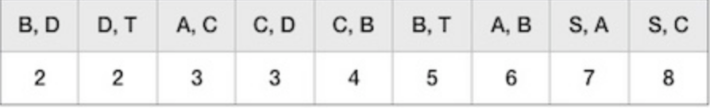
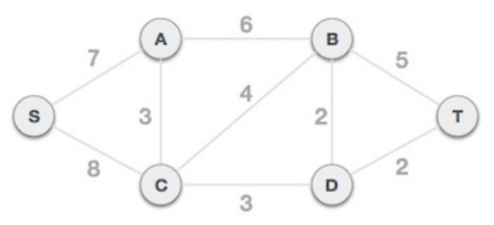
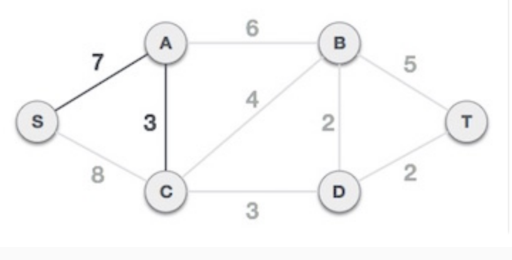
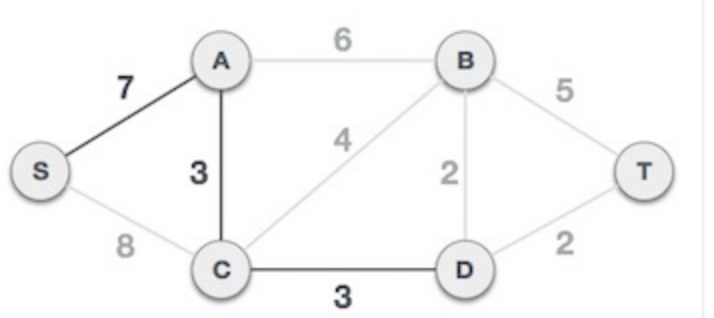
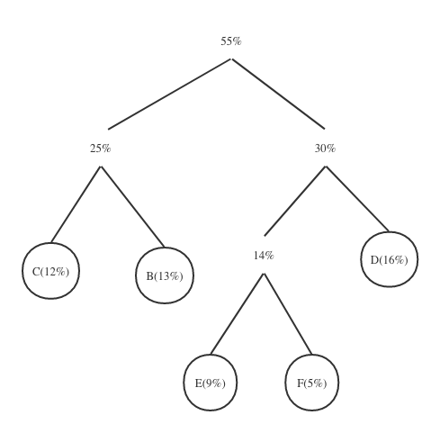
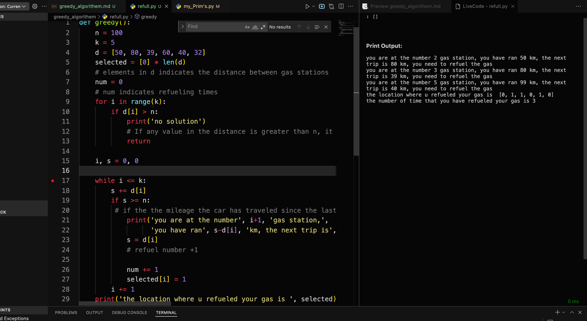

# greedy algorithem
## Technique definition 
A greedy algorithm (also known as a greedy algorithm) means that when solving a problem, it always makes the best choice at the moment. That is to say, without considering the overall optimality, the algorithm obtains a local optimal solution in a sense.
Greedy algorithms are particularly effective in problems with optimal substructure. The optimal substructure means that the local optimal solution can determine the global optimal solution. Simply put, the problem can be solved by decomposing it into sub-problems, and the optimal solutions of the sub-problems can be recursive to the optimal solution of the final problem.

The greedy algorithm has two important properties:

- The greedy choice property means that the overall optimal solution of the problem can be achieved through a series of partial optimal choices, that is, greedy choice. This is the first basic element of the feasibility of a greedy algorithm, and it is also an important difference between a greedy algorithm and a dynamic programming algorithm. Dynamic programming algorithms usually solve each sub-problem in a bottom-up manner, while greedy algorithms usually solve each sub-problem in a top-down manner. , making successive greedy choices in an iterative manner, and each time a greedy choice is made, the problem is reduced to a smaller subproblem.
optimal substructure properties

- When the optimal solution of a problem contains the optimal solutions of its subproblems, the problem is said to have optimal substructure properties. The optimal substructure property of the problem is the key feature that the problem can be solved by dynamic programming algorithm or greedy algorithm
## Minimum spanning trees
A minimum spanning tree (MST) or minimum weight spanning tree is a subset of the edges of a connected edge-weighted undirected graph that connects all vertices together without any cycles and with the smallest possible total edge weight. [1] That is, it is a spanning tree whose sum of edge weights is as small as possible. [2] More generally, any edge-weighted undirected graph (not necessarily connected) has a minimum spanning forest, which is the union of the minimum spanning trees of its connected components.

> Why optimal set of edges cannot contain a cycle?
because removing an edge from this cycle would reduce the cost without compromising connectivity:

> A minimum spanning tree has (V – 1) edges, V is number of vertices
definition
Greedy algorithms build up a solution piece by piece, always choosing the next piece that offers the most obvious and immediate benefit. 

#### Application of Minimum Spanning Tree:
- a) To lay optical cables between n cities, the main goal is to enable communication between any two of these n cities, but the cost of laying optical cables is very high, and the cost of laying optical cables between cities is different, so another One goal is to minimize the overall cost of laying fiber optic cables. This requires finding the weighted minimum spanning tree.
- b) There are 8 villages distributed in various regions. The government intends to use the least funds to connect these 8 villages, so that no matter which village is in, you can go to the other 7 villages. It is known that two or two villages can be reached. Villages that can communicate with each other and the money it takes to build the sections between them
#### exercise
Consider the following graph.

(a) What is the cost of its minimum spanning tree?

(b) How many minimum spanning trees does it have?
#### solution
 (a) The minimum spanning tree is the following picture

the minimal cost is 14.
I ran prim's Algorithm on the graph
```
step 1 --------------
current node is  A  ,edge is  A to B
cost[ B ]= 100000
edge[ A ][ B ] is  4
apparently cost[ B ] > edge[ A ][ B ]
*** update cost and previous ****
current cost is  {'A': 0, 'B': 4, 'C': 100000, 'D': 100000, 'E': 100000, 'F': 100000, 'G': 100000}
current prev is  {'A': None, 'B': 'A', 'C': None, 'D': None, 'E': None, 'F': None, 'G': None}
 
step 2 --------------
current node is  A  ,edge is  A to D
cost[ D ]= 100000
edge[ A ][ D ] is  1
apparently cost[ D ] > edge[ A ][ D ]
*** update cost and previous ****
current cost is  {'A': 0, 'B': 4, 'C': 100000, 'D': 1, 'E': 100000, 'F': 100000, 'G': 100000}
current prev is  {'A': None, 'B': 'A', 'C': None, 'D': 'A', 'E': None, 'F': None, 'G': None}
 
step 3 --------------
current node is  D  ,edge is  D to A
cost[ A ] is  0
edge[ D ][ A ] is  1
apparently cost[ A ] < edge[ D ][ A ]
no update continue
 
step 4 --------------
current node is  D  ,edge is  D to B
cost[ B ]= 4
edge[ D ][ B ] is  3
apparently cost[ B ] > edge[ D ][ B ]
*** update cost and previous ****
current cost is  {'A': 0, 'B': 3, 'C': 100000, 'D': 1, 'E': 100000, 'F': 100000, 'G': 100000}
current prev is  {'A': None, 'B': 'D', 'C': None, 'D': 'A', 'E': None, 'F': None, 'G': None}
 
step 5 --------------
current node is  D  ,edge is  D to E
cost[ E ]= 100000
edge[ D ][ E ] is  1
apparently cost[ E ] > edge[ D ][ E ]
*** update cost and previous ****
current cost is  {'A': 0, 'B': 3, 'C': 100000, 'D': 1, 'E': 1, 'F': 100000, 'G': 100000}
current prev is  {'A': None, 'B': 'D', 'C': None, 'D': 'A', 'E': 'D', 'F': None, 'G': None}
 
step 6 --------------
current node is  E  ,edge is  E to B
cost[ B ]= 3
edge[ E ][ B ] is  2
apparently cost[ B ] > edge[ E ][ B ]
*** update cost and previous ****
current cost is  {'A': 0, 'B': 2, 'C': 100000, 'D': 1, 'E': 1, 'F': 100000, 'G': 100000}
current prev is  {'A': None, 'B': 'E', 'C': None, 'D': 'A', 'E': 'D', 'F': None, 'G': None}
 
step 7 --------------
current node is  E  ,edge is  E to C
cost[ C ]= 100000
edge[ E ][ C ] is  6
apparently cost[ C ] > edge[ E ][ C ]
*** update cost and previous ****
current cost is  {'A': 0, 'B': 2, 'C': 6, 'D': 1, 'E': 1, 'F': 100000, 'G': 100000}
current prev is  {'A': None, 'B': 'E', 'C': 'E', 'D': 'A', 'E': 'D', 'F': None, 'G': None}
 
step 8 --------------
current node is  E  ,edge is  E to D
cost[ D ] is  1
edge[ E ][ D ] is  1
apparently cost[ D ] < edge[ E ][ D ]
no update continue
 
step 9 --------------
current node is  E  ,edge is  E to F
cost[ F ]= 100000
edge[ E ][ F ] is  3
apparently cost[ F ] > edge[ E ][ F ]
*** update cost and previous ****
current cost is  {'A': 0, 'B': 2, 'C': 6, 'D': 1, 'E': 1, 'F': 3, 'G': 100000}
current prev is  {'A': None, 'B': 'E', 'C': 'E', 'D': 'A', 'E': 'D', 'F': 'E', 'G': None}
 
step 10 --------------
current node is  B  ,edge is  B to A
cost[ A ] is  0
edge[ B ][ A ] is  4
apparently cost[ A ] < edge[ B ][ A ]
no update continue
 
step 11 --------------
current node is  B  ,edge is  B to C
cost[ C ]= 6
edge[ B ][ C ] is  5
apparently cost[ C ] > edge[ B ][ C ]
*** update cost and previous ****
current cost is  {'A': 0, 'B': 2, 'C': 5, 'D': 1, 'E': 1, 'F': 3, 'G': 100000}
current prev is  {'A': None, 'B': 'E', 'C': 'B', 'D': 'A', 'E': 'D', 'F': 'E', 'G': None}
 
step 12 --------------
current node is  B  ,edge is  B to D
cost[ D ] is  1
edge[ B ][ D ] is  3
apparently cost[ D ] < edge[ B ][ D ]
no update continue
 
step 13 --------------
current node is  B  ,edge is  B to E
cost[ E ] is  1
edge[ B ][ E ] is  2
apparently cost[ E ] < edge[ B ][ E ]
no update continue
 
step 14 --------------
current node is  F  ,edge is  F to C
cost[ C ]= 5
edge[ F ][ C ] is  4
apparently cost[ C ] > edge[ F ][ C ]
*** update cost and previous ****
current cost is  {'A': 0, 'B': 2, 'C': 4, 'D': 1, 'E': 1, 'F': 3, 'G': 100000}
current prev is  {'A': None, 'B': 'E', 'C': 'F', 'D': 'A', 'E': 'D', 'F': 'E', 'G': None}
 
step 15 --------------
current node is  F  ,edge is  F to E
cost[ E ] is  1
edge[ F ][ E ] is  3
apparently cost[ E ] < edge[ F ][ E ]
no update continue
 
step 16 --------------
current node is  F  ,edge is  F to G
cost[ G ]= 100000
edge[ F ][ G ] is  3
apparently cost[ G ] > edge[ F ][ G ]
*** update cost and previous ****
current cost is  {'A': 0, 'B': 2, 'C': 4, 'D': 1, 'E': 1, 'F': 3, 'G': 3}
current prev is  {'A': None, 'B': 'E', 'C': 'F', 'D': 'A', 'E': 'D', 'F': 'E', 'G': 'F'}
 
step 17 --------------
current node is  G  ,edge is  G to C
cost[ C ] is  4
edge[ G ][ C ] is  5
apparently cost[ C ] < edge[ G ][ C ]
no update continue
 
step 18 --------------
current node is  G  ,edge is  G to F
cost[ F ] is  3
edge[ G ][ F ] is  3
apparently cost[ F ] < edge[ G ][ F ]
no update continue
 
step 19 --------------
current node is  C  ,edge is  C to B
cost[ B ] is  2
edge[ C ][ B ] is  5
apparently cost[ B ] < edge[ C ][ B ]
no update continue
 
step 20 --------------
current node is  C  ,edge is  C to E
cost[ E ] is  1
edge[ C ][ E ] is  6
apparently cost[ E ] < edge[ C ][ E ]
no update continue
 
step 21 --------------
current node is  C  ,edge is  C to F
cost[ F ] is  3
edge[ C ][ F ] is  4
apparently cost[ F ] < edge[ C ][ F ]
no update continue
 
step 22 --------------
current node is  C  ,edge is  C to G
cost[ G ] is  3
edge[ C ][ G ] is  5
apparently cost[ G ] < edge[ C ][ G ]
no update continue
```
You can see that in last update 
 cost is  ```{'A': 0, 'B': 2, 'C': 4, 'D': 1, 'E': 1, 'F': 3, 'G': 3}```
 prev is  ```{'A': None, 'B': 'E', 'C': 'F', 'D': 'A', 'E': 'D', 'F': 'E', 'G': 'F'}```
If you added up the value in cost. You will get 14
(b) It only has one minimum spanning tree.


## Prim’s & Kruskal’s Algorithm

**Kruskal's algorithm**
> Steps:
    1. Sort all the edges in non-decreasing order of their weight. 
    2. Pick the smallest edge. Check if it forms a cycle with the spanning tree formed so far. If cycle is not formed, include this edge. Else, discard it. 
    3. Repeat step#2 until there are (V-1) edges in the spanning tree.

> Greedy algorithem implementation of Kruskal's algorithm
>- Candidates - edges
>- Selection - a subset S⊆ E of the candidate edges
>- Solution check - does S touch every vertex, is it connected?
>- Feasibility check - does adding e ∈ E create a cycle?
>- Select function - edge weight
>- Objective function - sum of weights

Consider following graph

- Step 1 - Arrange all edges in order of increasing weight
> The next step is to create a set of edges and weights in ascending order of weight (cost).


- Step 2 - Add the edge with the least weight
> Now we start adding edges to the graph starting with the graph with the least weight. Throughout the process, we will continue to check that the spanning property is intact. If the spanning tree property does not hold by adding an edge, then we will consider not including the edge in the graph.


> The minimum cost is 2 and the edges involved are B,D and D,T. We add them. Adding them does not violate spanning tree properties, so we move on to the next edge selection.
The next cost is 3 and the associated edges are A,C and C,D. We add them again


> The next cost in the table is 4, we observe that adding it will create a cycle in the diagram. 

>  We ignore it. In this process, we will ignore/avoid edges that creates cycle.


> We observe that edges with cost 5 and 6 also generate circuits. We ignore them and move on.


> Now we only have one node left to add. Between the minimum cost edges 7 and 8 available, we'll add an edge with a cost of 7.

> By adding edges S, A, we have included all the nodes of the graph and now we have the minimum cost spanning tree.

**Following word is I cited from geeks for geeks. I think it is very useful.**
Time Complexity: O(ElogE) or O(ElogV). Sorting of edges takes O(ELogE) time. After sorting, we iterate through all edges and apply the find-union algorithm. The find and union operations can take at most O(LogV) time. So overall complexity is O(ELogE + ELogV) time. The value of E can be at most O(V2), so O(LogV) is O(LogE) the same. Therefore, the overall time complexity is O(ElogE) or O(ElogV)

**Prim's algorithm**
> Prim's algorithm for finding the minimum spanning tree (like Kruskal's algorithm) uses a greedy approach. Prim's algorithm shares similarities with the shortest path first algorithm.
> Compared to Kruskal's algorithm, Prim's algorithm treats nodes as a single tree and continues to add new nodes to the spanning tree from the given graph.

- Step 1 - Select any node as root node
> In this case, we choose the S node as the root node of the Prim spanning tree. This node is arbitrarily chosen, so any node can be the root node. One might wonder why any video can be a root node. So the answer is that in a spanning tree, all nodes of the graph are contained, and because it is connected, there must be at least one edge that connects it to the rest of the tree.


- Step 2  Check Outgoing Edges and Choose Less Costly Edges
> On selecting the root node S, we see that S, A and S, C are two edges with weights 7 and 8, respectively. We choose edge S, A because it is smaller than the other side.


> Now, the tree S-7-A is considered a node and we examine all edges coming out of it. We choose the one with the lowest cost and include it in the tree



> After this step, the S-7-A-3-C tree is formed. Now we will treat it as a node again and will check all edges again. However, we will only choose the lowest cost advantage. In this case, C-3-D is the new edge, less than the cost of the other edges 8, 6, 4, etc.



> After adding node D to the spanning tree, we now have two edges with the same cost, D-2-T and D-2-B. So we can add either one. But the next step will again generate edge 2 as the lowest cost. Therefore, we are showing a spanning tree with two edges.


##### exercise
Build a communication network in major cities, as shown in the figure below, each circle represents a city, and the number on the side represents the price of establishing a communication connection. So, how can the major cities be directly or indirectly connected with the smallest price?

(a) Run Prim’s algorithm; whenever there is a choice of nodes, always use alphabetic ordering
(b) Run Kruskal’s algorithm on the same graph. Show how the disjoint-sets data structure looks at every intermediate stage (including the structure of the directed trees), assuming path compression is used.
#### solution
(a)
I start from node A. Draw a table showing the intermediate values of the cost array.
| set(s)    | A | B     | C     | D     | E     | F     | G     |
|---------  |---|-------|-------|-------|-------|-------|-------|
|           | 0 | 10000 | 10000 | 10000 | 10000 | 10000 | 10000 |
| A         |   | 1     | 10000 | 1     | 10000 | 10000 | 10000 |
| A,B       |   |       | 5     |       | 2     | 10000 | 10000 |
| A,B,D     |   |       | 5     |       | 1     | 10000 | 10000 |
| A,B,D,E   |   |       | 5     |       |       | 3     | 1     |
| A,B,D,E,G |   |       | 4     |       |       | 3     | 1     |


Steps to run Prim's
```
step 1 --------------
current node is  A  ,edge is  A to B
cost[ B ]= 100000
edge[ A ][ B ] is  1
apparently cost[ B ] > edge[ A ][ B ]
*** update cost and previous ****
current cost is  {'A': 0, 'B': 1, 'C': 100000, 'D': 100000, 'E': 100000, 'F': 100000, 'G': 100000}
current prev is  {'A': None, 'B': 'A', 'C': None, 'D': None, 'E': None, 'F': None, 'G': None}
 
step 2 --------------
current node is  A  ,edge is  A to D
cost[ D ]= 100000
edge[ A ][ D ] is  1
apparently cost[ D ] > edge[ A ][ D ]
*** update cost and previous ****
current cost is  {'A': 0, 'B': 1, 'C': 100000, 'D': 1, 'E': 100000, 'F': 100000, 'G': 100000}
current prev is  {'A': None, 'B': 'A', 'C': None, 'D': 'A', 'E': None, 'F': None, 'G': None}
 
step 3 --------------
current node is  B  ,edge is  B to A
cost[ A ] is  0
edge[ B ][ A ] is  1
apparently cost[ A ] < edge[ B ][ A ]
no update continue
 
step 4 --------------
current node is  B  ,edge is  B to C
cost[ C ]= 100000
edge[ B ][ C ] is  5
apparently cost[ C ] > edge[ B ][ C ]
*** update cost and previous ****
current cost is  {'A': 0, 'B': 1, 'C': 5, 'D': 1, 'E': 100000, 'F': 100000, 'G': 100000}
current prev is  {'A': None, 'B': 'A', 'C': 'B', 'D': 'A', 'E': None, 'F': None, 'G': None}
 
step 5 --------------
current node is  B  ,edge is  B to D
cost[ D ] is  1
edge[ B ][ D ] is  3
apparently cost[ D ] < edge[ B ][ D ]
no update continue
 
step 6 --------------
current node is  B  ,edge is  B to E
cost[ E ]= 100000
edge[ B ][ E ] is  2
apparently cost[ E ] > edge[ B ][ E ]
*** update cost and previous ****
current cost is  {'A': 0, 'B': 1, 'C': 5, 'D': 1, 'E': 2, 'F': 100000, 'G': 100000}
current prev is  {'A': None, 'B': 'A', 'C': 'B', 'D': 'A', 'E': 'B', 'F': None, 'G': None}
 
step 7 --------------
current node is  D  ,edge is  D to A
cost[ A ] is  0
edge[ D ][ A ] is  1
apparently cost[ A ] < edge[ D ][ A ]
no update continue
 
step 8 --------------
current node is  D  ,edge is  D to B
cost[ B ] is  1
edge[ D ][ B ] is  3
apparently cost[ B ] < edge[ D ][ B ]
no update continue
 
step 9 --------------
current node is  D  ,edge is  D to E
cost[ E ]= 2
edge[ D ][ E ] is  1
apparently cost[ E ] > edge[ D ][ E ]
*** update cost and previous ****
current cost is  {'A': 0, 'B': 1, 'C': 5, 'D': 1, 'E': 1, 'F': 100000, 'G': 100000}
current prev is  {'A': None, 'B': 'A', 'C': 'B', 'D': 'A', 'E': 'D', 'F': None, 'G': None}
 
step 10 --------------
current node is  E  ,edge is  E to B
cost[ B ] is  1
edge[ E ][ B ] is  2
apparently cost[ B ] < edge[ E ][ B ]
no update continue
 
step 11 --------------
current node is  E  ,edge is  E to C
cost[ C ] is  5
edge[ E ][ C ] is  6
apparently cost[ C ] < edge[ E ][ C ]
no update continue
 
step 12 --------------
current node is  E  ,edge is  E to D
cost[ D ] is  1
edge[ E ][ D ] is  1
apparently cost[ D ] < edge[ E ][ D ]
no update continue
 
step 13 --------------
current node is  E  ,edge is  E to F
cost[ F ]= 100000
edge[ E ][ F ] is  3
apparently cost[ F ] > edge[ E ][ F ]
*** update cost and previous ****
current cost is  {'A': 0, 'B': 1, 'C': 5, 'D': 1, 'E': 1, 'F': 3, 'G': 100000}
current prev is  {'A': None, 'B': 'A', 'C': 'B', 'D': 'A', 'E': 'D', 'F': 'E', 'G': None}
 
step 14 --------------
current node is  E  ,edge is  E to G
cost[ G ]= 100000
edge[ E ][ G ] is  1
apparently cost[ G ] > edge[ E ][ G ]
*** update cost and previous ****
current cost is  {'A': 0, 'B': 1, 'C': 5, 'D': 1, 'E': 1, 'F': 3, 'G': 1}
current prev is  {'A': None, 'B': 'A', 'C': 'B', 'D': 'A', 'E': 'D', 'F': 'E', 'G': 'E'}
 
step 15 --------------
current node is  G  ,edge is  G to C
cost[ C ] is  5
edge[ G ][ C ] is  5
apparently cost[ C ] < edge[ G ][ C ]
no update continue
 
step 16 --------------
current node is  G  ,edge is  G to F
cost[ F ] is  3
edge[ G ][ F ] is  3
apparently cost[ F ] < edge[ G ][ F ]
no update continue
 
step 17 --------------
current node is  F  ,edge is  F to C
cost[ C ]= 5
edge[ F ][ C ] is  4
apparently cost[ C ] > edge[ F ][ C ]
*** update cost and previous ****
current cost is  {'A': 0, 'B': 1, 'C': 4, 'D': 1, 'E': 1, 'F': 3, 'G': 1}
current prev is  {'A': None, 'B': 'A', 'C': 'F', 'D': 'A', 'E': 'D', 'F': 'E', 'G': 'E'}
 
step 18 --------------
current node is  F  ,edge is  F to E
cost[ E ] is  1
edge[ F ][ E ] is  3
apparently cost[ E ] < edge[ F ][ E ]
no update continue
 
step 19 --------------
current node is  F  ,edge is  F to G
cost[ G ] is  1
edge[ F ][ G ] is  3
apparently cost[ G ] < edge[ F ][ G ]
no update continue
 
step 20 --------------
current node is  C  ,edge is  C to B
cost[ B ] is  1
edge[ C ][ B ] is  5
apparently cost[ B ] < edge[ C ][ B ]
no update continue
 
step 21 --------------
current node is  C  ,edge is  C to E
cost[ E ] is  1
edge[ C ][ E ] is  6
apparently cost[ E ] < edge[ C ][ E ]
no update continue
 
step 22 --------------
current node is  C  ,edge is  C to F
cost[ F ] is  3
edge[ C ][ F ] is  4
apparently cost[ F ] < edge[ C ][ F ]
no update continue
```

(b)
- First we sort the edge with Ascending order.
```
(A-B)=1
(A-D)=1
(D-E)=1
(E-G)=1
(B-E)=2
(B-D)=3
(E-F)=3
(F-G)=3
(C-F)=4
(B-C)=5
(C-E)=6
```
- Secondly, makeset(A),makeset(B),...,makeset(G).
- Then we start run union by rank on the disjoint set. I use directed tree instead of disjoint set here.
**number behind( )is the rank of node**
> step1 union (A-B) (A-D), directed graph is 


> step2 union (D-E)
 

> step3 union (E-G)


> step4 ignore (B-D) and (B-E), union(E-F)=3


> step5 ignore (F-G) ,union(C-F)


> step6 ignore (B-C),(C-E), then we do path compression on the tree

## Huffman encoding

Huffman enCoding is a coding method, an entropy coding (weight coding) algorithm for lossless data compression.
Huffman coding relies on Huffman trees. The Huffman tree utilizes the different weights of each character in the character set, and a 01 binary tree is constructed "greedily", in which the node where the character with a smaller weight is located is farther from the root node of the tree (its encoding is relatively long), and the weight is relatively long. The node where the significant character is located is closer to the node in the tree (its encoding is relatively short).
For example, in English, e has the highest probability of occurrence, while z has the lowest probability of occurrence. When using Huffman coding to compress a piece of English, e is very likely to be represented by one bit, while z may take 25 bits (not 26). When using the common representation method, each English letter occupies one byte, that is, 8 bits. Compared with the two, e uses 1/8 of the length of the general encoding, and z uses more than 3 times. If we can achieve a more accurate estimation of the probability of occurrence of each letter in English, the ratio of lossless compression can be greatly improved.

#### exercise
The following table shows the frequency of occurrence of characters in a file. Huffman coding is used to encode the following characters, then the encoding of the character sequence 'BEE' is?
| character | A  | B     | C     | D     | E     | F     |
|---------  |----|-------|-------|-------|-------|-------|
|           | 45 | 13    | 12    | 16    | 9     | 5     |

#### solution
> step1 sorting the character in frequency descending order
```
A=45%
D=16%
B=13%
C=12%
E=9%
F=5%
```
> step2 combine E(5%) and F(9%) =14%
```
A=45%
D=16%
14%
B=13%
C=12%
```

> step3 combine B(13%) with C(12%) =25%
```
A=45%
25%
D=16%
14%
```

> step4 combine 14% with D(16%) = 30%
```
A=45%
30%
25%
```

> step5 combine 25% with 30% = 55%
```
55%
A=45%
```

> step6 combine 55% with A(45%) = 100%, Then we give it 


The huffman coding of the character is 
```
A=0
B=101
C=100
D=111
E=1100
F=1101
```
BEE=10111001100
## Greedy algorithm design

### elements in greedy algorithem

    1. A set C of candidates
    2. A set S of selected items
    3. A solution check: does the set S provide a solution to the problem (ignoring questions of optimality)?
    4. A feasibility check: can the set S be extended to a solution to the problem?
    5. A select function which evaluates the items in C
    6. An objective function

### A standard and simple greedy algorithm template
```
def greedy_algorithem:
    candidate_set=[]
    selected_set=[]
    while solution check& feasibility check:
        if select function:
            selected_set.append(candidate)
    return selected_set
```
**exercise**
A car can travel n kilometers with full gas. There are several gas stations during the trip. Design an efficient algorithm to indicate which gas stations should stop to refuel to minimize the number of refuelings along the way. For a given n (n <= 5000) and k (k <= 1000) gas station locations, program the calculation of the minimum number of refills. And give the location of refuel gas station location

**solution**

> **candidates**: all the gas stations along the road
> 
> **selected items**: the gas stations to refuel
> 
> **solution check**: the car has finished the trip,it is equivalent to whether it has passed all the gas stations
> 
> **feasibility check**: The distance between two Neighboring gas station is smaller than the maximal distance 
> 
> **select function**: Whether the mileage the car has traveled since the last time it was filled with gas add the distance from the current gas station to the next gas station is less than the maximum mileage the car can travel with full gas. If yes do not refuel, otherwise refuel.
> 
> **Objective function**: Total number of refueling

```pyhton

# Suppose the car can travel n kilometers after filling up the gas, and there are k gas stations on the journey
 
def greedy():
    n = 100
    k = 5
    d = [50,80,39,60,40,32]
    # elements in d indicates the distance between gas stations
    num = 0
    # num indicates refueling times
    selected = [0] * len(d)
    for i in range(k):
        if d[i] > n:
            print('no solution')
            # If any value in the distance is greater than n, it cannot be calculated.This is feasiblity check
            return 
 
    i, s = 0, 0
    # while the car has not passed all gas stations
    while i <= k:
        s += d[i]
        if s >= n:
            # if the the mileage the car has traveled since the last time it was filled with gas add the distance from the current gas station to the next gas station is longer than n
            s = d[i]
            # refuel number +1
            num += 1
            selected[i] = 1
        i += 1
    print(num)
 
if __name__ == '__main__':
    greedy()
```

Output of my algorithem


https://github.com/zyune/CS5800_algorithem/blob/main/greedy_algorithem/refull.py